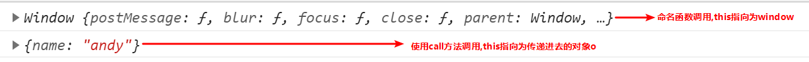
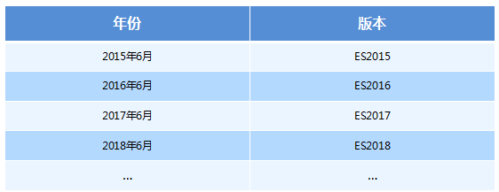
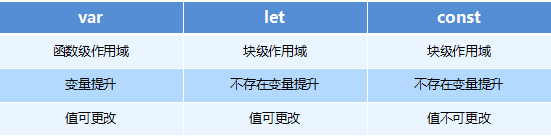

## 1.数据类型的分类和判断
* 基本(值)类型
  * Number ----- 任意数值 -------- typeof
  * String ----- 任意字符串 ------ typeof
  * Boolean ---- true/false ----- typeof
  * undefined --- undefined ----- typeof/===
  * null -------- null ---------- ===
* 对象(引用)类型
  * Object ----- typeof/instanceof
  * Array ------ instanceof
  * Function ---- typeof

##### 问题：

- undefined与null的区别?
  1. undefined代表定义未赋值
  2. nulll定义并赋值了, 只是值为null

- 什么时候给变量赋值为null呢?
  1. 初始赋值, 表明将要赋值为对象 
  2. 结束前, 让对象成为垃圾对象(被垃圾回收器回收)

- 严格区别变量类型与数据类型?

  1. 数据的类型

     -  基本类型

     -  对象类型

  2. 变量的类型(变量内存值的类型)

     - 基本类型: 保存就是基本类型的数据
     - 引用类型: 保存的是地址值

```js
// 实例: 实例对象
  // 类型: 类型对象
  function Person (name, age) {// 构造函数  类型
    this.name = name
    this.age = age
  }
  var p = new Person('tom', 12) // 根据类型创建的实例对象
  // Person('jack', 12)
  // 1. undefined与null的区别?
  var a
  console.log(a)  // undefined
  a = null
  console.log(a) // null
  //起始
  var b = null  // 初始赋值为null, 表明将要赋值为对象
  //确定对象就赋值
  b = ['atguigu', 12]
  //最后
  b = null // 让b指向的对象成为垃圾对象(被垃圾回收器回收)
  // b = 2
  var c = function () {

  }
```

## 2.数据,变量, 内存的理解

* 什么是数据?
  * 在内存中可读的, 可传递的保存了特定信息的'东东'
  * 一切皆数据, 函数也是数据
  * 在内存中的所有操作的目标: 数据
* 什么是变量?
  * 在程序运行过程中它的值是允许改变的量
  * 一个变量对应一块小内存, 它的值保存在此内存中  
* 什么是内存?
  * 内存条通电后产生的存储空间(临时的)
  * 内存产生和死亡: 内存条(电路版)==>通电==>产生内存空间==>存储数据==>处理数据==>断电==>内存空间和数据都消失
  * 一块内存包含2个方面的数据
    * 内部存储的数据
    * 地址值数据
  * 内存空间的分类
    * 栈空间: 全局变量和局部变量
    * 堆空间: 对象 
* 内存,数据, 变量三者之间的关系
  * 内存是容器, 用来存储不同数据
  * 变量是内存的标识, 通过变量我们可以操作(读/写)内存中的数据  
  
#### 问题1：

var a = xxx, a内存中到底保存的是什么?

1. xxx是基本数据, 保存的就是这个数据
2. xxx是对象, 保存的是对象的地址值
3. xxx是一个变量, 保存的xxx的内存内容(可能是基本数据, 也可能是地址值)

```javascript
var a = 3
  a = function () {
  }
  var b = 'abc'
  a = b
  b = {}
  a = b
```

#### 问题2：

关于引用变量赋值问题？

1. 2个引用变量指向同一个对象, 通过一个变量修改对象内部数据, 另一个变量看到的是修改之后的数据
2.  2个引用变量指向同一个对象, 让其中一个引用变量指向另一个对象, 另一引用变量依然指向前一个对象

```javascript
 var obj1 = {name: 'Tom'}
  var obj2 = obj1
  obj2.age = 12
  console.log(obj1.age)  // 12
  function fn (obj) {
    obj.name = 'A'
  }
  fn(obj1)
  console.log(obj2.name) //A
  var a = {age: 12}
  var b = a
  a = {name: 'BOB', age: 13}
  b.age = 14
  console.log(b.age, a.name, a.age) // 14 Bob 13
  function fn2 (obj) {
    obj = {age: 15}
  }
  fn2(a)
  console.log(a.age)
```

## 3.对象的理解和使用

* 什么是对象?
  * 多个数据(属性)的集合
  * 用来保存多个数据(属性)的容器
* 属性组成:
  * 属性名 : 字符串(标识)
  * 属性值 : 任意类型
* 属性的分类:
  * 一般 : 属性值不是function  描述对象的状态
  * 方法 : 属性值为function的属性  描述对象的行为
* 特别的对象
  * 数组: 属性名是0,1,2,3之类的索引
  * 函数: 可以执行的
* 如何操作内部属性(方法)
  * .属性名
  * ['属性名']: 属性名有特殊字符/属性名是一个变量
  
## 4.函数的理解和使用
* 什么是函数?
  * 用来实现特定功能的, n条语句的封装体
  * 只有函数类型的数据是可以执行的, 其它的都不可以
* 为什么要用函数?
  * 提高复用性
  * 便于阅读交流
* 函数也是对象
  * instanceof Object===true
  * 函数有属性: prototype
  * 函数有方法: call()/apply()
  * 可以添加新的属性/方法
* 函数的3种不同角色
  * 一般函数 : 直接调用
  * 构造函数 : 通过new调用
  * 对象 : 通过.调用内部的属性/方法
* 函数中的this
  * 显式指定谁: obj.xxx()
  * 通过call/apply指定谁调用: xxx.call(obj)
  * 不指定谁调用: xxx()  : window
  * 回调函数: 看背后是通过谁来调用的: window/其它
* 匿名函数自调用:
  ```
  (function(w, obj){
    //实现代码
  })(window, obj)
  ```
  * 专业术语为: IIFE (Immediately Invoked Function Expression) 立即调用函数表达式						  
* 回调函数的理解
  * 什么函数才是回调函数?
    * 你定义的
    * 你没有调用
    * 但它最终执行了(在一定条件下或某个时刻)
  * 常用的回调函数
    * dom事件回调函数
    * 定时器回调函数
    * ajax请求回调函数(后面讲解)
    * 生命周期回调函数(后面讲解)
  

## 5.原型与原型链

* 所有函数都有一个特别的属性:

  * `prototype` : 显式原型属性

    ```javascript
    <!--
    1. 函数的prototype属性(图)
      * 每个函数都有一个prototype属性, 它默认指向一个Object空对象(即称为: 原型对象)
      * 原型对象中有一个属性constructor, 它指向函数对象
    2. 给原型对象添加属性(一般都是方法)
      * 作用: 函数的所有实例对象自动拥有原型中的属性(方法)
    -->
    <script type="text/javascript">
    
      // 每个函数都有一个prototype属性, 它默认指向一个Object空对象(即称为: 原型对象)
      console.log(Date.prototype, typeof Date.prototype)
      function Fun () {//alt + shift +r(重命名rename)
    
      }
      console.log(Fun.prototype)  // 默认指向一个Object空对象(没有我们的属性)
    
      // 原型对象中有一个属性constructor, 它指向函数对象
      console.log(Date.prototype.constructor===Date)
      console.log(Fun.prototype.constructor===Fun)
    
      //给原型对象添加属性(一般是方法) ===>实例对象可以访问
      Fun.prototype.test = function () {
        console.log('test()')
      }
      var fun = new Fun()
      fun.test()
    ```

* 所有实例对象都有一个特别的属性:

  * `__proto__` : 隐式原型属性

* 显式原型与隐式原型的关系

  * 函数的prototype: 定义函数时被自动赋值, 值默认为{}, 即用为原型对象

  * 实例对象的__proto__: 在创建实例对象时被自动添加, 并赋值为构造函数的prototype值

  * 原型对象即为当前实例对象的父对象

    

    ```javascript
    <!--
    1. 每个函数function都有一个prototype，即显式原型(属性)
    2. 每个实例对象都有一个__proto__，可称为隐式原型(属性)
    3. 对象的隐式原型的值为其对应构造函数的显式原型的值
    4. 内存结构(图)
    5. 总结:
      * 函数的prototype属性: 在定义函数时自动添加的, 默认值是一个空Object对象
      * 对象的__proto__属性: 创建对象时自动添加的, 默认值为构造函数的prototype属性值
      * 程序员能直接操作显式原型, 但不能直接操作隐式原型(ES6之前)
    -->
    <script type="text/javascript">
      //定义构造函数
      function Fn() {   // 内部语句: this.prototype = {}
    
      }
      // 1. 每个函数function都有一个prototype，即显式原型属性, 默认指向一个空的Object对象
      console.log(Fn.prototype)
      // 2. 每个实例对象都有一个__proto__，可称为隐式原型
      //创建实例对象
      var fn = new Fn()  // 内部语句: this.__proto__ = Fn.prototype
      console.log(fn.__proto__)
      // 3. 对象的隐式原型的值为其对应构造函数的显式原型的值
      console.log(Fn.prototype===fn.__proto__) // true
      //给原型添加方法
      Fn.prototype.test = function () {
        console.log('test()')
      }
      //通过实例调用原型的方法
      fn.test()
    ```

* 原型链

  * 所有的实例对象都有__proto__属性, 它指向的就是原型对象

  * 这样通过__proto__属性就形成了一个链的结构---->原型链

  * 当查找对象内部的属性/方法时, js引擎自动沿着这个原型链查找

  * 当给对象属性赋值时不会使用原型链, 而只是在当前对象中进行操作

    

    ```javascript
    <!--
    1. 原型链(图解)
      * 访问一个对象的属性时，
        * 先在自身属性中查找，找到返回
        * 如果没有, 再沿着__proto__这条链向上查找, 找到返回
        * 如果最终没找到, 返回undefined
      * 别名: 隐式原型链
      * 作用: 查找对象的属性(方法)
    2. 构造函数/原型/实体对象的关系(图解)
    3. 构造函数/原型/实体对象的关系2(图解)
    -->
    <script type="text/javascript">
      // console.log(Object)
      //console.log(Object.prototype)
      console.log(Object.prototype.__proto__)
      function Fn() {
        this.test1 = function () {
          console.log('test1()')
        }
      }
      console.log(Fn.prototype)
      Fn.prototype.test2 = function () {
        console.log('test2()')
      }
    
      var fn = new Fn()
    
      fn.test1()
      fn.test2()
      console.log(fn.toString())
      console.log(fn.test3)
      // fn.test3()
      /*
      1. 函数的显示原型指向的对象默认是空Object实例对象(但Object不满足)
       */
      console.log(Fn.prototype instanceof Object) // true
      console.log(Object.prototype instanceof Object) // false
      console.log(Function.prototype instanceof Object) // true
      /*
      2. 所有函数都是Function的实例(包含Function)
      */
      console.log(Function.__proto__===Function.prototype)
      /*
      3. Object的原型对象是原型链尽头
       */
      console.log(Object.prototype.__proto__) // null
    ```

- 原型链_属性问题

  - 读取对象的属性值时: 会自动到原型链中查找

  - 设置对象的属性值时: 不会查找原型链, 如果当前对象中没有此属性, 直接添加此属性并设置其值

  - 方法一般定义在原型中, 属性一般通过构造函数定义在对象本身上

    ```javascript
    function Fn() {
    
      }
      Fn.prototype.a = 'xxx'
      var fn1 = new Fn()
      console.log(fn1.a, fn1)
    
      var fn2 = new Fn()
      fn2.a = 'yyy'
      console.log(fn1.a, fn2.a, fn2)
    
      function Person(name, age) {
        this.name = name
        this.age = age
      }
      Person.prototype.setName = function (name) {
        this.name = name
      }
      var p1 = new Person('Tom', 12)
      p1.setName('Bob')
      console.log(p1)
    
      var p2 = new Person('Jack', 12)
      p2.setName('Cat')
      console.log(p2)
      console.log(p1.__proto__===p2.__proto__) // true
    ```

    

- instanceof是如何判断的?

  - 表达式: A instanceof B

  - 如果B函数的显式原型对象在A对象的原型链上, 返回true, 否则返回false

- Function是通过new自己产生的实例

  ```javascript
  /*
    案例1
     */
    function Foo() {  }
    var f1 = new Foo()
    console.log(f1 instanceof Foo) // true
    console.log(f1 instanceof Object) // true
  
    /*
    案例2
     */
    console.log(Object instanceof Function) // true
    console.log(Object instanceof Object) // true
    console.log(Function instanceof Function) // true
    console.log(Function instanceof Object) // true
  
    function Foo() {}
    console.log(Object instanceof  Foo) // false
  ```

  - 06_面试题

    ```javascript
     /*
      测试题1
       */
      function A () {
    
      }
      A.prototype.n = 1
    
      var b = new A()
    
      A.prototype = {
        n: 2,
        m: 3
      }
    
      var c = new A()
      console.log(b.n, b.m, c.n, c.m)//1 undefine 2 3
    
    
      /*
       测试题2
       */
      function F (){}
      Object.prototype.a = function(){
        console.log('a()')
      }
      Function.prototype.b = function(){
        console.log('b()')
      }
      
      var f = new F()
      f.a() //a()
      // f.b()//报错
      F.a()//a()
      F.b()//b()
      console.log(f)
      console.log(Object.prototype)
      console.log(Function.prototype)
    
    ```

    

## 6.执行上下文与执行上下文栈

* 变量提升与函数提升

  * 变量提升: 在变量定义语句之前, 就可以访问到这个变量(undefined)

  * 函数提升: 在函数定义语句之前, 就执行该函数

  * 先有变量提升, 再有函数提升

    ```JavaScript
    <!--
    1. 变量声明提升
      * 通过var定义(声明)的变量, 在定义语句之前就可以访问到
      * 值: undefined
    2. 函数声明提升
      * 通过function声明的函数, 在之前就可以直接调用
      * 值: 函数定义(对象)
    3. 问题: 变量提升和函数提升是如何产生的?
    -->
    <script type="text/javascript">
      console.log('-----')
      /*
      面试题 : 输出 undefined
       */
      var a = 3
      function fn () {
        console.log(a)
        var a = 4
      }
      fn()
    
      console.log(b) //undefined  变量提升
      fn2() //可调用  函数提升
      // fn3() //不能  变量提升
    
      var b = 3
      function fn2() {
        console.log('fn2()')
      }
    
       var fn3 = function () {
        console.log('fn3()')
      }
    ```

* 理解

  * 执行上下文: 由js引擎自动创建的对象, 包含对应作用域中的所有变量属性

    ```JavaScript
    <!--
    1. 代码分类(位置)
      * 全局代码
      * 函数(局部)代码
    2. 全局执行上下文
      * 在执行全局代码前将window确定为全局执行上下文
      * 对全局数据进行预处理
        * var定义的全局变量==>undefined, 添加为window的属性
        * function声明的全局函数==>赋值(fun), 添加为window的方法
        * this==>赋值(window)
      * 开始执行全局代码
    3. 函数执行上下文
      * 在调用函数, 准备执行函数体之前, 创建对应的函数执行上下文对象(虚拟的, 存在于栈中)
      * 对局部数据进行预处理
        * 形参变量==>赋值(实参)==>添加为执行上下文的属性
        * arguments==>赋值(实参列表), 添加为执行上下文的属性
        * var定义的局部变量==>undefined, 添加为执行上下文的属性
        * function声明的函数 ==>赋值(fun), 添加为执行上下文的方法
        * this==>赋值(调用函数的对象)
      * 开始执行函数体代码
    -->
    <script type="text/javascript">
      // 全局执行上下文
      console.log(a1, window.a1)//undefined  undefined 
      window.a2()//a2()
      console.log(this)//window
    
      var a1 = 3
      function a2() {
        console.log('a2()')
      }
      console.log(a1) //3
    
      // 函数执行上下文
      function fn(a1){
        console.log(a1);//3
        console.log(a2);//undefined
        a3()
        console.log(this);//windown
        console.log(arguments);//伪数组（2,3）
        var a2=3
        function a3 (){
          console.log('a3()')
        }
      }
      fn(2.3)
    ```

  * 执行上下文栈: 用来管理产生的多个执行上下文

    ```JavaScript
    <!--
    1. 在全局代码执行前, JS引擎就会创建一个栈来存储管理所有的执行上下文对象
    2. 在全局执行上下文(window)确定后, 将其添加到栈中(压栈)
    3. 在函数执行上下文创建后, 将其添加到栈中(压栈)
    4. 在当前函数执行完后,将栈顶的对象移除(出栈)
    5. 当所有的代码执行完后, 栈中只剩下window
    -->
    <script type="text/javascript">
                                //1.进入全局执行上下文
      var a = 10
      var bar = function (x) {
        var b = 5
        foo(x + b)              //3.进入foo执行上下文
      }
      var foo = function (y) {
        var c = 5
        console.log(a + c + y)
      }
      bar(10)                  //2.进入bar函数执行上下文
      // bar(10)
    
    ```

* 分类:

  * 全局: window
  * 函数: 对程序员来说是透明的

* 生命周期

  * 全局 : 准备执行全局代码前产生, 当页面刷新/关闭页面时死亡
  * 函数 : 调用函数时产生, 函数执行完时死亡

* 包含哪些属性:

  * 全局 : 
    * 用var定义的全局变量  ==>undefined
    * 使用function声明的函数   ===>function
    * this   ===>window
  * 函数
    * 用var定义的局部变量  ==>undefined
    * 使用function声明的函数   ===>function
    * this   ===> 调用函数的对象, 如果没有指定就是window 
    * 形参变量   ===>对应实参值
    * arguments ===>实参列表的伪数组

* 执行上下文创建和初始化的过程

  * 全局:
    * 在全局代码执行前最先创建一个全局执行上下文(window)
    * 收集一些全局变量, 并初始化
    * 将这些变量设置为window的属性
  * 函数:
    * 在调用函数时, 在执行函数体之前先创建一个函数执行上下文
    * 收集一些局部变量, 并初始化
    * 将这些变量设置为执行上下文的属性

```JavaScript
<!--
1. 依次输出什么?
  gb: undefined
  fb: 1
  fb: 2
  fb: 3
  fe: 3
  fe: 2
  fe: 1
  ge: 1
2. 整个过程中产生了几个执行上下文?  5
-->
<script type="text/javascript">
  console.log('gb: '+ i)
  var i = 1
  foo(1)
  function foo(i) {
    if (i == 4) {
      return
    }
    console.log('fb:' + i)
    foo(i + 1) //递归调用: 在函数内部调用自己
    console.log('fe:' + i)
  }
  console.log('ge: ' + i)

```

##### 面试题

```JavaScript
  /*
   测试题1:  先执行变量提升, 再执行函数提升
   */
  function a() {}
  var a
  console.log(typeof a) // 'function'


  /*
   测试题2:
   */
  if (!(b in window)) {
    var b = 1
  }
  console.log(b) // undefined

  /*
   测试题3:变量名与函数名同名报错
   */
  var c = 1
  function c(c) {
    console.log(c)
    var c = 3
  }
  c(2) // 报错

```

## 7.作用域与作用域链

* 理解:

  * 作用域: 一块代码区域, 在编码时就确定了, 不会再变化

    ```JavaScript
    <!--
    1. 理解
      * 就是一块"地盘", 一个代码段所在的区域
      * 它是静态的(相对于上下文对象), 在编写代码时就确定了
    2. 分类
      * 全局作用域
      * 函数作用域
      * 没有块作用域(ES6有了)
    3. 作用
      * 隔离变量，不同作用域下同名变量不会有冲突
    -->
    <script type="text/javascript">
    /*  //没块作用域
      if(true) {
        var c = 3
      }
      console.log(c)*/
    
      var a = 10,
        b = 20
      function fn(x) {
        var a = 100,
          c = 300;
        console.log('fn()', a, b, c, x)
        function bar(x) {
          var a = 1000,
            d = 400
          console.log('bar()', a, b, c, d, x)
        }
    
        bar(100)
        bar(200)
      }
      fn(10)
    
    ```

    

  * 作用域链: 多个嵌套的作用域形成的由内向外的结构, 用于查找变量

    ```
    
    ```

* 分类:

  * 全局
  * 函数
  * js没有块作用域(在ES6之前)

* 作用

  * 作用域: 隔离变量, 可以在不同作用域定义同名的变量不冲突

  * 作用域链: 查找变量

    ```JavaScript
    <!--
    1. 理解
      * 多个上下级关系的作用域形成的链, 它的方向是从下向上的(从内到外)
      * 查找变量时就是沿着作用域链来查找的
    2. 查找一个变量的查找规则
      * 在当前作用域下的执行上下文中查找对应的属性, 如果有直接返回, 否则进入2
      * 在上一级作用域的执行上下文中查找对应的属性, 如果有直接返回, 否则进入3
      * 再次执行2的相同操作, 直到全局作用域, 如果还找不到就抛出找不到的异常
    -->
    <script type="text/javascript">
      var a = 1
      function fn1() {
        var b = 2
        function fn2() {
          var c = 3
          console.log(c)
          console.log(b)
          console.log(a)
          console.log(d)
        }
        fn2()
      }
      fn1()
    
    ```

* 区别作用域与执行上下文

  * 作用域: 静态的, 编码时就确定了(不是在运行时), 一旦确定就不会变化了

  * 执行上下文: 动态的, 执行代码时动态创建, 当执行结束消失

  * 联系: 执行上下文环境是在对应的作用域中的

    ```JavaScript
    <!--
    1. 区别1
      * 全局作用域之外，每个函数都会创建自己的作用域，作用域在函数定义时就已经确定了。而不是在函数调用时
      * 全局执行上下文环境是在全局作用域确定之后, js代码马上执行之前创建
      * 函数执行上下文是在调用函数时, 函数体代码执行之前创建
    2. 区别2
      * 作用域是静态的, 只要函数定义好了就一直存在, 且不会再变化
      * 执行上下文是动态的, 调用函数时创建, 函数调用结束时就会自动释放
    3. 联系
      * 执行上下文(对象)是从属于所在的作用域
      * 全局上下文环境==>全局作用域
      * 函数上下文环境==>对应的函数使用域
    -->
    <script type="text/javascript">
      var a = 10,
        b = 20
      function fn(x) {
        var a = 100,
          c = 300;
        console.log('fn()', a, b, c, x)
        function bar(x) {
          var a = 1000,
            d = 400
          console.log('bar()', a, b, c, d, x)
        }
    
        bar(100)
        bar(200)
      }
      fn(10)
    
    ```

##### 面试题

```JavaScript
var x = 10;
  function fn() {
    console.log(x);
  }
  function show(f) {
    var x = 20;
    
    f();
  }
  show(fn);
  
  /***************************************************/
   var fn = function () {
    console.log(fn)
  }
  fn()

  var obj = {
    fn2: function () {
     console.log(fn2)
     //console.log(this.fn2)
    }
  }
  obj.fn2()

```

## 8.闭包 

* 理解:

  * 当嵌套的内部函数引用了外部函数的变量时就产生了闭包
  * 通过chrome工具得知: 闭包本质是内部函数中的一个对象, 这个对象中包含引用的变量属性

* 常见的闭包

  - 将函数作为另一个函数的返回值

  - 将函数作为实参传递给另一个函数调用

    ```JavaScript
    // 1. 将函数作为另一个函数的返回值
      function fn1() {
        var a = 2
        function fn2() {
          a++
          console.log(a)
        }
        return fn2
      }
      var f = fn1()
      f() // 3
      f() // 4
    
      // 2. 将函数作为实参传递给另一个函数调用
      function showDelay(msg, time) {
        setTimeout(function () {
          alert(msg)
        }, time)
      }
      showDelay('atguigu', 2000)
    
    ```

* 作用:

  * 延长局部变量的生命周期

  * 让函数外部能操作内部的局部变量

    ```JavaScript
    <!--
    1. 使用函数内部的变量在函数执行完后, 仍然存活在内存中(延长了局部变量的生命周期)
    2. 让函数外部可以操作(读写)到函数内部的数据(变量/函数)
    
    问题:
      1. 函数执行完后, 函数内部声明的局部变量是否还存在?  一般是不存在, 存在于闭中的变量才可能存在
      2. 在函数外部能直接访问函数内部的局部变量吗? 不能, 但我们可以通过闭包让外部操作它
    -->
    <script type="text/javascript">
      function fn1() {
        var a = 2
        function fn2() {
          a++
          console.log(a)
          // return a
        }
        function fn3() {
          a--
          console.log(a)
        }
        return fn3
      }
      var f = fn1()
      f() // 1
      f() // 0
    
    ```

* 闭包的生命周期

  - 产生: 在嵌套内部函数定义执行完时就产生了(不是在调用)

  - 死亡: 在嵌套的内部函数成为垃圾对象时

    ```JavaScript
    function fn1() {
        //此时闭包就已经产生了(函数提升, 内部函数对象已经创建了)
        var a = 2
        function fn2 () {
          a++
          console.log(a)
        }
        return fn2
      }
      var f = fn1()
      f() // 3
      f() // 4
      f = null //闭包死亡(包含闭包的函数对象成为垃圾对象)
    
    ```

* 写一个闭包程序

  ```JavaScript
  <!--
  1. 如何产生闭包?
    * 当一个嵌套的内部(子)函数引用了嵌套的外部(父)函数的变量(函数)时, 就产生了闭包
  2. 闭包到底是什么?
    * 使用chrome调试查看
    * 理解一: 闭包是嵌套的内部函数(绝大部分人)
    * 理解二: 包含被引用变量(函数)的对象(极少数人)
    * 注意: 闭包存在于嵌套的内部函数中
  3. 产生闭包的条件?
    * 函数嵌套
    * 内部函数引用了外部函数的数据(变量/函数)
  -->
  function fn1() {
    var a = 2;
    function fn2() {
      a++;
      console.log(a);
    }
    return fn2;
  }
  var f = fn1();
  f();
  f();
  
  ```

* 闭包应用:

  * 模块化: 封装一些数据以及操作数据的函数, 向外暴露一些行为

  * 循环遍历加监听

  * JS框架(jQuery)大量使用了闭包

    ```javascript
    //应用1
    <!DOCTYPE html>
    <html lang="en">
    <head>
      <meta charset="UTF-8">
      <title>05_闭包的应用_自定义JS模块</title>
    </head>
    <body>
    <!--
    闭包的应用2 : 定义JS模块
      * 具有特定功能的js文件
      * 将所有的数据和功能都封装在一个函数内部(私有的)
      * 只向外暴露一个包信n个方法的对象或函数
      * 模块的使用者, 只需要通过模块暴露的对象调用方法来实现对应的功能
    -->
    <script type="text/javascript" src="myModule.js"></script>
    <script type="text/javascript">
      var module = myModule()
      module.doSomething()
      module.doOtherthing()
    </script>
    </body>
    </html>
    /*******************************myModule*********************/
    function myModule() {
      //私有数据
      var msg = 'My atguigu'
      //操作数据的函数
      function doSomething() {
        console.log('doSomething() '+msg.toUpperCase())
      }
      function doOtherthing () {
        console.log('doOtherthing() '+msg.toLowerCase())
      }
    
      //向外暴露对象(给外部使用的方法)
      return {
        doSomething: doSomething,
        doOtherthing: doOtherthing
      }
    }
    
    
    //应用2
    <!DOCTYPE html>
    <html lang="en">
    <head>
      <meta charset="UTF-8">
      <title>05_闭包的应用_自定义JS模块2</title>
    </head>
    <body>
    <!--
    闭包的应用2 : 定义JS模块
      * 具有特定功能的js文件
      * 将所有的数据和功能都封装在一个函数内部(私有的)
      * 只向外暴露一个包信n个方法的对象或函数
      * 模块的使用者, 只需要通过模块暴露的对象调用方法来实现对应的功能
    -->
    <script type="text/javascript" src="myModule2.js"></script>
    <script type="text/javascript">
      myModule2.doSomething()
      myModule2.doOtherthing()
    </script>
    </body>
    </html>
    /*******************************myModule2*********************/
    
    (function () {
      //私有数据
      var msg = 'My atguigu'
      //操作数据的函数
      function doSomething() {
        console.log('doSomething() '+msg.toUpperCase())
      }
      function doOtherthing () {
        console.log('doOtherthing() '+msg.toLowerCase())
      }
    
      //向外暴露对象(给外部使用的方法)
      window.myModule2 = {
        doSomething: doSomething,
        doOtherthing: doOtherthing
      }
    })()
    
    ```

* 缺点:

  * 变量占用内存的时间可能会过长

  * 可能导致内存泄露

  * 解决:

    * 及时释放 : f = null; //让内部函数对象成为垃圾对象

      ```JavaScript
      1. 缺点
        * 函数执行完后, 函数内的局部变量没有释放, 占用内存时间会变长
        * 容易造成内存泄露
      2. 解决
        * 能不用闭包就不用
        * 及时释放
      -->
      <script type="text/javascript">
        function fn1() {
          var arr = new Array[100000]
          function fn2() {
            console.log(arr.length)
          }
          return fn2
        }
        var f = fn1()
        f()
      
        f = null //让内部函数成为垃圾对象-->回收闭包
      
      ```

##### 面试题

```JavaScript
//代码片段一
  var name = "The Window";
  var object = {
    name : "My Object",
    getNameFunc : function(){
      return function(){
        return this.name;
      };
    }
  };
  alert(object.getNameFunc()());  //?  the window


  //代码片段二
  var name2 = "The Window";
  var object2 = {
    name2 : "My Object",
    getNameFunc : function(){
      var that = this;
      return function(){
        return that.name2;
      };
    }
  };
  alert(object2.getNameFunc()()); //?  my object
/***************************************************************************/
 function fun(n,o) {
    console.log(o)
    return {
      fun:function(m){
        return fun(m,n)
      }
    }
  }
  var a = fun(0)
  a.fun(1)
  a.fun(2)
  a.fun(3)//undefined,0,0,0

  var b = fun(0).fun(1).fun(2).fun(3)//undefined,0,1,2

  var c = fun(0).fun(1)
  c.fun(2)
  c.fun(3)//undefined,0,1,1

```

## 9.内存溢出与内存泄露

1. 内存溢出

  * 一种程序运行出现的错误
  * 当程序运行需要的内存超过了剩余的内存时, 就出抛出内存溢出的错误

2. 内存泄露

  * 占用的内存没有及时释放

  * 内存泄露积累多了就容易导致内存溢出

  * 常见的内存泄露:

    * 意外的全局变量

    * 没有及时清理的计时器或回调函数

    * 闭包

      ```JavaScript
      <!--
      1. 内存溢出
        * 一种程序运行出现的错误
        * 当程序运行需要的内存超过了剩余的内存时, 就出抛出内存溢出的错误
      2. 内存泄露
        * 占用的内存没有及时释放
        * 内存泄露积累多了就容易导致内存溢出
        * 常见的内存泄露:
          * 意外的全局变量
          * 没有及时清理的计时器或回调函数
          * 闭包
      -->
        // 1. 内存溢出
        var obj = {}
        for (var i = 0; i < 10000; i++) {
          obj[i] = new Array(10000000)
          console.log('-----')
        }
      
        // 2. 内存泄露
          // 意外的全局变量
        function fn() {
          a = new Array(10000000)
          console.log(a)
        }
        fn()
      
         // 没有及时清理的计时器或回调函数
        var intervalId = setInterval(function () { //启动循环定时器后不清理
          console.log('----')
        }, 1000)
      
        // clearInterval(intervalId)//解决方法
      
          // 闭包
        function fn1() {
          var a = 4
          function fn2() {
            console.log(++a)
          }
          return fn2
        }
        var f = fn1()
        f()
      
        // f = null//解决方法
      
      ```


## 10.对象的创建模式

* Object构造函数模式

  ```JavaScript
  <!--
  方式一: Object构造函数模式
    * 套路: 先创建空Object对象, 再动态添加属性/方法
    * 适用场景: 起始时不确定对象内部数据
    * 问题: 语句太多
  -->
  <script type="text/javascript">
    /*
    一个人: name:"Tom", age: 12
     */
    // 先创建空Object对象
    var p = new Object()
    p = {} //此时内部数据是不确定的
    // 再动态添加属性/方法
    p.name = 'Tom'
    p.age = 12
    p.setName = function (name) {
      this.name = name
    }
  
    //测试
    console.log(p.name, p.age)
    p.setName('Bob')
    console.log(p.name, p.age)
  ```

* 对象字面量模式

  ```JavaScript
  <!--
  方式二: 对象字面量模式
    * 套路: 使用{}创建对象, 同时指定属性/方法
    * 适用场景: 起始时对象内部数据是确定的
    * 问题: 如果创建多个对象, 有重复代码
  -->
  <script type="text/javascript">
    var p = {
      name: 'Tom',
      age: 12,
      setName: function (name) {
        this.name = name
      }
    }
  
    //测试
    console.log(p.name, p.age)
    p.setName('JACK')
    console.log(p.name, p.age)
  
    var p2 = {  //如果创建多个对象代码很重复
      name: 'Bob',
      age: 13,
      setName: function (name) {
        this.name = name
      }
    }
  ```

* 工程模式

  ```JavaScript
  <!--
  方式三: 工厂模式
    * 套路: 通过工厂函数动态创建对象并返回
    * 适用场景: 需要创建多个对象
    * 问题: 对象没有一个具体的类型, 都是Object类型
  -->
  <script type="text/javascript">
    function createPerson(name, age) { //返回一个对象的函数===>工厂函数
      var obj = {
        name: name,
        age: age,
        setName: function (name) {
          this.name = name
        }
      }
  
      return obj
    }
  
    // 创建2个人
    var p1 = createPerson('Tom', 12)
    var p2 = createPerson('Bob', 13)
  
    // p1/p2是Object类型
  
    function createStudent(name, price) {
      var obj = {
        name: name,
        price: price
      }
      return obj
    }
    var s = createStudent('张三', 12000)
    // s也是Object
  ```

  

* 构造函数模式

  ```JavaScript
  <!--
  方式四: 自定义构造函数模式
    * 套路: 自定义构造函数, 通过new创建对象
    * 适用场景: 需要创建多个类型确定的对象
    * 问题: 每个对象都有相同的数据, 浪费内存
  -->
  <script type="text/javascript">
    //定义类型
    function Person(name, age) {
      this.name = name
      this.age = age
      this.setName = function (name) {
        this.name = name
      }
    }
    var p1 = new Person('Tom', 12)
    p1.setName('Jack')
    console.log(p1.name, p1.age)
    console.log(p1 instanceof Person)
  
    function Student (name, price) {
      this.name = name
      this.price = price
    }
    var s = new Student('Bob', 13000)
    console.log(s instanceof Student)
  
    var p2 = new Person('JACK', 23)
    console.log(p1, p2)
  ```

* 构造函数+原型的组合模式

  ```JavaScript
  <!--
  方式六: 构造函数+原型的组合模式
    * 套路: 自定义构造函数, 属性在函数中初始化, 方法添加到原型上
    * 适用场景: 需要创建多个类型确定的对象
  -->
  <script type="text/javascript">
    function Person(name, age) { //在构造函数中只初始化一般函数
      this.name = name
      this.age = age
    }
    Person.prototype.setName = function (name) {
      this.name = name
    }
  
    var p1 = new Person('Tom', 23)
    var p2 = new Person('Jack', 24)
    console.log(p1, p2)
  ```

## 11.继承模式

* 原型链继承 : 得到方法

  ```JavaScript
  <!--
  方式1: 原型链继承
    1. 套路
      1. 定义父类型构造函数
      2. 给父类型的原型添加方法
      3. 定义子类型的构造函数
      4. 创建父类型的对象赋值给子类型的原型
      5. 将子类型原型的构造属性设置为子类型
      6. 给子类型原型添加方法
      7. 创建子类型的对象: 可以调用父类型的方法
    2. 关键
      1. 子类型的原型为父类型的一个实例对象
  -->
  <script type="text/javascript">
    //父类型
    function Supper() {
      this.supProp = 'Supper property'
    }
    Supper.prototype.showSupperProp = function () {
      console.log(this.supProp)
    }
  
    //子类型
    function Sub() {
      this.subProp = 'Sub property'
    }
  
    // 子类型的原型为父类型的一个实例对象
    Sub.prototype = new Supper()
    // 让子类型的原型的constructor指向子类型
    Sub.prototype.constructor = Sub
    Sub.prototype.showSubProp = function () {
      console.log(this.subProp)
    }
  
    var sub = new Sub()
    sub.showSupperProp()
    // sub.toString()
    sub.showSubProp()
  
    console.log(sub)  // Sub
  ```

  

* 借用构造函数 : 得到属性

  ```JavaScript
  <!--
  方式2: 借用构造函数继承(假的)
  1. 套路:
    1. 定义父类型构造函数
    2. 定义子类型构造函数
    3. 在子类型构造函数中调用父类型构造
  2. 关键:
    1. 在子类型构造函数中通用call()调用父类型构造函数
  -->
  <script type="text/javascript">
    function Person(name, age) {
      this.name = name
      this.age = age
    }
    function Student(name, age, price) {
      Person.call(this, name, age)  // 相当于: this.Person(name, age)
      /*this.name = name
      this.age = age*/
      this.price = price
    }
  
    var s = new Student('Tom', 20, 14000)
    console.log(s.name, s.age, s.price)
  ```

* 组合

  ```JavaScript
  <!--
  方式3: 原型链+借用构造函数的组合继承
  1. 利用原型链实现对父类型对象的方法继承
  2. 利用super()借用父类型构建函数初始化相同属性
  -->
  <script type="text/javascript">
    function Person(name, age) {
      this.name = name
      this.age = age
    }
    Person.prototype.setName = function (name) {
      this.name = name
    }
  
    function Student(name, age, price) {
      Person.call(this, name, age)  // 为了得到属性
      this.price = price
    }
    Student.prototype = new Person() // 为了能看到父类型的方法
    Student.prototype.constructor = Student //修正constructor属性
    Student.prototype.setPrice = function (price) {
      this.price = price
    }
  
    var s = new Student('Tom', 24, 15000)
    s.setName('Bob')
    s.setPrice(16000)
    console.log(s.name, s.age, s.price)
  ```

* new一个对象背后做了些什么?

  * 创建一个空对象
  * 给对象设置__proto__, 值为构造函数对象的prototype属性值   this.__proto__ = Fn.prototype
  * 执行构造函数体(给对象添加属性/方法)

# JavaScript高级第02天笔记

## 1.构造函数和原型

### 1.1对象的三种创建方式--复习

1. 字面量方式

   ```js
   var obj = {};
   ```

2. new关键字

   ```js
   var obj = new Object();
   ```

3. 构造函数方式

   ```js
   function Person(name,age){
     this.name = name;
     this.age = age;
   }
   var obj = new Person('zs',12);
   ```

### 1.2静态成员和实例成员

#### 1.2.1实例成员

实例成员就是构造函数内部通过this添加的成员 如下列代码中uname age sing 就是实例成员,实例成员只能通过实例化的对象来访问

```js
 function Star(uname, age) {
     this.uname = uname;
     this.age = age;
     this.sing = function() {
     console.log('我会唱歌');
    }
}
var ldh = new Star('刘德华', 18);
console.log(ldh.uname);//实例成员只能通过实例化的对象来访问
```

#### 1.2.2静态成员

静态成员 在构造函数本身上添加的成员  如下列代码中 sex 就是静态成员,静态成员只能通过构造函数来访问

```js
 function Star(uname, age) {
     this.uname = uname;
     this.age = age;
     this.sing = function() {
     console.log('我会唱歌');
    }
}
Star.sex = '男';
var ldh = new Star('刘德华', 18);
console.log(Star.sex);//静态成员只能通过构造函数来访问
```

### 1.3构造函数的问题

构造函数方法很好用，但是存在浪费内存的问题。


### 1.4构造函数原型prototype

构造函数通过原型分配的函数是所有对象所共享的。

JavaScript 规定，每一个构造函数都有一个prototype 属性，指向另一个对象。注意这个prototype就是一个对象，这个对象的所有属性和方法，都会被构造函数所拥有。

我们可以把那些不变的方法，直接定义在 prototype 对象上，这样所有对象的实例就可以共享这些方法。

```js
function Star(uname, age) {
    this.uname = uname;
    this.age = age;
}
Star.prototype.sing = function() {
	console.log('我会唱歌');
}
var ldh = new Star('刘德华', 18);
var zxy = new Star('张学友', 19);
ldh.sing();//我会唱歌
zxy.sing();//我会唱歌
```


### 1.5对象原型

```html
对象都会有一个属性 __proto__ 指向构造函数的 prototype 原型对象，之所以我们对象可以使用构造函数 prototype 原型对象的属性和方法，就是因为对象有 __proto__ 原型的存在。
__proto__对象原型和原型对象 prototype 是等价的
__proto__对象原型的意义就在于为对象的查找机制提供一个方向，或者说一条路线，但是它是一个非标准属性，因此实际开发中，不可以使用这个属性，它只是内部指向原型对象 prototype
```


### 1.6constructor构造函数

```html
对象原型（ __proto__）和构造函数（prototype）原型对象里面都有一个属性 constructor 属性 ，constructor 我们称为构造函数，因为它指回构造函数本身。
constructor 主要用于记录该对象引用于哪个构造函数，它可以让原型对象重新指向原来的构造函数。
一般情况下，对象的方法都在构造函数的原型对象中设置。如果有多个对象的方法，我们可以给原型对象采取对象形式赋值，但是这样就会覆盖构造函数原型对象原来的内容，这样修改后的原型对象 constructor  就不再指向当前构造函数了。此时，我们可以在修改后的原型对象中，添加一个 constructor 指向原来的构造函数。
```

如果我们修改了原来的原型对象,给原型对象赋值的是一个对象,则必须手动的利用constructor指回原来的构造函数如:

```js
 function Star(uname, age) {
     this.uname = uname;
     this.age = age;
 }
 // 很多情况下,我们需要手动的利用constructor 这个属性指回 原来的构造函数
 Star.prototype = {
 // 如果我们修改了原来的原型对象,给原型对象赋值的是一个对象,则必须手动的利用constructor指回原来的构造函数
   constructor: Star, // 手动设置指回原来的构造函数
   sing: function() {
     console.log('我会唱歌');
   },
   movie: function() {
     console.log('我会演电影');
   }
}
var zxy = new Star('张学友', 19);
console.log(zxy)
```

以上代码运行结果,设置constructor属性如图:

如果未设置constructor属性,如图:


### 1.7原型链

​	每一个实例对象又有一个__proto__属性，指向的构造函数的原型对象，构造函数的原型对象也是一个对象，也有__proto__属性，这样一层一层往上找就形成了原型链。


### 1.8构造函数实例和原型对象三角关系

```js
1.构造函数的prototype属性指向了构造函数原型对象
2.实例对象是由构造函数创建的,实例对象的__proto__属性指向了构造函数的原型对象
3.构造函数的原型对象的constructor属性指向了构造函数,实例对象的原型的constructor属性也指向了构造函数
```


### 1.9原型链和成员的查找机制

任何对象都有原型对象,也就是prototype属性,任何原型对象也是一个对象,该对象就有__proto__属性,这样一层一层往上找,就形成了一条链,我们称此为原型链;

```html
当访问一个对象的属性（包括方法）时，首先查找这个对象自身有没有该属性。
如果没有就查找它的原型（也就是 __proto__指向的 prototype 原型对象）。
如果还没有就查找原型对象的原型（Object的原型对象）。
依此类推一直找到 Object 为止（null）。
__proto__对象原型的意义就在于为对象成员查找机制提供一个方向，或者说一条路线。
```

### 1.10原型对象中this指向

构造函数中的this和原型对象的this,都指向我们new出来的实例对象

```js
function Star(uname, age) {
    this.uname = uname;
    this.age = age;
}
var that;
Star.prototype.sing = function() {
    console.log('我会唱歌');
    that = this;
}
var ldh = new Star('刘德华', 18);
// 1. 在构造函数中,里面this指向的是对象实例 ldh
console.log(that === ldh);//true
// 2.原型对象函数里面的this 指向的是 实例对象 ldh
```


### 1.11通过原型为数组扩展内置方法

```js
 Array.prototype.sum = function() {
   var sum = 0;
   for (var i = 0; i < this.length; i++) {
   sum += this[i];
   }
   return sum;
 };
 //此时数组对象中已经存在sum()方法了  可以始终 数组.sum()进行数据的求
```

## 2.继承

### 2.1call()

- call()可以调用函数
- call()可以修改this的指向,使用call()的时候 参数一是修改后的this指向,参数2,参数3..使用逗号隔开连接

```js
 function fn(x, y) {
     console.log(this);
     console.log(x + y);
}
  var o = {
  	name: 'andy'
  };
  fn.call(o, 1, 2);//调用了函数此时的this指向了对象o,
```


### 2.2子构造函数继承父构造函数中的属性

1. 先定义一个父构造函数
2. 再定义一个子构造函数
3. 子构造函数继承父构造函数的属性(使用call方法)

```js
 // 1. 父构造函数
 function Father(uname, age) {
   // this 指向父构造函数的对象实例
   this.uname = uname;
   this.age = age;
 }
  // 2 .子构造函数 
function Son(uname, age, score) {
  // this 指向子构造函数的对象实例
  3.使用call方式实现子继承父的属性
  Father.call(this, uname, age);
  this.score = score;
}
var son = new Son('刘德华', 18, 100);
console.log(son);
```


### 2.3借用原型对象继承方法

1. 先定义一个父构造函数
2. 再定义一个子构造函数
3. 子构造函数继承父构造函数的属性(使用call方法)

```js
// 1. 父构造函数
function Father(uname, age) {
  // this 指向父构造函数的对象实例
  this.uname = uname;
  this.age = age;
}
Father.prototype.money = function() {
  console.log(100000);
 };
 // 2 .子构造函数 
  function Son(uname, age, score) {
      // this 指向子构造函数的对象实例
      Father.call(this, uname, age);
      this.score = score;
  }
// Son.prototype = Father.prototype;  这样直接赋值会有问题,如果修改了子原型对象,父原型对象也会跟着一起变化
  Son.prototype = new Father();
  // 如果利用对象的形式修改了原型对象,别忘了利用constructor 指回原来的构造函数
  Son.prototype.constructor = Son;
  // 这个是子构造函数专门的方法
  Son.prototype.exam = function() {
    console.log('孩子要考试');

  }
  var son = new Son('刘德华', 18, 100);
  console.log(son);
```

如上代码结果如图:


## 3.ES5新增方法

### 3.1数组方法forEach遍历数组

```js
 arr.forEach(function(value, index, array) {
       //参数一是:数组元素
       //参数二是:数组元素的索引
       //参数三是:当前的数组
 })
  //相当于数组遍历的 for循环 没有返回值
```

### 3.2数组方法filter过滤数组

```js
  var arr = [12, 66, 4, 88, 3, 7];
  var newArr = arr.filter(function(value, index,array) {
  	 //参数一是:数组元素
     //参数二是:数组元素的索引
     //参数三是:当前的数组
     return value >= 20;
  });
  console.log(newArr);//[66,88] //返回值是一个新数组
```

### 3.3数组方法some

```js
some 查找数组中是否有满足条件的元素 
 var arr = [10, 30, 4];
 var flag = arr.some(function(value,index,array) {
    //参数一是:数组元素
     //参数二是:数组元素的索引
     //参数三是:当前的数组
     return value < 3;
  });
console.log(flag);//false返回值是布尔值,只要查找到满足条件的一个元素就立马终止循环
```

### 3.4筛选商品案例

1. 定义数组对象数据

   ```js
   var data = [{
               id: 1,
               pname: '小米',
               price: 3999
           }, {
               id: 2,
               pname: 'oppo',
               price: 999
           }, {
               id: 3,
               pname: '荣耀',
               price: 1299
           }, {
               id: 4,
               pname: '华为',
               price: 1999
           }, ];
   ```

2. 使用forEach遍历数据并渲染到页面中

   ```js
   data.forEach(function(value) {
     var tr = document.createElement('tr');
     tr.innerHTML = '<td>' + value.id + '</td><td>' + value.pname + '</td><td>' + value.price + '</td>';
     tbody.appendChild(tr);
    });
   ```

3. 根据价格筛选数据

   1. 获取到搜索按钮并为其绑定点击事件

      ```js
      search_price.addEventListener('click', function() {
      });
      ```

   2. 使用filter将用户输入的价格信息筛选出来

      ```js
      search_price.addEventListener('click', function() {
            var newDate = data.filter(function(value) {
              //start.value是开始区间
              //end.value是结束的区间
            	return value.price >= start.value && value.price <= end.value;
            });
            console.log(newDate);
       });
      ```

   3. 将筛选出来的数据重新渲染到表格中

      1. 将渲染数据的逻辑封装到一个函数中

         ```js
         function setDate(mydata) {
               // 先清空原来tbody 里面的数据
           tbody.innerHTML = '';
           mydata.forEach(function(value) {
             var tr = document.createElement('tr');
             tr.innerHTML = '<td>' + value.id + '</td><td>' + value.pname + '</td><td>' + value.price + '</td>';
               tbody.appendChild(tr);
           });
          }
         ```

      2. 将筛选之后的数据重新渲染

         ```js
          search_price.addEventListener('click', function() {
              var newDate = data.filter(function(value) {
              return value.price >= start.value && value.price <= end.value;
              });
              console.log(newDate);
              // 把筛选完之后的对象渲染到页面中
              setDate(newDate);
         });
         ```

   4. 根据商品名称筛选

      1. 获取用户输入的商品名称

      2. 为查询按钮绑定点击事件,将输入的商品名称与这个数据进行筛选

         ```js
          search_pro.addEventListener('click', function() {
              var arr = [];
              data.some(function(value) {
                if (value.pname === product.value) {
                  // console.log(value);
                  arr.push(value);
                  return true; // return 后面必须写true  
                }
              });
              // 把拿到的数据渲染到页面中
              setDate(arr);
         })
         ```

### 3.5some和forEach区别

- 如果查询数组中唯一的元素, 用some方法更合适,在some 里面 遇到 return true 就是终止遍历 迭代效率更高
- 在forEach 里面 return 不会终止迭代

### 3.6trim方法去除字符串两端的空格

```js
var str = '   hello   '
console.log(str.trim()）  //hello 去除两端空格
var str1 = '   he l l o   '
console.log(str.trim()）  //he l l o  去除两端空格
```

### 3.7获取对象的属性名

Object.keys(对象) 获取到当前对象中的属性名 ，返回值是一个数组

```js
 var obj = {
     id: 1,
     pname: '小米',
     price: 1999,
     num: 2000
};
var result = Object.keys(obj)
console.log(result)//[id，pname,price,num]
```

### 3.8Object.defineProperty

Object.defineProperty设置或修改对象中的属性

```js
Object.defineProperty(对象，修改或新增的属性名，{
		value:修改或新增的属性的值,
		writable:true/false,//如果值为false 不允许修改这个属性值
		enumerable: false,//enumerable 如果值为false 则不允许遍历
        configurable: false  //configurable 如果为false 则不允许删除这个属性 属性是否可以被删除或是否可以再次修改特性
})	
```

# JavaScript高级第03天笔记

## 1.函数的定义和调用

### 1.1函数的定义方式

1. 方式1 函数声明方式 function 关键字 (命名函数)

   ```js
   function fn(){}
   ```

2. 方式2 函数表达式(匿名函数)

   ```js
   var fn = function(){}
   ```

3. 方式3 new Function() 

   ```js
   var f = new Function('a', 'b', 'console.log(a + b)');
   f(1, 2);
   
   var fn = new Function('参数1','参数2'..., '函数体')
   注意
   /*Function 里面参数都必须是字符串格式
   第三种方式执行效率低，也不方便书写，因此较少使用
   所有函数都是 Function 的实例(对象)  
   函数也属于对象
   */
   ```

### 1.2函数的调用

```js
/* 1. 普通函数 */
function fn() {
	console.log('人生的巅峰');
}
 fn(); 
/* 2. 对象的方法 */
var o = {
  sayHi: function() {
  	console.log('人生的巅峰');
  }
}
o.sayHi();
/* 3. 构造函数*/
function Star() {};
new Star();
/* 4. 绑定事件函数*/
 btn.onclick = function() {};   // 点击了按钮就可以调用这个函数
/* 5. 定时器函数*/
setInterval(function() {}, 1000);  这个函数是定时器自动1秒钟调用一次
/* 6. 立即执行函数(自调用函数)*/
(function() {
	console.log('人生的巅峰');
})();
```

## 2.this

### 2.1函数内部的this指向

这些 this 的指向，是当我们调用函数的时候确定的。调用方式的不同决定了this 的指向不同

一般指向我们的调用者.


### 2.2改变函数内部 this 指向

#### 2.2.1 call方法

call()方法调用一个对象。简单理解为调用函数的方式，但是它可以改变函数的 this 指向

应用场景:  经常做继承. 

```js
var o = {
	name: 'andy'
}
 function fn(a, b) {
      console.log(this);
      console.log(a+b)
};
fn(1,2)// 此时的this指向的是window 运行结果为3
fn.call(o,1,2)//此时的this指向的是对象o,参数使用逗号隔开,运行结果为3
```

以上代码运行结果为:


#### 2.2.2 apply方法

apply() 方法调用一个函数。简单理解为调用函数的方式，但是它可以改变函数的 this 指向。

应用场景:  经常跟数组有关系

```js
var o = {
	name: 'andy'
}
 function fn(a, b) {
      console.log(this);
      console.log(a+b)
};
fn()// 此时的this指向的是window 运行结果为3
fn.apply(o,[1,2])//此时的this指向的是对象o,参数使用数组传递 运行结果为3
```



#### 2.2.3 bind方法

bind() 方法不会调用函数,但是能改变函数内部this 指向,返回的是原函数改变this之后产生的新函数

如果只是想改变 this 指向，并且不想调用这个函数的时候，可以使用bind

应用场景:不调用函数,但是还想改变this指向

```js
 var o = {
 name: 'andy'
 };

function fn(a, b) {
	console.log(this);
	console.log(a + b);
};
var f = fn.bind(o, 1, 2); //此处的f是bind返回的新函数
f();//调用新函数  this指向的是对象o 参数使用逗号隔开
```


#### 2.2.4 call、apply、bind三者的异同

- 共同点 : 都可以改变this指向
- 不同点:
  - call 和 apply  会调用函数, 并且改变函数内部this指向.
  - call 和 apply传递的参数不一样,call传递参数使用逗号隔开,apply使用数组传递
  - bind  不会调用函数, 可以改变函数内部this指向.


- 应用场景
  1. call 经常做继承. 
  2. apply经常跟数组有关系.  比如借助于数学对象实现数组最大值最小值
  3. bind  不调用函数,但是还想改变this指向. 比如改变定时器内部的this指向. 

## 3.严格模式

### 3.1什么是严格模式

JavaScript 除了提供正常模式外，还提供了严格模式（strict mode）。ES5 的严格模式是采用具有限制性 JavaScript变体的一种方式，即在严格的条件下运行 JS 代码。

严格模式在 IE10 以上版本的浏览器中才会被支持，旧版本浏览器中会被忽略。

严格模式对正常的 JavaScript 语义做了一些更改： 

1.消除了 Javascript 语法的一些不合理、不严谨之处，减少了一些怪异行为。

2.消除代码运行的一些不安全之处，保证代码运行的安全。

3.提高编译器效率，增加运行速度。

4.禁用了在 ECMAScript 的未来版本中可能会定义的一些语法，为未来新版本的 Javascript 做好铺垫。比如一些保留字如：class,enum,export, extends, import, super 不能做变量名

### 3.2开启严格模式

严格模式可以应用到整个脚本或个别函数中。因此在使用时，我们可以将严格模式分为为脚本开启严格模式和为函数开启严格模式两种情况。

- 情况一 :为脚本开启严格模式

  - 有的 script 脚本是严格模式，有的 script 脚本是正常模式，这样不利于文件合并，所以可以将整个脚本文件放在一个立即执行的匿名函数之中。这样独立创建一个作用域而不影响其他
    script 脚本文件。

    ```js
    (function (){
      //在当前的这个自调用函数中有开启严格模式，当前函数之外还是普通模式
    　　　　"use strict";
           var num = 10;
    　　　　function fn() {}
    })();
    //或者 
    <script>
      　"use strict"; //当前script标签开启了严格模式
    </script>
    <script>
      			//当前script标签未开启严格模式
    </script>
    ```

- 情况二: 为函数开启严格模式

  - 要给某个函数开启严格模式，需要把“use strict”;  (或 'use strict'; ) 声明放在函数体所有语句之前。

    ```js
    function fn(){　　"use strict";　　return "123";} //当前fn函数开启了严格模式
    ```

### 3.3严格模式中的变化

严格模式对 Javascript 的语法和行为，都做了一些改变。

```js
'use strict'num = 10 console.log(num)//严格模式后使用未声明的变量--------------------------------------------------------------------------------var num2 = 1;delete num2;//严格模式不允许删除变量--------------------------------------------------------------------------------function fn() { console.log(this); // 严格模式下全局作用域中函数中的 this 是 undefined}fn();  ---------------------------------------------------------------------------------function Star() {	 this.sex = '男';}// Star();严格模式下,如果 构造函数不加new调用, this 指向的是undefined 如果给他赋值则 会报错.var ldh = new Star();console.log(ldh.sex);----------------------------------------------------------------------------------setTimeout(function() {  console.log(this); //严格模式下，定时器 this 还是指向 window}, 2000);  
```

[更多严格模式要求参考](https://developer.mozilla.org/zh-CN/docs/Web/JavaScript/Reference/Strict_mode)

## 4.高阶函数

高阶函数是对其他函数进行操作的函数，它接收函数作为参数或将函数作为返回值输出。

.png)

此时fn 就是一个高阶函数

函数也是一种数据类型，同样可以作为参数，传递给另外一个参数使用。最典型的就是作为回调函数。

同理函数也可以作为返回值传递回来

## 5.闭包

### 5.1变量的作用域复习

变量根据作用域的不同分为两种：全局变量和局部变量。

1. 函数内部可以使用全局变量。
2. 函数外部不可以使用局部变量。
3. 当函数执行完毕，本作用域内的局部变量会销毁。

### 5.2什么是闭包

闭包（closure）指有权访问另一个函数作用域中变量的函数。简单理解就是 ，一个作用域可以访问另外一个函数内部的局部变量。 


### 5.3闭包的作用

作用：延伸变量的作用范围。

```js
 function fn() {   var num = 10;   function fun() {       console.log(num); 	}    return fun; }var f = fn();f();
```

### 5.4闭包的案例

1. 利用闭包的方式得到当前li 的索引号

```js
for (var i = 0; i < lis.length; i++) {// 利用for循环创建了4个立即执行函数// 立即执行函数也成为小闭包因为立即执行函数里面的任何一个函数都可以使用它的i这变量(function(i) {    lis[i].onclick = function() {      console.log(i);    } })(i);}
```

2. 闭包应用-3秒钟之后,打印所有li元素的内容

```js
 for (var i = 0; i < lis.length; i++) {   (function(i) {     setTimeout(function() {     console.log(lis[i].innerHTML);     }, 3000)   })(i);}
```

3. 闭包应用-计算打车价格 

```js
/*需求分析打车起步价13(3公里内),  之后每多一公里增加 5块钱.  用户输入公里数就可以计算打车价格如果有拥堵情况,总价格多收取10块钱拥堵费*/ var car = (function() {     var start = 13; // 起步价  局部变量     var total = 0; // 总价  局部变量     return {       // 正常的总价       price: function(n) {         if (n <= 3) {           total = start;         } else {           total = start + (n - 3) * 5         }         return total;       },       // 拥堵之后的费用       yd: function(flag) {         return flag ? total + 10 : total;       }	} })();console.log(car.price(5)); // 23console.log(car.yd(true)); // 33
```

### 5.5案例

```js
 var name = "The Window";   var object = {     name: "My Object",     getNameFunc: function() {     return function() {     return this.name;     };   } };console.log(object.getNameFunc()())-----------------------------------------------------------------------------------var name = "The Window";　　  var object = {　　　　    name: "My Object",    getNameFunc: function() {    var that = this;    return function() {    return that.name;    };  }};console.log(object.getNameFunc()())       
```

## 6.递归

### 6.1什么是递归

**递归：**如果一个函数在内部可以调用其本身，那么这个函数就是递归函数。简单理解:函数内部自己调用自己, 这个函数就是递归函数

**注意：**递归函数的作用和循环效果一样，由于递归很容易发生“栈溢出”错误（stack overflow），所以必须要加退出条件return。

### 6.2利用递归求1~n的阶乘

```js
//利用递归函数求1~n的阶乘 1 * 2 * 3 * 4 * ..n function fn(n) {     if (n == 1) { //结束条件       return 1;     }     return n * fn(n - 1); } console.log(fn(3));
```


### 6.3利用递归求斐波那契数列

```js
// 利用递归函数求斐波那契数列(兔子序列)  1、1、2、3、5、8、13、21...// 用户输入一个数字 n 就可以求出 这个数字对应的兔子序列值// 我们只需要知道用户输入的n 的前面两项(n-1 n-2)就可以计算出n 对应的序列值function fb(n) {  if (n === 1 || n === 2) {        return 1;  }  return fb(n - 1) + fb(n - 2);}console.log(fb(3));
```

### 6.4利用递归遍历数据

```js
// 我们想要做输入id号,就可以返回的数据对象 var data = [{   id: 1,   name: '家电',   goods: [{     id: 11,     gname: '冰箱',     goods: [{       id: 111,       gname: '海尔'     }, {       id: 112,       gname: '美的'     },            ]   }, {     id: 12,     gname: '洗衣机'   }] }, {   id: 2,   name: '服饰'}];//1.利用 forEach 去遍历里面的每一个对象 function getID(json, id) {   var o = {};   json.forEach(function(item) {     // console.log(item); // 2个数组元素     if (item.id == id) {       // console.log(item);       o = item;       return o;       // 2. 我们想要得里层的数据 11 12 可以利用递归函数       // 里面应该有goods这个数组并且数组的长度不为 0      } else if (item.goods && item.goods.length > 0) {       o = getID(item.goods, id);     }   });   return o;}
```

# JavaScript高级第04天笔记

## 1.正则表达式概述

### 1.1什么是正则表达式

正则表达式（ Regular Expression ）是用于匹配字符串中字符组合的模式。在JavaScript中，正则表达式也是对象。

正则表通常被用来检索、替换那些符合某个模式（规则）的文本，例如验证表单：用户名表单只能输入英文字母、数字或者下划线， 昵称输入框中可以输入中文(匹配)。此外，正则表达式还常用于过滤掉页面内容中的一些敏感词(替换)，或从字符串中获取我们想要的特定部分(提取)等 。

其他语言也会使用正则表达式，本阶段我们主要是利用JavaScript 正则表达式完成表单验证。

### 1.2 正则表达式的特点

1. 灵活性、逻辑性和功能性非常的强。
2. 可以迅速地用极简单的方式达到字符串的复杂控制。
3. 对于刚接触的人来说，比较晦涩难懂。比如：^\w+([-+.]\w+)*@\w+([-.]\w+)*\.\w+([-.]\w+)*$
4. 实际开发,一般都是直接复制写好的正则表达式. 但是要求会使用正则表达式并且根据实际情况修改正则表达式.   比如用户名:   /^[a-z0-9_-]{3,16}$/

## 2.正则表达式在js中的使用

### 2.1正则表达式的创建

在 JavaScript 中，可以通过两种方式创建一个正则表达式。

方式一：通过调用RegExp对象的构造函数创建 

```js
var regexp = new RegExp(/123/);
console.log(regexp);
```

方式二：利用字面量创建 正则表达式

```js
 var rg = /123/;
```

### 2.2测试正则表达式 

test() 正则对象方法，用于检测字符串是否符合该规则，该对象会返回 true 或 false，其参数是测试字符串。

```js
var rg = /123/;
console.log(rg.test(123));//匹配字符中是否出现123  出现结果为true
console.log(rg.test('abc'));//匹配字符中是否出现123 未出现结果为false
```


## 3.正则表达式中的特殊字符

### 3.1正则表达式的组成

一个正则表达式可以由简单的字符构成，比如 /abc/，也可以是简单和特殊字符的组合，比如 /ab*c/ 。其中特殊字符也被称为元字符，在正则表达式中是具有特殊意义的专用符号，如 ^ 、$ 、+ 等。

特殊字符非常多，可以参考： 

[MDN](https://developer.mozilla.org/zh-CN/docs/Web/JavaScript/Guide/Regular_Expressions)

jQuery 手册：正则表达式部分

[正则测试工具]( <http://tool.oschina.net/regex)

### 3.2边界符

正则表达式中的边界符（位置符）用来提示字符所处的位置，主要有两个字符

| 边界符 | 说明                           |
| ------ | ------------------------------ |
| ^      | 表示匹配行首的文本（以谁开始） |
| $      | 表示匹配行尾的文本（以谁结束） |

如果 ^和 $ 在一起，表示必须是精确匹配。

```js
var rg = /abc/; // 正则表达式里面不需要加引号 不管是数字型还是字符串型
// /abc/ 只要包含有abc这个字符串返回的都是true
console.log(rg.test('abc'));
console.log(rg.test('abcd'));
console.log(rg.test('aabcd'));
console.log('---------------------------');
var reg = /^abc/;
console.log(reg.test('abc')); // true
console.log(reg.test('abcd')); // true
console.log(reg.test('aabcd')); // false
console.log('---------------------------');
var reg1 = /^abc$/; // 精确匹配 要求必须是 abc字符串才符合规范
console.log(reg1.test('abc')); // true
console.log(reg1.test('abcd')); // false
console.log(reg1.test('aabcd')); // false
console.log(reg1.test('abcabc')); // false
```

### 3.3字符类

字符类表示有一系列字符可供选择，只要匹配其中一个就可以了。所有可供选择的字符都放在方括号内。

#### 3.3.1 [] 方括号

表示有一系列字符可供选择，只要匹配其中一个就可以了

```js
var rg = /[abc]/; // 只要包含有a 或者 包含有b 或者包含有c 都返回为true
console.log(rg.test('andy'));//true
console.log(rg.test('baby'));//true
console.log(rg.test('color'));//true
console.log(rg.test('red'));//false
var rg1 = /^[abc]$/; // 三选一 只有是a 或者是 b  或者是c 这三个字母才返回 true
console.log(rg1.test('aa'));//false
console.log(rg1.test('a'));//true
console.log(rg1.test('b'));//true
console.log(rg1.test('c'));//true
console.log(rg1.test('abc'));//true
----------------------------------------------------------------------------------
var reg = /^[a-z]$/ //26个英文字母任何一个字母返回 true  - 表示的是a 到z 的范围  
console.log(reg.test('a'));//true
console.log(reg.test('z'));//true
console.log(reg.test('A'));//false
-----------------------------------------------------------------------------------
//字符组合
var reg1 = /^[a-zA-Z0-9]$/; // 26个英文字母(大写和小写都可以)任何一个字母返回 true  
------------------------------------------------------------------------------------
//取反 方括号内部加上 ^ 表示取反，只要包含方括号内的字符，都返回 false 。
var reg2 = /^[^a-zA-Z0-9]$/;
console.log(reg2.test('a'));//false
console.log(reg2.test('B'));//false
console.log(reg2.test(8));//false
console.log(reg2.test('!'));//true
```

#### 3.3.2量词符

量词符用来设定某个模式出现的次数。

| 量词  | 说明            |
| ----- | --------------- |
| *     | 重复0次或更多次 |
| +     | 重复1次或更多次 |
| ?     | 重复0次或1次    |
| {n}   | 重复n次         |
| {n,}  | 重复n次或更多次 |
| {n,m} | 重复n到m次      |

#### 3.3.3用户名表单验证

功能需求:

1. 如果用户名输入合法, 则后面提示信息为:  用户名合法,并且颜色为绿色
2. 如果用户名输入不合法, 则后面提示信息为:  用户名不符合规范, 并且颜色为红色


分析:

1. 用户名只能为英文字母,数字,下划线或者短横线组成, 并且用户名长度为6~16位.
2. 首先准备好这种正则表达式模式/$[a-zA-Z0-9-_]{6,16}^/
3. 当表单失去焦点就开始验证. 
4. 如果符合正则规范, 则让后面的span标签添加 right类.
5. 如果不符合正则规范, 则让后面的span标签添加 wrong类.

```js
<input type="text" class="uname"> <span>请输入用户名</span>
 <script>
 //  量词是设定某个模式出现的次数
 var reg = /^[a-zA-Z0-9_-]{6,16}$/; // 这个模式用户只能输入英文字母 数字 下划线 中划线
 var uname = document.querySelector('.uname');
 var span = document.querySelector('span');
 uname.onblur = function() {
   if (reg.test(this.value)) {
   console.log('正确的');
   span.className = 'right';
   span.innerHTML = '用户名格式输入正确';
   } else {
   console.log('错误的');
   span.className = 'wrong';
   span.innerHTML = '用户名格式输入不正确';
   }
 }
</script>
```

#### 3.3.4 括号总结

1.大括号  量词符.  里面表示重复次数

2.中括号 字符集合。匹配方括号中的任意字符. 

3.小括号表示优先级

[正则表达式在线测试](https://c.runoob.com/)

### 3.4预定义类

预定义类指的是某些常见模式的简写方式.


**案例:验证座机号码**

```js
var reg = /^\d{3}-\d{8}|\d{4}-\d{7}$/;
var reg = /^\d{3,4}-\d{7,8}$/;
```

**表单验证案例**

```js
//手机号验证:/^1[3|4|5|7|8][0-9]{9}$/;
//验证通过与不通过更换元素的类名与元素中的内容
 if (reg.test(this.value)) {
    // console.log('正确的');
    this.nextElementSibling.className = 'success';
    this.nextElementSibling.innerHTML = '<i class="success_icon"></i> 恭喜您输入正确';
   } else {
       // console.log('不正确');
      this.nextElementSibling.className = 'error';
      this.nextElementSibling.innerHTML = '<i class="error_icon"></i>格式不正确,请从新输入 ';
 }
```

```js
//QQ号验证: /^[1-9]\d{4,}$/; //昵称验证:/^[\u4e00-\u9fa5]{2,8}$///验证通过与不通过更换元素的类名与元素中的内容 ,将上一步的匹配代码进行封装,多次调用即可 function regexp(ele, reg) {    ele.onblur = function() {      if (reg.test(this.value)) {        // console.log('正确的');        this.nextElementSibling.className = 'success';        this.nextElementSibling.innerHTML = '<i class="success_icon"></i> 恭喜您输入正确';   } else {     // console.log('不正确');     this.nextElementSibling.className = 'error';     this.nextElementSibling.innerHTML = '<i class="error_icon"></i> 格式不正确,请从新输入 ';            }        } };
```

```js
//密码验证:/^[a-zA-Z0-9_-]{6,16}$///再次输入密码只需匹配与上次输入的密码值 是否一致
```

### 3.5正则替换replace

replace() 方法可以实现替换字符串操作，用来替换的参数可以是一个字符串或是一个正则表达式。

```js
var str = 'andy和red';var newStr = str.replace('andy', 'baby');console.log(newStr)//baby和red//等同于 此处的andy可以写在正则表达式内var newStr2 = str.replace(/andy/, 'baby');console.log(newStr2)//baby和red//全部替换var str = 'abcabc'var nStr = str.replace(/a/,'哈哈')console.log(nStr) //哈哈bcabc//全部替换gvar nStr = str.replace(/a/a,'哈哈')console.log(nStr) //哈哈bc哈哈bc//忽略大小写ivar str = 'aAbcAba';var newStr = str.replace(/a/gi,'哈哈')//"哈哈哈哈bc哈哈b哈哈"
```

**案例:过滤敏感词汇**

```js
<textarea name="" id="message"></textarea> <button>提交</button><div></div><script>    var text = document.querySelector('textarea');    var btn = document.querySelector('button');    var div = document.querySelector('div');    btn.onclick = function() {    	div.innerHTML = text.value.replace(/激情|gay/g, '**');    }</script>
```

# ES6语法

## 目标

- 能够说出使用let关键字声明变量的特点
- 能够使用解构赋值从数组中提取值
- 能够说出箭头函数拥有的特性
- 能够使用剩余参数接收剩余的函数参数
- 能够使用拓展运算符拆分数组
- 能够说出模板字符串拥有的特性

## ES6相关概念（★★）

### 什么是ES6

ES 的全称是 ECMAScript , 它是由 ECMA 国际标准化组织,制定的一项脚本语言的标准化规范。



### 为什么使用 ES6 ?

每一次标准的诞生都意味着语言的完善，功能的加强。JavaScript语言本身也有一些令人不满意的地方。

- 变量提升特性增加了程序运行时的不可预测性
- 语法过于松散，实现相同的功能，不同的人可能会写出不同的代码

## ES6新增语法

### let（★★★）

ES6中新增了用于声明变量的关键字

#### let声明的变量只在所处于的块级有效

```javascript
 if (true) { 
     let a = 10;
 }
console.log(a) // a is not defined
```

**注意：**使用let关键字声明的变量才具有块级作用域，使用var声明的变量不具备块级作用域特性。

#### 不存在变量提升

```javascript
console.log(a); // a is not defined 
let a = 20;
```

#### 暂时性死区

利用let声明的变量会绑定在这个块级作用域，不会受外界的影响

```javascript
 var tmp = 123;
 if (true) { 
     tmp = 'abc';
     let tmp; 
 } 
```

#### 经典面试题

```javascript
 var arr = [];
 for (var i = 0; i < 2; i++) {
     arr[i] = function () {
         console.log(i); 
     }
 }
 arr[0]();
 arr[1]();

```


**经典面试题图解：**此题的关键点在于变量i是全局的，函数执行时输出的都是全局作用域下的i值。

```javascript
 let arr = [];
 for (let i = 0; i < 2; i++) {
     arr[i] = function () {
         console.log(i); 
     }
 }
 arr[0]();
 arr[1]();

```


**经典面试题图解：**此题的关键点在于每次循环都会产生一个块级作用域，每个块级作用域中的变量都是不同的，函数执行时输出的是自己上一级（循环产生的块级作用域）作用域下的i值.

#### 小结

- let关键字就是用来声明变量的
- 使用let关键字声明的变量具有块级作用域
- 在一个大括号中 使用let关键字声明的变量才具有块级作用域 var关键字是不具备这个特点的
- 防止循环变量变成全局变量
- 使用let关键字声明的变量没有变量提升
- 使用let关键字声明的变量具有暂时性死区特性

### const（★★★）

声明常量，常量就是值（内存地址）不能变化的量

#### 具有块级作用域

```javascript
 if (true) { 
     const a = 10;
 }
console.log(a) // a is not defined
```

#### 声明常量时必须赋值

```javascript
const PI; // Missing initializer in const declaration
```

#### 常量赋值后，值不能修改  

```javascript
const PI = 3.14;
PI = 100; // Assignment to constant variable.

const ary = [100, 200];
ary[0] = 'a';
ary[1] = 'b';
console.log(ary); // ['a', 'b']; 
ary = ['a', 'b']; // Assignment to constant variable.
```

#### 小结

- const声明的变量是一个常量
- 既然是常量不能重新进行赋值，如果是基本数据类型，不能更改值，如果是复杂数据类型，不能更改地址值
- 声明 const时候必须要给定值

### let、const、var 的区别

- 使用 var 声明的变量，其作用域为该语句所在的函数内，且存在变量提升现象
- 使用 let 声明的变量，其作用域为该语句所在的代码块内，不存在变量提升
- 使用 const 声明的是常量，在后面出现的代码中不能再修改该常量的值



### 解构赋值（★★★）

ES6中允许从数组中提取值，按照对应位置，对变量赋值，对象也可以实现解构

#### 数组解构

```javascript
 let [a, b, c] = [1, 2, 3]; console.log(a)//1 console.log(b)//2 console.log(c)//3 console.log(d)//undefined console.log(e)// undefined//如果解构不成功，变量的值为undefined
```

#### 对象解构

```javascript
 let person = { name: 'zhangsan', age: 20 };  let { name, age } = person; console.log(name); // 'zhangsan'  console.log(age); // 20 let {name: myName, age: myAge} = person; // myName myAge 属于别名 console.log(myName); // 'zhangsan'  console.log(myAge); // 20
```

#### 小结

- 解构赋值就是把数据结构分解，然后给变量进行赋值
- 如果结构不成功，变量跟数值个数不匹配的时候，变量的值为undefined
- 数组解构用中括号包裹，多个变量用逗号隔开，对象解构用花括号包裹，多个变量用逗号隔开
- 利用解构赋值能够让我们方便的去取对象中的属性跟方法

### 箭头函数（★★★）

ES6中新增的定义函数的方式。

```javascript
() => {} //()：代表是函数； =>：必须要的符号，指向哪一个代码块；{}：函数体const fn = () => {}//代表把一个函数赋值给fn
```

函数体中只有一句代码，且代码的执行结果就是返回值，可以省略大括号

```javascript
 function sum(num1, num2) {      return num1 + num2;  } //es6写法 const sum = (num1, num2) => num1 + num2; 
```

如果形参只有一个，可以省略小括号

```javascript
 function fn (v) {     return v; } //es6写法 const fn = v => v;
```

箭头函数不绑定this关键字，箭头函数中的this，指向的是函数定义位置的上下文this

```javascript
const obj = { name: '张三'}  function fn () {      console.log(this);//this 指向 是obj对象     return () => {          console.log(this);//this 指向 的是箭头函数定义的位置，那么这个箭头函数定义在fn里面，而这个fn指向是的obj对象，所以这个this也指向是obj对象     }  }  const resFn = fn.call(obj);  resFn();
```

#### 小结

- 箭头函数中不绑定this，箭头函数中的this指向是它所定义的位置，可以简单理解成，定义箭头函数中的作用域的this指向谁，它就指向谁
- 箭头函数的优点在于解决了this执行环境所造成的一些问题。比如：解决了匿名函数this指向的问题（匿名函数的执行环境具有全局性），包括setTimeout和setInterval中使用this所造成的问题

#### 面试题

```javascript
var age = 100;var obj = {	age: 20,	say: () => {		alert(this.age)	}}obj.say();//箭头函数this指向的是被声明的作用域里面，而对象没有作用域的，所以箭头函数虽然在对象中被定义，但是this指向的是全局作用域
```

### 剩余参数（★★）

剩余参数语法允许我们将一个不定数量的参数表示为一个数组，不定参数定义方式，这种方式很方便的去声明不知道参数情况下的一个函数 

```javascript
 function sum (first, ...args) {     console.log(first); // 10     console.log(args); // [20, 30]  } sum(10, 20, 30)
```

#### 剩余参数和解构配合使用

```javascript
let students = ['wangwu', 'zhangsan', 'lisi'];let [s1, ...s2] = students; console.log(s1);  // 'wangwu' console.log(s2);  // ['zhangsan', 'lisi']
```

## ES6 的内置对象扩展

### Array 的扩展方法（★★）

#### 扩展运算符（展开语法）

扩展运算符可以将数组或者对象转为用逗号分隔的参数序列

```javascript
 let ary = [1, 2, 3]; ...ary  // 1, 2, 3 console.log(...ary);    // 1 2 3,相当于下面的代码 console.log(1,2,3);
```

##### 扩展运算符可以应用于合并数组

```javascript
// 方法一  let ary1 = [1, 2, 3]; let ary2 = [3, 4, 5]; let ary3 = [...ary1, ...ary2]; // 方法二  ary1.push(...ary2);
```

##### 将类数组或可遍历对象转换为真正的数组

```javascript
let oDivs = document.getElementsByTagName('div'); oDivs = [...oDivs];
```

#### 构造函数方法：Array.from()

将伪数组或可遍历对象转换为真正的数组

```javascript
//定义一个集合let arrayLike = {    '0': 'a',    '1': 'b',    '2': 'c',    length: 3}; //转成数组let arr2 = Array.from(arrayLike); // ['a', 'b', 'c']
```

方法还可以接受第二个参数，作用类似于数组的map方法，用来对每个元素进行处理，将处理后的值放入返回的数组

```javascript
 let arrayLike = {      "0": 1,     "1": 2,     "length": 2 } let newAry = Array.from(arrayLike, item => item *2)//[2,4]
```

注意：如果是对象，那么属性需要写对应的索引

#### 实例方法：find()

用于找出第一个符合条件的数组成员，如果没有找到返回undefined

```javascript
let ary = [{     id: 1,     name: '张三' }, {      id: 2,     name: '李四' }];  let target = ary.find((item, index) => item.id == 2);//找数组里面符合条件的值，当数组中元素id等于2的查找出来，注意，只会匹配第一个
```

#### 实例方法：findIndex()

用于找出第一个符合条件的数组成员的位置，如果没有找到返回-1

```javascript
let ary = [1, 5, 10, 15];let index = ary.findIndex((value, index) => value > 9); console.log(index); // 2
```

#### 实例方法：includes()

判断某个数组是否包含给定的值，返回布尔值。

```javascript
[1, 2, 3].includes(2) // true [1, 2, 3].includes(4) // false
```

#### map() 方法

创建一个新数组，其结果是该数组中的每个元素都调用一个提供的函数后返回的结果。

```
let arr=[4,7,8]
const arrMap=]arr.map(x=>x*2)
console.log(arrMap)

//打印结果为
[8,14,16]
```


### String 的扩展方法

#### 模板字符串（★★★）

ES6新增的创建字符串的方式，使用反引号定义

```javascript
let name = `zhangsan`;
```

##### 模板字符串中可以解析变量

```javascript
let name = '张三'; let sayHello = `hello,my name is ${name}`; // hello, my name is zhangsan
```

##### 模板字符串中可以换行

```javascript
 let result = {      name: 'zhangsan',      age: 20,     sex: '男'  }  let html = ` <div>     <span>${result.name}</span>     <span>${result.age}</span>     <span>${result.sex}</span> </div> `;
```

##### 在模板字符串中可以调用函数

```javascript
const sayHello = function () {     return '哈哈哈哈 追不到我吧 我就是这么强大'; };  let greet = `${sayHello()} 哈哈哈哈`; console.log(greet); // 哈哈哈哈 追不到我吧 我就是这么强大 哈哈哈哈
```

#### 实例方法：startsWith() 和 endsWith()

- startsWith()：表示参数字符串是否在原字符串的头部，返回布尔值
- endsWith()：表示参数字符串是否在原字符串的尾部，返回布尔值

```javascript
let str = 'Hello world!';str.startsWith('Hello') // true str.endsWith('!')       // true
```

#### 实例方法：repeat()

repeat方法表示将原字符串重复n次，返回一个新字符串

```javascript
'x'.repeat(3)      // "xxx" 'hello'.repeat(2)  // "hellohello"
```

### Set 数据结构（★★）

ES6 提供了新的数据结构  Set。它类似于数组，但是成员的值都是唯一的，没有重复的值。

Set本身是一个构造函数，用来生成  Set  数据结构

```javascript
const s = new Set();
```

Set函数可以接受一个数组作为参数，用来初始化。

```javascript
const set = new Set([1, 2, 3, 4, 4]);//{1, 2, 3, 4}
```

#### 实例方法

- add(value)：添加某个值，返回 Set 结构本身
- delete(value)：删除某个值，返回一个布尔值，表示删除是否成功
- has(value)：返回一个布尔值，表示该值是否为 Set 的成员
- clear()：清除所有成员，没有返回值

```javascript
 const s = new Set(); s.add(1).add(2).add(3); //   s.delete(2)             // 删除 set 结构中的2值    s.has(1)                // 表示 set 结构中是否有1这个值 返回布尔值  s.clear()               // 清除 set 结构中的所有值 //注意：删除的是元素的值，不是代表的索引
```

#### 遍历

Set 结构的实例与数组一样，也拥有forEach方法，用于对每个成员执行某种操作，没有返回值。

```javascript
s.forEach(value => console.log(value))
```


