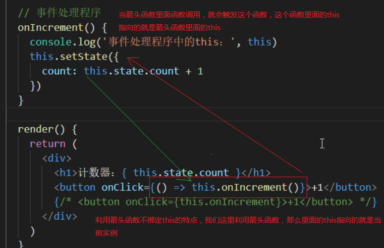
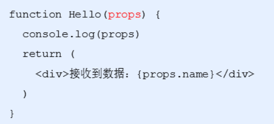
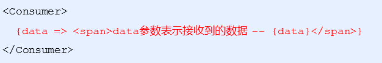

# 一、React基础知识点

## 1.目标

- 能够说出React是什么
- 能够说出React的特点
- 能够掌握React的基本使用
- 能够使用React脚手架

## 2.什么是React （★★★）

React是一个用于构建用户界面的javaScript库，起源于facebook的内部项目，后续在13年开源了出来

### 3.特点

- 声明式

你只需要描述UI看起来是什么样式，就跟写HTML一样，React负责渲染UI

- 基于组件

组件时React最重要的内容，组件表示页面中的部分内容

- 学习一次，随处使用

使用React可以开发Web应用，使用React可以开发移动端，可以开发VR应用

## 4.React基本使用

### 4.1.React的安装

npm i react react-dom 

- react 包是核心，提供创建元素，组件等功能
- react-dom 包提供DOM相关功能

### 4.2.React的使用

- 引入react和react-dom的两个js文件

```html
<script src="./node_modules/react/umd/react.development.js"></script>
<script src="./node_modules/react-dom/umd/react-dom.development.js"></script>
```

- 创建React元素

```javascript
// 创建元素节点
// 1. 元素名称
// 2. 元素属性 传递的是个对象
// 3. 元素内容
let title = React.createElement('li', null, 'hellow react');
```

- 渲染到页面

```javascript
// 渲染到页面
ReactDOM.render(title, root)
```

## 5.React脚手架（★★★）

### 5.1.React脚手架意义

- 脚手架是开发现代Web应用的必备
- 充分利用 Webpack，Babel，ESLint等工具辅助项目开发
- 零配置，无需手动配置繁琐的工具即可使用
- 关注业务，而不是工具配置

### 5.2.使用React脚手架初始化项目

- 初始化项目，命令： npx create-react-app my-pro
  - npx 目的：提升包内提供的命令行工具的使用体验
  - 原来：先安装脚手架包，再使用这个包中提供的命令
  - 现在：无需安装脚手架包，就可以直接使用这个包提供的命令
  - create-react-app  这个是脚手架名称 不能随意更改
  - my-pro  自己定义的项目名称
- 启动项目，在项目根目录执行命令： npm start

yarn命令简介

- yarn 是Facebook发布的包管理器，可以看做是npm的替代品，功能与npm相同
- yarn具有快速，可靠和安全的特点
- 初始化新项目：yarn init
- 安装包： yarn add 包名称
- 安装项目依赖： yarn

### 5.3.脚手架中使用React

- 导入react和react-dom两个包

```react
import React from 'react'
import ReactDOM from 'react-dom'
```

- 创建元素

```react
let h1 = React.createElement('h1',null,'我是标题')
```

- 渲染到页面

```react
ReactDOM.render(h1,document.getElementById('root'))
```

# 二、JSX的使用

## 1.目标

- 知道什么是JSX
- 能够使用JSX创建React元素
- 能够在JSX中使用JavaScript表达式
- 能够使用JSX的条件渲染和列表渲染
- 能够给JSX添加样式

## 2.概述

#### 2.1.JSX产生的原因

由于通过createElement()方法创建的React元素有一些问题，代码比较繁琐，结构不直观，无法一眼看出描述的结构，不优雅，用户体验不爽

#### 2.2.JSX的概述

JSX是JavaScript XML 的简写，表示在JavaScript代码中写HTML格式的代码

优势：声明式语法更加直观，与HTML结构相同，降低了学习成本，提升开发效率

## 3.简单入门使用（★★★）

#### 3.1.使用步骤

- 使用JSX语法创建react元素

```react
let h1 = <h1>我是通过JSX创建的元素</h1>
```

- 使用ReactDOM来渲染元素

```react
ReactDOM.render(h1,document.getElementById('root'))
```

#### 3.2.为什么在脚手架中可以使用JSX语法

- JSX 不是标准的ECMAScript语法，它是ECMAScript的语法拓展
- 需要使用babel编译处理后，才能在浏览器环境中使用
- create-react-app脚手架中已经默认有该配置，无需手动配置
- 编译JSX语法的包： @bable/preset-react

#### 3.3.注意点

- React元素的属性名使用驼峰命名法
- 特殊属性名：class -> className，for -> htmlFor，tabindex -> tabIndex
- 如果没有子节点的React元素可以用 `/>` 来结束
- 推荐：使用 小括号包裹JSX，从而避免JS中自动插入分号报错

## 4.JSX语法（★★★）

JSX是来描述页面的结构，我们一般在编写业务逻辑渲染页面的时候，需要涉及到传递值，调用函数，判断条件，循环等，这一些在JSX中都能得到支持

#### 4.1.嵌入JS表达式

语法：{JavaScritp表达式}

例子：

```react
let content = '插入的内容'
let h1 = <h1>我是通过JSX创建的元素+ {content}</h1>
```

##### 4.1.1.注意点

- 只要是合法的js表达式都可以进行嵌入
- JSX自身也是js表达式
- 注意：js中的对象是一个例外，一般只会出现在style属性中
- 注意：在{}中不能出现语句

#### 4.2.条件渲染

根据不同的条件来渲染不同的JSX结构

```react
let isLoading = true
let loading = ()=>{
    if(isLoading){
        return <div>Loading.</div>
    }
    return <div>加载完成</div>
}
const dv=(<div>{loading()}</div>)

ReactDOM.render(
  dv,
  document.getElementById('root')
);
```

可以发现，写JSX的条件渲染与我们之前编写代码的逻辑是差不多的，根据不同的判断逻辑，返回不同的 JSX结构，然后渲染到页面中

#### 4.3.列表渲染

- 如果需要渲染一组数据，我们应该使用数组的 map () 方法
- 注意：渲染列表的时候需要添加key属性，key属性的值要保证唯一
- 原则：map()遍历谁，就给谁添加key属性
- 注意：尽量避免使用索引号作为key

```react
let arr = [{
    id:1,
    name:'三国演义'
},{
    id:2,
    name:'水浒传'
},{
    id:3,
    name:'西游记'
},{
    id:4,
    name:'红楼梦'
}]
let ul = (<ul>
    {arr.map(item => <li key={item.id}>{item.name}</li>)}
</ul>)
ReactDOM.render(ul,document.getElementById('root'))
```

#### 4.4.样式处理

##### 4.4.1.行内样式 -style

在style里面我们通过对象的方式传递数据

```react
<li key={item.id} style={{'color': 'red',"backgroundColor": 'pink'}}>{item.name}</li>
```

这种方式比较的麻烦，不方便进行阅读，而且还会导致代码比较的繁琐

##### 4.4.2.类名 -className

创建CSS文件编写样式代码

```css
.container {
    text-align: center
}
```

在js中进行引入，然后设置类名即可

```react
import './css/index.css'

<li className='container' key={item.id} style={{'color': 'red',"backgroundColor": 'pink'}}>{item.name}</li>
```

### 5.小结

- JSX是React的核心内容
- JSX表示在JS代码中写HTML结构，是React声明式的体现
- 使用JSX配合嵌入的JS表达式、条件渲染、列表渲染、可以描述任意UI结构
- 推荐使用className的方式给JSX添加样式
- React完全利用JS语言自身的能力来编写UI，而不是造轮子增强HTML功能

# 三、React组件（1）

## 1.目标

- 能够使用函数创建组件
- 能够使用class创建组件
- 能够给React元素绑定事件
- 能够使用state和setState()
- 能够处理事件中的this指向问题

## 2.React组件介绍

- 组件是React的一等公民，使用React就是在用组件
- 组件表示页面中的部分功能
- 组合多个组件实现完整的页面功能
- 特点：可复用、独立、可组合


## 3.组件的创建方式

### 3.1.函数创建组件

- 函数组件：使用JS的函数创建组件
- **约定1：**函数名称必须以大写字母开头
- **约定2：**函数组件必须有返回值，表示该组件的结构
- 如果返回值为null，表示不渲染任何内容

#### 3.1.1.示例demo

编写函数组件

```react
function Hello() {
    return (
        
    )
}
```

利用ReactDOM.render()进行渲染

```react
ReactDOM.render(<Hello />,document.getElementById('root'))
```

### 3.2.类组件（★★★）

- 使用ES6语法的class创建的组件
- 约定1：类名称也必须要大写字母开头
- 约定2：类组件应该继承React.Component父类，从而可以使用父类中提供的方法或者属性
- 约定3：类组件必须提供 render 方法
- 约定4：render方法中必须要有return返回值

#### 3.2.1.示例demo

创建class类，继承React.Component，在里面提供render方法，在return里面返回内容

```react
class Hello extends React.Component{
    render(){
        return (
            <div>这是第一个类组件</div>
        )
    }
}
```

通过ReactDOM进行渲染

```react
ReactDOM.render(<Hello />,document.getElementById('root'))
```

### 3.3.抽离成单独的JS文件（★★★）

- 思考：项目中组件多了之后，该如何组织这些组件？
- 选择一：将所有的组件放在同一个JS文件中
- 选择二：将每个组件放到单独的JS文件中
- **组件作为一个独立的个体，一般都会放到一个单独的JS文件中**

#### 3.3.1.示例demo

- 创建Hello.js
- 在Hello.js 中导入React，创建组件，在Hello.js中导出

```react
import React from 'react'

export default class extends React.Component {
    render(){
        return (
            <div>单独抽离出来的 Hello</div>
        )
    }
}
```

- 在index.js中导入Hello组件，渲染到页面

```react
import Hello from './js/Hello'
ReactDOM.render(<Hello />,document.getElementById('root'))
```

## 4.React事件处理（★★★）

### 4.1.事件绑定

- React事件绑定语法与DOM事件语法相似
- 语法：on+事件名称=事件处理函数，比如  onClick = function(){}
- 注意：React事件采用驼峰命名法

#### 4.1.1.示例demo

```react
export default class extends React.Component {
    clickHandle(e){
        console.log('点了')
    }
    render(){
        return (
            <div><button onClick = {this.clickHandle}>点我点我点我</button></div>
        )
    }
}
```

#### 4.1.2.小结

- 在React中绑定事件与原生很类似
- 需要注意点在于，在React绑定事件需要遵循驼峰命名法
- 类组件与函数组件绑定事件是差不多的，只是在类组件中绑定事件函数的时候需要用到this，代表指向当前的类的引用，在函数中不需要调用this

### 4.2.事件对象

- 可以通过事件处理函数的参数获取到事件对象
- React中的事件对象叫做：合成事件
- 合成事件：兼容所有浏览器，无需担心跨浏览器兼容问题
- 除兼容所有浏览器外，它还拥有和浏览器原生事件相同的接口，包括 `stopPropagation()`和 `preventDefault()`
- 如果你想获取到原生事件对象，可以通过 `nativeEvent` 属性来进行获取

#### 4.2.1.示例demo

```react
export default class extends React.Component {
    clickHandle(e){
        // 获取原生事件对象
        console.log(e.nativeEvent)
    }
    render(){
        return (
            <div><button onClick = {this.clickHandle}>点我点我点我</button></div>
        )
    }
}
```

### 4.3.支持的事件（有兴趣的课下去研究）

- Clipboard Events  剪切板事件

  - 事件名 ：onCopy onCut onPaste
  - 属性     ：DOMDataTransfer clipboardData

- compositionEvent  复合事件

  - 事件名： onCompositionEnd onCompositionStart onCompositionUpdate
  - 属性： string data

- Keyboard Events  键盘事件

  - 事件名：onKeyDown onKeyPress onKeyUp
  - 属性： 例如 number keyCode  太多就不一一列举

- Focus Events  焦点事件  （这些焦点事件在 React DOM 上的所有元素都有效，不只是表单元素）

  - 事件名： onFocus onBlur
  - 属性： DOMEventTarget relatedTarget

- Form Events  表单事件

  - 事件名： onChange onInput onInvalid onSubmit

- Mouse Events  鼠标事件

  - 事件名：

    ```react
    onClick onContextMenu onDoubleClick onDrag onDragEnd onDragEnter onDragExit
    onDragLeave onDragOver onDragStart onDrop onMouseDown onMouseEnter onMouseLeave
    onMouseMove onMouseOut onMouseOver onMouseUp
    ```

- Pointer Events  指针事件

  - 事件名：

    ```react
    onPointerDown onPointerMove onPointerUp onPointerCancel onGotPointerCapture
    onLostPointerCapture onPointerEnter onPointerLeave onPointerOver onPointerOut
    ```

- Selection Events  选择事件

  - 事件名：onSelect

- Touch Events  触摸事件

  - 事件名：onTouchCancel onTouchEnd onTouchMove onTouchStart

- UI Events  UI 事件

  - 事件名： onScroll

- Wheel Events  滚轮事件

  - 事件名：onWheel

  - 属性： 

    ```react
    number deltaMode
    number deltaX
    number deltaY
    number deltaZ
    ```

- Media Events  媒体事件

  - 事件名：

    ```react
    onAbort onCanPlay onCanPlayThrough onDurationChange onEmptied onEncrypted
    onEnded onError onLoadedData onLoadedMetadata onLoadStart onPause onPlay
    onPlaying onProgress onRateChange onSeeked onSeeking onStalled onSuspend
    onTimeUpdate onVolumeChange onWaiting
    ```

- Image Events 图像事件

  - 事件名：onLoad onError

- Animation Events 动画事件

  - 事件名：onAnimationStart onAnimationEnd onAnimationIteration

- Transition Events 过渡事件

  - 事件名：onTransitionEnd

- Other Events  其他事件

  - 事件名： onToggle

### 4.4.有状态组件和无状态组件

- 函数组件又叫做 无状态组件，类组件又叫做 有状态组件
- 状态(state) 即数据
- 函数组件没有自己的状态，只负责数据展示
- 类组件有自己的状态，负责更新UI，让页面动起来


## 5.State和SetState（★★★）

### 5.1.state基本使用

- 状态(state)即数据，是组件内部的私有数据，只能在组件内部使用
- state的值是对象，表示一个组件中可以有多个数据
- 通过this.state来获取状态

#### 5.1.1.示例demo

```react
export default class extends React.Component {
    constructor(){
        super()

        // 第一种初始化方式
        this.state = {
            count : 0
        }
    }
    // 第二种初始化方式(简化语法)
    state = {
        count:1
    }
    render(){
        return (
            <div>计数器 :{this.state.count}</div>
        )
    }
}
```

### 5.2.setState() 修改状态

- 状态是可变的
- 语法：this.setState({要修改的数据})
- **注意：不要直接修改state中的值，这是错误的**
- setState() 作用：1.修改 state 2.更新UI
- 思想：数据驱动视图


#### 5.2.1.示例demo

```react
export default class extends React.Component {
    // 第二种初始化方式
    state = {
        count:1
    }
    render(){
        return (
            <div>
                <div>计数器 :{this.state.count}</div>
                <button onClick={() => {
                     this.setState({
            	 		count: this.state.count+1
           			  })   
                }}>+1</button>
            </div>
        )
    }
}
```

#### 5.2.2.小结

- 修改state里面的值我们需要通过 this.setState() 来进行修改
- React底层会有监听，一旦我们调用了setState导致了数据的变化，就会重新调用一次render方法，重新渲染当前组件

### 5.3.抽取事件处理函数

- 当我们把上面代码的事件处理程序抽取出来后，会报错，找不到this


#### 5.3.1.原因

- 在JSX中我们写的事件处理函数可以找到this，原因在于在JSX中我们利用箭头函数，箭头函数是不会绑定this，所以会向外一层去寻找，外层是render方法，在render方法里面的this刚好指向的是当前实例对象

## 6.事件绑定this指向

### 6.1.箭头函数

- 利用箭头函数自身不绑定this的特点



### 6.2.利用bind方法（★★★）

​	利用原型bind方法是可以更改函数里面this的指向的，所以我们可以在构造中调用bind方法，然后把返回的值赋值给我们的函数即可

```react
class App extends React.Component {
  constructor() {
    super()
	.
    // 通过bind方法改变了当前函数中this的指向
    this.onIncrement = this.onIncrement.bind(this)
  }
  // 事件处理程序
  onIncrement() {
    .
  }

  render() {
    .
  }
}
```

### 6.3.class的实例方法（★★★）

- 利用箭头函数形式的class实例方法
- 注意：该语法是实验性语法，但是，由于babel的存在可以使用

```react
  // 事件处理程序
  onIncrement = () => {
    console.log('事件处理程序中的this：', this)
    this.setState({
      count: this.state.count + 1
    })
  }
```

### 6.4.小结

- 推荐：使用class的实例方法，也是依赖箭头函数不绑定this的原因

# 三、React组件（2）

## 1.目标

- 能够知道受控组件是什么
- 能够写出受控组件
- 了解非受控组件

## 2.表单处理

### 2.1.受控组件（★★★）

- HTML中的表单元素是可输入的，也就是有自己的可变状态
- 而React中可变状态通常保存在state中，并且只能通过`setState()` 方法来修改
- React讲state与表单元素值value绑定在一起，有state的值来控制表单元素的值
- 受控组件：值受到react控制的表单元素


#### 2.1.1.使用步骤

- 在state中添加一个状态，作为表单元素的value值
- 给表单元素绑定change事件，将表单元素的值设置为state的值

#### 2.1.2.示例demo

```react
class App extends React.Component {
    constructor(){
        super()
        this.inputChange = this.inputChange.bind(this)
    }
    state = {
        txt : ''
    }
    inputChange(e){
       this.setState({
           txt: e.target.value
       })
    }
    render(){
        console.log(this.state);
        
        return (
            <div>
                {/* 把state的值设置给输入框的value，绑定change事件，这样用户在输入内容的时候调用相应函数，在函数里面把当前设置的值赋值给state，从而达到数据的统一 */}
                <input type="text" value={this.state.txt} onChange={this.inputChange}/>
            </div>
        )
    }
}
ReactDOM.render(<App />,document.getElementById('root'))
```

#### 2.1.3.多表单元素优化

- 问题：每个表单元素都有一个单独的事件处理函数，这样太繁琐
- 优化：使用一个事件处理程序同时处理多个表单元素

##### 步骤

- 给表单元素添加name属性（用来区分是哪一个表单），名称与state相同（用来更新数据的）
- 根据表单内容来获取对应值
- 在change事件处理程序中通过 [name] 来修改对应的state

##### 示例demo

```react
inputChange(e){
   let target = e.target;
   let value = target.type == 'checkbox' ? target.checked : target.value;
   this.setState({
       [e.target.name]: value
   })
}
<input type="text" value={this.state.txt} name="txt" onChange={this.inputChange}/>
<input type="checkbox" value={this.state.isChecked} name="isChecked" onChange={this.inputChange}/>
```

### 2.2.非受控组件 （了解）

- 说明：借助于ref，使用元素DOM方式获取表单元素值
- ref的作用：获取DOM或者组件

### 2.3.ref回调形式

```jsx
//创建组件
		class Demo extends React.Component{
			//展示左侧输入框的数据
			showData = ()=>{
				const {input1} = this
				alert(input1.value)
			}
			//展示右侧输入框的数据
			showData2 = ()=>{
				const {input2} = this
				alert(input2.value)
			}
			render(){
				return(
					<div>
						<input ref={c => this.input1 = c } type="text" placeholder="点击按钮提示数据"/>&nbsp;
						<button onClick={this.showData}>点我提示左侧的数据</button>&nbsp;
						<input onBlur={this.showData2} ref={c => this.input2 = c } type="text" 			  											placeholder="失去焦点提示数据"/>&nbsp;
					</div>
				)
			}
		}
```

#### 2.2.1.使用步骤

- 调用 `React.createRef()` 方法创建ref对象
- 将创建好的 ref 对象添加到文本框中
- 通过ref对象获取到文本框的值

```react
class App extends React.Component {
    constructor(){
        super()
        
        //创建 ref
        this.txtRef = React.createRef()
    }
    // 获取文本框的值
    getTxt =() => {
        console.log(this.txtRef.current.value)
    }
    render(){
        return (
          <div>
            <input type ="text" ref={this.txtRef} />
            <button onClick ={this.getTxt}>获取值</button>
          </div>
        )
    }
}
```

# 四、React组件综合案例（★★★）

## 1.需求分析

- 渲染评论列表（列表渲染）
- 没有评论数据时渲染：暂无评论（条件渲染）
- 获取评论信息，包括评论人和评论内容（受控组件）
- 发表评论，更新评论列表（`setState()`）


## 2.搭建评论列表的模板

- 结构

```react
import React from 'react'
import ReactDOM from 'react-dom'

/* 
  评论列表案例

  comments: [
    { id: 1, name: 'jack', content: '沙发！！！' },
    { id: 2, name: 'rose', content: '板凳~' },
    { id: 3, name: 'tom', content: '楼主好人' }
  ]
*/

import './index.css'

class App extends React.Component {
  render() {
    return (
      <div className="app">
        <div>
          <input className="user" type="text" placeholder="请输入评论人" />
          <br />
          <textarea
            className="content"
            cols="30"
            rows="10"
            placeholder="请输入评论内容"
          />
          <br />
          <button>发表评论</button>
        </div>

        <div className="no-comment">暂无评论，快去评论吧~</div>
        <ul>
          <li>
            <h3>评论人：jack</h3>
            <p>评论内容：沙发！！！</p>
          </li>
        </ul>
      </div>
    )
  }
}

// 渲染组件
ReactDOM.render(<App />, document.getElementById('root'))
```

- 样式

```css
.app {
  width: 300px;
  padding: 10px;
  border: 1px solid #999;
}

.user {
  width: 100%;
  box-sizing: border-box;
  margin-bottom: 10px;
}

.content {
  width: 100%;
  box-sizing: border-box;
  margin-bottom: 10px;
}

.no-comment {
  text-align: center;
  margin-top: 30px;
}
```

## 3.渲染评论列表

- 在state中初始化评论列表数据

```react
  state = {
    comments: [
      { id: 1, name: 'jack', content: '沙发！！！' },
      { id: 2, name: 'rose', content: '板凳~' },
      { id: 3, name: 'tom', content: '楼主好人' }
    ]
  }
```

- 使用数组的map方法遍历state中的列表数据
- 给每一个被遍历的li元素添加key属性
- 在render方法里的ul节点下嵌入表达式

```react
{
  this.state.comments.map(item => {
    return (
       <li key={item.id}>
          <h3>{item.name}</h3>
          <p>{item.content}</p>
       </li>
    )
  })
}
```

## 4.渲染暂无评论

- 判断列表数据的长度是否为0
- 如果为0，则渲染暂无评论
- 如果不为0，那么渲染列表数据

- 在jsx中大量写逻辑会导致很臃肿，所以我们可以把条件渲染的逻辑抽取成一个函数

```react
/**
 * 条件渲染，这里抽取出来了，这样在结构中不会很混乱
 */
renderList(){
  if (this.state.comments.length === 0) {
    return (<div className="no-comment">暂无评论，快去评论吧~</div>)
  } else {
    return (
      <ul> {
        this.state.comments.map(item => {
          return (
            <li key={item.id}>
              <h3>{item.name}</h3>
              <p>{item.content}</p>
            </li>
          )
        })
      }
      </ul>
    )
  }
}
```

- 在render的return方法里面调用这个函数即可

```react
render() {
    return (
        <div>. {/* 通过条件渲染来判断是否显示暂无评论 */} {this.renderList()} </div> 
    )}
```

## 5.获取评论信息

- 通过受控组件来获取内容
- 初始化用户名和用户内容的state

```react
userName: '',
userContent: ''
```

- 在结构中，把表单元素的value与state进行绑定，还需要绑定name属性和onChange属性

```react
<input className="user" type="text" placeholder="请输入评论人" value={this.state.userName} name="userName" onChange={this.handleForm}/>
<br />
<textarea  className="content" cols="30" rows="10" placeholder="请输入评论内容" value={this.state.userContent}  name="userContent"  onChange={this.handleForm}/>
```

- 在`handleFrom`函数中利用`setState`来让数据保持一致

```react
  handleForm = (e) => {    
      this.setState({ 
          [e.target.name] : e.target.value
      })
  }
```

## 3.发表评论

- 给按钮绑定事件
- 在事件处理程序中，通过state获取评论信息
- 将评论信息添加到state中，利用setState来更新页面
- 添加评论前需要判断用户是否输入内容
- 添加评论后，需要情况文本框用户输入的值

```react
handleClick = (e) => {  
    // 拿到用户输入的内容  
 let {userName,userContent} = this.state  
 if(userName.trim()==='' || userContent.trim() === ''){ 
     alert('请输入内容')      
     return 
 } 
    // 利用数组拓展运算符来进行数据的拼接，把用户输入的存放在数组的第一个位置  
    let newComments = [{    
        id: this.state.comments.length+1,   
        name: userName,
        content: userContent  
    },
    .this.state.comments
  ]  
    this.setState({    
        comments: newComments,    
        userName:'',    
        userContent: ''  
    })
}
```

# 五、React组件进阶

## 1.目标

- 能够使用props接收数据
- 能够实现父子组件之间的通讯
- 能够实现兄弟组件之间的通讯
- 能够给组件添加props校验

## 2.组件通讯介绍

组件是独立且封闭的单元，默认情况下，只能使用组件自己的数据。在组件化过程中，我们将一个完整的功能拆分成多个组件，以更好的完成整个应用的功能。而在这个过程中，多个组件之间不可避免的要共享某些数据。为了实现这些功能，就需要打破组件的独立封闭性，让其与外界沟通，这个过程就是组件通讯

## 3.组件的props（★★★）

### 3.1.基本使用

- 组件时封闭的，要接受外部数据应该通过props来实现
- props的作用：接收传递给组件的数据
- 传递数据：给组件标签添加属性


- 接收数据：函数组件通过 参数 props接收数据，类组件通过 this.props接收数据

  - 函数组件获取

    

  - 类组件获取

    


​    

### 3.2.特点

- 可以给组件传递任意类型的数据
- props是只读属性，不能对值进行修改
- 注意：使用类组件时，如果写了构造函数，应该将props传递给super(),否则，无法在构造函数中获取到props，其他的地方是可以拿到的


## 4.组件通讯的三种方式（★★★）

### 4.1.父组件传递数据给子组件

- 父组件提供要传递的state数据
- 给子组件标签添加属性，值为state中的数据
- 子组件中通过props接收父组件中传递的数据


### 4.2.子组件传递数据给父组件

- 利用回调函数，父组件提供回调，子组件调用，将要传递的数据作为回调函数的参数
- 父组件提供一个回调函数，用来接收数据
- 将该函数作为属性的值，传递给子组件


- 子组件通过props调用回调函数


### 4.3.兄弟组件传递

- 将共享状态(数据)提升到最近的公共父组件中，由公共父组件管理这个状态
- 这个称为状态提升
- 公共父组件职责：1. 提供共享状态 2.提供操作共享状态的方法
- 要通讯的子组件只需要通过props接收状态或操作状态的方法


#### 4.3.1.示例demo

- 定义布局结构，一个Counter里面包含两个子组件，一个是计数器的提示，一个是按钮

```react
class Counter extends React.Component {
  render() {
    return (<div>
      <Child1 />
      <Child2 />
    </div>)
  }
}
class Child1 extends React.Component {
  render() {
    return (<h1>计数器：</h1>)
  }
}
class Child2 extends React.Component {
  render() {
    return (
      <button>+1</button>
    )
  }
}
```

- 在父组件里定义共享状态，把这个状态传递给第一个子组件

```react
class Counter extends React.Component {
  // 提供共享的状态    
  state = {
    count: 0
  }
  render() {
    return (
      <div>
        {/* 把状态提供给第一个子组件 */}
        <Child1 count={this.state.count} />
        <Child2 />
      </div>
    )
  }
}
```

- 在第一个子组件里面就能通过props获取到

```react
class Child1 extends React.Component {
  render() {
    return (
      <h1>计数器：{this.props.count}</h1>)
  }
}
```

- 在父组件中提供共享方法，通过属性传递给第二个子组件，方便第二个子组件来进行调用

```react
// 提供共享方法    
onIncrement = (res) => {
  // 只要第二个子组件调用了这个函数，就会执行里面代码        
  this.setState({
    count: this.state.count + res
  })
}
render() {
  return (<div>            .
    {/* 把共享方法提供给第二个子组件 */}
    <Child2 onIncrement={this.onIncrement} />
  </div>)
}
```

- 在第二个子组件里面通过props来获取到对应函数，然后进行调用

```react
class Child2 extends React.Component {
  handleClick = () => {
    // 这里一旦调用，就会执行父组件里面 onIncrement函数        
    this.props.onIncrement(2)
  }
  render() {
    return (
      <button onClick={this.handleClick}>+</button>
    )
  }
}
```

## 5.Context（★★★）

如果出现层级比较多的情况下（例如：爷爷传递数据给孙子），我们会使用Context来进行传递

作用： 跨组件传递数据

### 5.1.使用步骤

- 调用 `React.createContext()` 创建 Provider(提供数据) 和 Consumer(消费数据) 两个组件


- 使用Provider 组件作为父节点


- 设置value属性，表示要传递的数据


- 哪一层想要接收数据，就用Consumer进行包裹，在里面回调函数中的参数就是传递过来的值



### 5.2.小结

- 如果两个组件相隔层级比较多，可以使用Context实现组件通讯
- Context提供了两个组件：Provider 和 Consumer
- Provider组件： 用来提供数据
- Consumer组件： 用来消费数据

## 6.props进阶

### 6.1.children属性

- children属性： 表示组件标签的子节点，当组件标签有子节点时，props就会有该属性
- children属性与普通的props一样，值可以使任意值（文本、react元素、组件、甚至是函数）


### 6.2.props校验（★★★）

- 对于组件来说，props是外来的，无法保证组件使用者传入什么格式的数据，简单来说就是组件调用者可能不知道组件封装着需要什么样的数据
- 如果传入的数据不对，可能会导致报错
- 关键问题：组件的使用者不知道需要传递什么样的数据
- props校验：允许在创建组件的时候，指定props的类型、格式等


- 作用：捕获使用组件时因为props导致的错误，给出明确的错误提示，增加组件的健壮性


#### 6.2.1.使用步骤

- 安装包  `prop-types (yarn add prop-types | npm i props-types)`
- 导入prop-types 包
- 使用`组件名.propTypes={}` 来给组件的props添加校验规则
- 校验规则通过PropTypes对象来指定


#### 6.2.2.常见的约束规则

- 创建的类型： `array、bool、func、number、object、string`
- React元素类型：`element`
- 必填项：`isRequired`
- 特定结构的对象： `shape({})`
- 更多的[约束规则](<https://zh-hans.reactjs.org/docs/typechecking-with-proptypes.html#proptypes>)


### 6.2.3.props的默认值

- 场景：分页组件 -> 每页显示条数


## 7.消息订阅与发布机制

## 7.1.什么是什么是 pubsub?

​	PubSubJS is a topic-based publish/subscribe library written in JavaScript.即 一个利用JavaScript进行发布/订阅的库， 可用于不同组件之间的传值 

## 7.2.安装

yarn add pubsub-js 或npm i pubsub-js

## 7.2.使用

### 7.2.1.发布消息

```js
import PubSub from 'pubsub-js'//引用 注意：哪里需要就在哪里引用
PubSub.publish('name',value)//name：发布的消息名 注意：不同类别消息发布使用的消息名字应该不同，value：发布内容
```

### 7.2.2.订阅消息

```js
token = PubSub.subscribe('name',(msg,data)=>{
        console.log(msg) // 这里将会输出对应设置的 pubsubID
        console.log(data) // 这里将会输出对应设置的参数（发布来的消息）
})
```

### 7.2.3.取消订阅

```js
componentWillUnmount() {
//取消指定的订阅
 Pubsub.unsubscribe('name')
// 取消全部订阅
    PubSub.clearAllSubscriptions()
}
```

## 7.4.总结

1. 先订阅，再发布（理解：有一种隔空对话的感觉）
2. 适用于任意组件间通信
3. 要在组件的componentWillUnmount中取消订阅

# 六、组件生命周期（★★★）

## 1.目标

- 说出组件生命周期对应的钩子函数
- 钩子函数调用的时机

## 2.概述

意义：组件的生命周期有助于理解组件的运行方式，完成更复杂的组件功能、分析组件错误原因等

组件的生命周期： 组件从被创建到挂载到页面中运行，再到组件不在时卸载的过程

生命周期的每个阶段总是伴随着一些方法调用，这些方法就是生命周期的钩子函数

构造函数的作用：为开发人员在不同阶段操作组件提供了实际

## 3.生命周期阶段


### 3.1.创建时（挂载阶段）

- 执行时机：组件创建时（页面加载时）
- 执行顺序


### 3.2.更新时

执行时机：`setState()、 forceUpdate()、 组件接收到新的props`

说明：以上三者任意一种变化，组件就会重新渲染

执行顺序：


### 3.3.卸载时

执行时机：组件从页面中消失

作用：用来做清理操作


### 3.4.不常用的钩子函数

#### 3.4.1.旧版的生命周期钩子函数


#### 3.4.2.新版完整生命会走棋钩子函数


##### `getDerivedStateFromProps()`

- **`getDerivedStateFromProps`** 会在调用 render 方法之前调用，并且在初始挂载及后续更新时都会被调用。它应返回一个对象来更新 state，如果返回 null 则不更新任何内容
- 不管原因是什么，都会在*每次*渲染前触发此方法

##### `shouldComponentUpdate()`

- 根据 **`shouldComponentUpdate()`** 的返回值，判断 React 组件的输出是否受当前 state 或 props 更改的影响。默认行为是 state 每次发生变化组件都会重新渲染
- 当 props 或 state 发生变化时，**`shouldComponentUpdate()`** 会在渲染执行之前被调用。返回值默认为 true

##### `getSnapshotBeforeUpdate()`

- **`getSnapshotBeforeUpdate()`** 在最近一次渲染输出（提交到 DOM 节点）之前调用。它使得组件能在发生更改之前从 DOM 中捕获一些信息（例如，滚动位置）。此生命周期的任何返回值将作为参数传递给 **`componentDidUpdate()`**
- 此用法并不常见，但它可能出现在 UI 处理中，如需要以特殊方式处理滚动位置的聊天线程等

# 七、render-props模式 （★★★）

## 1.目标

- 知道render-props模式有什么作用
- 能够说出render-props的使用步骤

## 2.React组件复用概述

- 思考：如果两个组件中的部分功能相似或相同，该如何处理？
- 处理方式：复用相似的功能
- 复用什么？
  - state
  - 操作state的方法
- 两种方式：
  - render props模式
  - 高阶组件（HOC）
- 注意： 这两种方式不是新的API，而是利用React自身特点的编码技巧，演化而成的固定模式

## 3.思路分析

- 思路：将要复用的state和操作state的方法封装到一个组件中

- 如何拿到该组件中复用的state

  - 在使用组件时，添加一个值为函数的prop，通过函数参数来获取

    

- 如何渲染到任意的UI

  - 使用该函数的返回值作为要渲染的UI内容

    

## 4.使用步骤

- 创建Mouse组件，在组件中提供复用的逻辑代码
- 将要复用的状态作为 props.render(state)方法的参数，暴露到组件外部
- 使用props.render() 的返回值作为要渲染的内容


#### 4.1.示例demo

```react
class Mouse extends React.Component {
    // 鼠标位置状态
    state = {
        x: 0,
        y: 0
    }

    // 监听鼠标移动事件
    componentDidMount(){
        window.addEventListener('mousemove',this.handleMouseMove)
    }
    handleMouseMove = e => {
        this.setState({
            x: e.clientX,
            y: e.clientY
        })
    }
    render(){
        // 向外界提供当前子组件里面的数据
        return this.props.render(this.state)
    }
}
class App extends React.Component {
    render() {
        return (
            <div>
                App
                <Mouse render={mouse => {
                    return <p>X{mouse.x}Y{mouse.y}</p>
                }}/>
            </div>
        )
    }
}
ReactDOM.render(<App />,document.getElementById('root'))
```

## 5.children代替render属性

- 注意：并不是该模式叫 render props就必须使用名为render的prop，实际上可以使用任意名称的prop
- 把prop是一个函数并且告诉组件要渲染什么内容的技术叫做： render props模式
- 推荐：使用childre代替render属性


## 6.优化代码

- 推荐给render props模式添加props校验


-  


# 八、高阶组件 （★★★）

## 1.目标

- 知道高阶组件的作用
- 能够说出高阶的使用步骤

## 2.概述

- 目的：实现状态逻辑复用
- 采用 包装模式
- 手机：获取保护功能
- 手机壳：提供保护功能
- 高阶组件就相当于手机壳，通过包装组件，增强组件功能


## 3.思路分析

- 高阶组件(HOC、Higher-Order Component) 是一个函数，接收要包装的组件，返回增强后的组件


- 高阶组件内部创建了一个类组件，在这个类组件中提供复用的状态逻辑代码，通过prop将复用的状态传递给被包装组件`WrappedComponent`


## 4.使用步骤

- 创建一个函数，名称约定以with开头
- 指定函数参数，参数应该以大写字母开头
- 在函数内部创建一个类组件，提供复用的状态逻辑代码，并返回
- 在该组件中，渲染参数组件，同时将状态通过prop传递给参数组件
- 调用该高阶组件，传入要增强的组件，通过返回值拿到增强后的组件，并将其渲染到页面

**包装函数**

```react
// 定义一个函数，在函数内部创建一个相应类组件
function withMouse(WrappedComponent) {
    // 该组件提供复用状态逻辑
    class Mouse extends React.Component {
        state = {
            x: 0,
            y: 0
        }
        // 事件的处理函数
        handleMouseMove = (e) => {
            this.setState({
                x: e.clientX,
                y: e.clientY
            })
        }
        // 当组件挂载的时候进行事件绑定
        componentDidMount() {
            window.addEventListener('mousemove', this.handleMouseMove)
        }
        // 当组件移除时候解绑事件
        componentWillUnmount() {
            window.removeEventListener('mousemove', this.handleMouseMove)
        }
        render() {
            // 在render函数里面返回传递过来的组件，把当前组件的状态设置进去
            return <WrappedComponent {.this.state} />
        }
    }
    return Mouse
}
```

**哪个组件需要加强，通过调用`withMouse`这个函数，然后把返回的值设置到父组件中即可**

```react
function Position(props) {
    return (
        <p>
            X:{props.x}
            Y:{props.y}
        </p>
    )
}
// 把position 组件来进行包装
let MousePosition = withMouse(Position)

class App extends React.Component {
    constructor(props) {
        super(props)
    }
    render() {
        return (
            <div>
                高阶组件
                <MousePosition></MousePosition>
            </div>
        )
    }
}
```

## 5.设置`displayName`

- 使用高阶组件存在的问题：得到两个组件的名称相同
- 原因：默认情况下，React使用组件名称作为`displayName`
- 解决方式：为高阶组件设置`displayName`，便于调试时区分不同的组件
- `displayName的作用：用于设置调试信息(React Developer Tools信息)`
- 设置方式：


## 6.传递props

- 问题：如果没有传递props，会导致props丢失问题
- 解决方式： 渲染`WrappedComponent`时，将state和props一起传递给组件


## 7.小结

- 组件通讯是构建React应用必不可少的一环
- props的灵活性让组件更加强大
- 状态提升是React组件的常用模式
- 组件生命周期有助于理解组件的运行过程
- 钩子函数让开发者可以在特定的时机执行某些功能
- `render props` 模式和高阶组件都可以实现组件状态逻辑的复用
- 组件极简模型： `(state,props) => UI`

# 九、React原理

## 1.目标

- 能够知道`setState()`更新数据是异步的
- 能够知道JSX语法的转化过程  

## 2.`setState()`说明 （★★★）

### 2.1.更新数据

- `setState()`更新数据是异步的
- 注意：使用该语法，后面的`setState`不要依赖前面`setState`的值
- 多次调用`setState`，只会触发一次render

### 2.2.推荐语法 

- 推荐：使用 `setState((state,props) => {})` 语法
- 参数state： 表示最新的state
- 参数props： 表示最新的props


### 2.3.第二个参数

- 场景：在状态更新(页面完成重新渲染)后立即执行某个操作
- 语法：`setState(update[,callback])`


## 2.4.JSX语法的转化过程 （★★★）

- JSX仅仅是`createElement()` 方法的语法糖(简化语法)
- JSX语法被 @babel/preset-react 插件编译为`createElement()` 方法
- React 元素： 是一个对象，用来描述你希望在屏幕上看到的内容


# 十、React原理揭秘

## 1.目标

- 能够说出React组件的更新机制
- 能够对组件进行性能优化
- 能够说出虚拟DOM和DIff算法

## 2.组件更新机制

- setState() 的两个作用
  - 修改state
  - 更新组件

- 过程：父组件重新渲染时，也会重新渲染子组件，但只会渲染当前组件子树（当前组件以其所有子组件）


## 3.组件性能优化

### 3.1.减轻state

- 减轻state：只存储跟组件渲染相关的数据（比如：count/ 列表数据 /loading等）
- 注意：不用做渲染的数据不要放在state中
- 对于这种需要在多个方法中用到的数据，应该放到this中


### 3.2.避免不必要的重新渲染

- 组件更新机制：父组件更新会引起子组件也被更新，这种思路很清晰
- 问题：子组件没有任何变化时也会重新渲染
- 如果避免不必要的重新渲染？
- 解决方式：使用钩子函数 shouldComponentUpdate(nextProps, nextState)
  - 在这个函数中，nextProps和nextState是最新的状态以及属性
- 作用：这个函数有返回值，如果返回true，代表需要重新渲染，如果返回false，代表不需要重新渲染
- 触发时机：更新阶段的钩子函数，组件重新渲染前执行(shouldComponentUpdate => render)


#### 3.2.1.随机数案例

需求：随机生成数字，显示在页面，如果生成的数字与当前显示的数字相同，那么就不需要更新UI，反之更新UI。

利用nextState参数来判断当前组件是否需要更新

```react
class App extends React.Component {
    state = {
        number: 0
    }
    // 点击事件，每次点击生成一个随机数
    hanldeBtn = () => {
        this.setState({
            number: Math.floor(Math.random() * 3)
        })
    }
    // 将要更新UI的时候会执行这个钩子函数
    shouldComponentUpdate(nextProps,nextState) {
         // 判断一下当前生成的 值是否与页面的值相等
         if(nextState.number !== this.state.number){
             return true
         }
         return false
    }
    render() {
        return (
            <div>
                随机数：{this.state.number} <br />
                <button onClick={this.hanldeBtn}>生成随机数</button>
            </div>
        )
    }
}
```

利用props参数来判断是否需要进行更新

```react
class App extends React.Component {
    state = {
        number: 0
    }
    // 点击事件，每次点击生成一个随机数
    hanldeBtn = () => {
        this.setState({
            number: Math.floor(Math.random() * 3)
        })
    }

    render() {
        return (
            <div>
                <NumberBox number={this.state.number} />
                <button onClick={this.hanldeBtn}>生成随机数</button>
            </div>
        )
    }
}
class NumberBox extends React.Component {
    // 将要更新UI的时候会执行这个钩子函数
    shouldComponentUpdate(nextProps, nextState) {
        // 判断一下当前生成的 值是否与页面的值相等
        if (nextProps.number !== this.props.number) {
            return true
        }
        return false
    }
    render() {
        return (
            <h1>随机数：{this.props.number} </h1>
        )
    }
}
```

### 3.3.纯组件

#### 3.3.1.作用以及使用

- 纯组件： PureComponent 与 React.Component 功能相似
- 区别： PureComponent 内部自动实现了 shouldComponentUpdate钩子，不需要手动比较
- 原理：纯组件内部通过分别比对前后两次 props和state的值，来决定是否重新渲染组件


#### 3.3.2.实现原理

- 说明：纯组件内部的对比是 shallow compare（浅层对比）
- 对于值类型来说：比较两个值是否相同


- 引用类型：只比对对象的引用地址是否相同


- 注意：state 或 props 中属性值为引用类型时，应该创建新数据，不要直接修改原数据


## 4.虚拟DOM和Diff算法

- React更新视图的思想是：只要state变化就重新渲染视图
- 特点：思路非常清晰
- 问题：组件中只有一个DOM元素需要更新时，也得把整个组件的内容重新渲染吗？ 不是这样的
- 理想状态：部分更新，只更新变化的地方
- React运用的核心点就是 虚拟DOM 配合 Diff 算法

### 4.1.虚拟DOM

本质上就是一个JS对象，用来描述你希望在屏幕上看到的内容


### 4.2.Diff算法

执行过程

- 初次渲染时，React会根据初始化的state（model），创建一个虚拟DOM对象（树）
- 根据虚拟DOM生成真正的DOM，渲染到页面
- 当数据变化后(setState())，会重新根据新的数据，创建新的虚拟DOM对象（树）
- 与上一次得到的虚拟DOM对象，使用Diff算法比对（找不同），得到需要更新的内容
- 最终，React只将变化的内容更新（patch）到DOM中，重新渲染到页面


### 4.3.代码演示

- 组件render()调用后，根据状态和JSX结构生成虚拟DOM对象(render()方法的调用并不意味着浏览器进行渲染，render方法调用时意味着Diff算法开始比对了)
- 示例中，只更新p元素的文本节点内容
- 初次渲染的DOM对象


- 数据更新之后的虚拟DOM对象


## 5.小结

- 工作角度：应用第一，原理第二
- 原理有助于更好的理解React的自身运行机制
- setState() 异步更新数据
- 父组件更新导致子组件更新，纯组件提升性能
- 思路清晰简单为前提，虚拟DOM和Diff保效率（渲染变化的组件）
- 虚拟DOM -> state + JSX
- 虚拟DOM最大的特点是 脱离了浏览器的束缚，也就是意味着只要是能支持js的地方都可以用到react，所以为什么说react是可以进行跨平台的开发

# 十一、react脚手架配置代理

## 1、方法一

> 在package.json中追加如下配置

```json
"proxy":"http://localhost:5000"
```

说明：

1. 优点：配置简单，前端请求资源时可以不加任何前缀。
2. 缺点：不能配置多个代理。
3. 工作方式：上述方式配置代理，当请求了3000不存在的资源时，那么该请求会转发给5000 （优先匹配前端资源）

## 2、方法二

1. 第一步：创建代理配置文件

   ```
   在src下创建配置文件：src/setupProxy.js
   ```

2. 编写setupProxy.js配置具体代理规则：

   ```js
   const { createProxyMiddleware } = require("http-proxy-middleware")
   module.exports = function (app) {
     app.use(
       createProxyMiddleware("/api1",{//遇见/api1前缀的请求，就会触发该代理配置
         target: "http://localhost:5000", ////请求转发给需要代理的服务器(能返回数据的服务器地址)
         changeOrigin: true, //控制服务器接收到的请求头中host字段的值
         pathRewrite: { "^/api1": "" }, //重写请求路径(必须)
       }),
       ccreateProxyMiddleware("/api2",{//遇见/api1前缀的请求，就会触发该代理配置
         target: "http://localhost:5001", ////请求转发给需要代理的服务器(能返回数据的服务器地址)
         changeOrigin: true, //控制服务器接收到的请求头中host字段的值
         pathRewrite: { "^/api2": "" }, //重写请求路径(必须)
       }),
     )
   }
   ```

说明：

1. 优点：可以配置多个代理，可以灵活的控制请求是否走代理。
2. 缺点：配置繁琐，前端请求资源时必须加前缀。

# 十二、React路由基础

## 1.目标

- 能够说出React路由的作用
- 能够掌握-react-router-dom的基本使用
- 能够使用编程式导航跳转路由
- 能够知道React路由的匹配模式

## 2.React路由介绍

现代的前端应用大多数是SPA（单页应用程序），也就是只有一个HTML页面的应用程序。因为它的用户体验更好、对服务器压力更小，所以更受欢迎。为了有效的使用单个页面来管理多页面的功能，前端路由应运而生。

- 前端路由功能：让用户从一个视图（页面）导航到另一个视图（页面）
- 前端路由是一套映射规则，在React中，是URL路径与组件的对应关系
- 使用React路由简单来说，就是配置路径和组件

## 3.路由的基本使用

### 3.1.使用步骤

- 安装： yarn add react-router-dom

  - 如果没有安装yarn工具的，需要先全局安装一下yarn：npm install -g yarn

- 导入路由的三个核心组件： Router / Route / Link

  ```react
  import {BrowserRouter as Router, Route, Link} from 'react-router-dom'
  ```

- 使用Router 组件包裹整个应用


- 使用Link组件作为导航菜单（路由入口）


- 使用Route组件配置路由规则和要展示的组件（路由出口）


### 3.2.常用组件说明

- **Router组件：**包裹整个应用，一个React应用只需要使用一次
  - 两种常用的Router： HashRouter和BrowserRouter
  - HashRouter： 使用URL的哈希值实现 （localhost:3000/#/first）
  - 推荐 BrowserRouter：使用H5的history API实现（localhost3000/first）
- **Link组件：**用于指定导航链接（a标签）
  - 最终Link会编译成a标签，而to属性会被编译成 a标签的href属性
- **Route组件：**指定路由展示组件相关信息
  - path属性：路由规则，这里需要跟Link组件里面to属性的值一致
  - component属性：展示的组件
  - Route写在哪，渲染出来的组件就在哪

### 3.3.路由的执行过程

- 当我们点击Link组件的时候，修改了浏览器地址栏中的url
- React路由监听地址栏url的变化
- React路由内部遍历所有的Route组件，拿着Route里面path规则与pathname进行匹配


- 当路由规则（path）能够匹配地址栏中的pathname时，就展示该Route组件的内容

### 3.4.编程式导航

- **场景：**点击登陆按钮，登陆成功后，通过代码跳转到后台首页，如何实现？
- **编程式导航：**通过JS代码来实现页面跳转
- history是React路由提供的，用于获取浏览器历史记录的相关信息
- **push(path)：**跳转到某个页面，参数path表示要跳转的路径
- go(n)：前进或后退功能，参数n表示前进或后退页面数量


### 3.5默认路由

- 现在的路由都是通过点击导航菜单后展示的，如果进入页面的时候就主动触发路由呢
- 默认路由：表示进入页面时就会匹配的路由
- 默认路由：只需要把path设置为 `'/'`


### 3.6匹配模式

#### 3.6.1.模糊匹配模式

- 当Link组件的to属性值为 '/login' 时候，为什么默认路由也被匹配成功？
- 默认情况下，React路由是模糊匹配模式
- 模糊匹配规则：只要pathname以path开头就会匹配成功


#### 3.6.2.精准匹配

- 默认路由认可情况下都会展示，如果避免这种问题？
- 给Route组件添加exact属性，让其变为**精准匹配模式**
- 精确匹配：只有当path和pathname完全匹配时才会展示改路由


### 4.小结

- React路由可以有效的管理多个视图实现 SPA
- 路由先需要通过安装
- Router组件包裹整个应用，只需要使用一次
- Link组件是入口，Route组件是出口
- 通过props.history实现编程式导航
- 默认是模糊匹配，添加exact编程精确匹配
- React路由的一切都是组件，可以像思考组件一样思考路由

# 十三、redux 

### 学习文档

1. 英文文档: https://redux.js.org/
2. 中文文档: http://www.redux.org.cn/
3.  Github: https://github.com/reactjs/redux

## 1、安装

通过：npm install --save redux

## 2、什么是redux

1.  redux是一个专门用于做**状态管理**的JS库(不是react插件库)。
2.  它可以用在react, angular, vue等项目中, 但基本与react配合使用。
3.   作用: 集中式管理react应用中多个组件**共享**的状态。

## 3、什么情况下需要使用redux

1.   某个组件的状态，需要让其他组件可以随时拿到（共享）。
2.  一个组件需要改变另一个组件的状态（通信）。
3.    总体原则：能不用就不用, 如果不用比较吃力才考虑使用。

## 4、redux工作流程


## 5、redux的三个核心概念

### 5.1. action

1. 动作的对象

2.   包含2个属性

   - type：标识属性, 值为字符串, 唯一, 必要属性

   -  data：数据属性, 值类型任意, 可选属性

     例子：{ type: 'ADD_STUDENT',data:{name: 'tom',age:18} }

### 5.2.reducer

1. 用于初始化状态、加工状态。
2. 加工时，根据旧的state和action， 产生新的state的**纯函数。**

### 5.3. store

1.   将state、action、reducer联系在一起的对象
2.    如何得到此对象?
   - import {createStore} from 'redux'
   - import reducer from './reducers'
   -  const store = createStore(reducer)
3.  此对象的功能?
   -  getState(): 得到state
   - dispatch(action): 分发action, 触发reducer调用, 产生新的state
   - subscribe(listener): 注册监听, 当产生了新的state时, 自动调用

## 6、redux的核心API

### 6.1. createstore()

作用：创建包含指定reducer的store对象

### 6.2.store对象

1. 作用: redux库最核心的管理对象
2. 它内部维护着:
   - state
   -  reducer
3.   核心方法:
   - getState()
   -  dispatch(action)
   - subscribe(listener)
4. 具体编码:
   - store.getState()
   - store.dispatch({type:'INCREMENT', number})
   - store.subscribe(render)

### 6.3. applyMiddleware()

作用：应用上基于redux的中间件(插件库)

```js
//applyMiddleware，应用上基于redux的中间件(插件库)
import {createStore,applyMiddleware} from 'redux'
export default createStore(reducer,composeWithDevTools(applyMiddleware(thunk)))
```

### 6.4.combineReducers()

作用：合并多个reducer函数

```
//该文件用于汇总所有的reducer为一个总的reducer
//引入combineReducers，用于汇总多个reducer
import {combineReducers} from 'redux'
//引入为Count组件服务的reducer
import count from './count'
//引入为Person组件服务的reducer
import persons from './person'

//汇总所有的reducer变为一个总的reducer
export default  combineReducers({
	count,
	persons
})
```

## 7、redux异步编程

### 7.1.理解：

1.  redux默认是不能进行异步处理的,
2.   某些时候应用中需要在**redux中执行异步任务**(ajax, 定时器)

### 7.2.使用异步中间件

npm install --save redux-thunk

```
//引入redux-thunk，用于支持异步action
import thunk from 'redux-thunk'
export default createStore(reducer,composeWithDevTools(applyMiddleware(thunk)))
```


## 8、react-redux

### 8.1.什么是react-redux

1. 一个react插件库
2.  专门用来简化react应用中使用redux

### 8.2.react-Redux将所有组件分成两大类

1. UI组件
   -  只负责 UI 的呈现，不带有任何业务逻辑
   -   通过props接收数据(一般数据和函数)
   -   不使用任何 Redux 的 API
   -   一般保存在components文件夹下
2. 容器组件
   -  负责管理数据和业务逻辑，不负责UI的呈现
   -   使用 Redux 的 API
   -  一般保存在containers文件夹下

### 8.3.相关API

1. Provider：让所有组件都可以得到state数据，该组件可以自动判断哪个节点需要store 哪个不需要store

   ```HTML
   <Provider store={store}>
     <App />
   </Provider>
   ```

2. connect：用于包装 UI 组件生成容器组件

   ```js
   import { connect } from 'react-redux'
     connect(
       mapStateToprops,
       mapDispatchToProps
     )(Counter)
   ```

3.   mapStateToprops：将外部的数据（即state对象）转换为UI组件的标签属性

   ```JS
   const mapStateToprops = function (state) {
     return {
       value: state
     }
   }
   ```

4. mapDispatchToProps：将分发action的函数转换为UI组件的标签属性

   ```js
   /* 
   	1.mapDispatchToProps函数返回的是一个对象；
   	2.返回的对象中的key就作为传递给UI组件props的key,value就作为传递给UI组件props的value
   	3.mapDispatchToProps用于传递操作状态的方法
   */
   function mapDispatchToProps(dispatch){
   	return {
   		jia:number => dispatch(createIncrementAction(number)),
   		jian:number => dispatch(createDecrementAction(number)),
   		jiaAsync:(number,time) => dispatch(createIncrementAsyncAction(number,time)),
   	}
   }
   ```
   
   5.简写
   
   ```js
   //使用connect()()创建并暴露一个Count的容器组件
   export default connect(
   	state => ({count:state}),
   
   	//mapDispatchToProps的一般写法
   	/* dispatch => ({
   		jia:number => dispatch(createIncrementAction(number)),
   		jian:number => dispatch(createDecrementAction(number)),
   		jiaAsync:(number,time) => dispatch(createIncrementAsyncAction(number,time)),
   	}) */
   
   	//mapDispatchToProps的简写
   	{
   		jia:createIncrementAction,
   		jian:createDecrementAction,
   		jiaAsync:createIncrementAsyncAction,
   	}
   )(Count)
   
   ```

## 9、**react-redux开发者工具的使用**

### 9.1.安装：

​	yarn add redux-devtools-extension

### 9.2.使用：

  store中进行配置

```js
//导入redux-devtools-extension
import {composeWithDevTools} from 'redux-devtools-extension'
const store = createStore(allReducer,composeWithDevTools(applyMiddleware(thunk)))
```


# 十四、setState

## 1、setState更新状态的2种写法

### 1.1.对象式的setState

​	语法：setState(stateChange, [callback])

- stateChange为状态改变对象(该对象可以体现出状态的更改)
- callback是可选的回调函数, 它在状态更新完毕、界面也更新后(render调用后)才被调用

## 1.2.函数式的setState

语法：setState(updater, [callback])

- updater为返回stateChange对象的函数。
- updater可以接收到state和props。
- .callback是可选的回调函数, 它在状态更新、界面也更新后(render调用后)才被调用。

## 1.3.总结:

1. 对象式的setState是函数式的setState的简写方式(语法糖)
2. 使用原则：
   - 如果新状态不依赖于原状态 ===> 使用对象方式
   - 如果新状态依赖于原状态 ===> 使用函数方式
   - 如果需要在setState()执行后获取最新的状态数据, 要在第二个callback函数中读取

```
	
```


------


# 十五、 lazyLoad

## 1、路由组件的lazyLoad

```js
	//1.通过React的lazy函数配合import()函数动态加载路由组件 ===> 路由组件代码会被分开打包
	const Login = lazy(()=>import('@/pages/Login'))
	
	//2.通过<Suspense>指定在加载得到路由打包文件前显示一个自定义loading界面
	<Suspense fallback={<h1>loading..</h1>}>
        <Switch>
            <Route path="/xxx" component={Xxxx}/>
            <Redirect to="/login"/>
        </Switch>
    </Suspense>
```

------

# 十六、Hooks

## 1、React Hook/Hooks是什么?

- Hook是React 16.8.0版本增加的新特性/新语法
-  可以让你在函数组件中使用 state 以及其他的 React 特性

## 2、三个常用的Hook

1. State Hook: React.useState()
2. Effect Hook: React.useEffect()
3.  Ref Hook: React.useRef()

### 2.1. State Hook

1.  State Hook让函数组件也可以有state状态, 并进行状态数据的读写操作
2.  语法: const [xxx, setXxx] = React.useState(initValue) 
3.  useState()说明:
           参数: 第一次初始化指定的值在内部作缓存
           返回值: 包含2个元素的数组, 第1个为内部当前状态值, 第2个为更新状态值的函数
4. setXxx()2种写法:
           setXxx(newValue): 参数为非函数值, 直接指定新的状态值, 内部用其覆盖原来的状态值
           setXxx(value => newValue): 参数为函数, 接收原本的状态值, 返回新的状态值, 内部用其覆盖原来的状态值

### 2.2. Effect Hook

1. Effect Hook 可以让你在函数组件中执行副作用操作(用于模拟类组件中的生命周期钩子)
2.  React中的副作用操作:
           发ajax请求数据获取
           设置订阅 / 启动定时器
           手动更改真实DOM
3. 语法和说明: 
           useEffect(() => { 
             // 在此可以执行任何带副作用操作
             return () => { // 在组件卸载前执行
               // 在此做一些收尾工作, 比如清除定时器/取消订阅等
             }
           }, [stateValue]) // 如果指定的是[], 回调函数只会在第一次render()后执行
4. 可以把 useEffect Hook 看做如下三个函数的组合
           componentDidMount()
           componentDidUpdate()
       	componentWillUnmount() 

### 2.3. Ref Hook

1. Ref Hook可以在函数组件中存储/查找组件内的标签或任意其它数据

2. 语法: const refContainer = useRef()

3. 作用:保存标签对象,功能与React.createRef()一样

   ```jsx
   <input ref={c => this.password = c} type="password" name="password"/>
    const myRef = useRef()
   <input type="text" ref={myRef}/>
   ```

# 十七、 Fragment

## 1、使用

```html
<Fragment><Fragment>
<></>
```

## 2、作用

> 可以不用必须有一个真实的DOM根标签了

<hr/>

# 十八、 Context

## 1、理解

> 一种组件间通信方式, 常用于【祖组件】与【后代组件】间通信

## 2、使用

```js
1) 创建Context容器对象：const XxxContext = React.createContext()  	
2) 渲染子组时，外面包裹xxxContext.Provider, 通过value属性给后代组件传递数据：	
<xxxContext.Provider value={数据}>子组件</xxxContext.Provider>    
3) 后代组件读取数据：	
//第一种方式:仅适用于类组件 	  
static contextType = xxxContext  // 声明接收context	  
this.context // 读取context中的value数据	  	
//第二种方式: 函数组件与类组件都可以	 
<xxxContext.Consumer>	    
{value => ( // value就是context中的value数据要显示的内容)}
</xxxContext.Consumer>
```

## 3、注意

​	在应用开发中一般不用context, 一般都用它的封装react插件

<hr/>


# 十八、 组件优化

## 1、Component的2个问题 

> 1. 只要执行setState(),即使不改变状态数据, 组件也会重新render() ==> 效率低
>
> 2. 只当前组件重新render(), 就会自动重新render子组件，纵使子组件没有用到父组件的任何数据 ==> 效率低

## 2、效率高的做法

>  只有当组件的state或props数据发生改变时才重新render()

## 3、原因

>  Component中的shouldComponentUpdate()总是返回true

## 4、解决

- 办法1: 重写shouldComponentUpdate()方法比较新旧state或props数据, 如果有变化才返回true, 如果没有返回false
- 办法2:使用PureComponent	PureComponent重写了shouldComponentUpdate(), 只有state或props数据有变化才返回true	
- 注意: 只是进行state和props数据的浅比较, 如果只是数据对象内部数据变了, 返回false 不要直接修改state数据, 而是要产生新数据项目中一般使用PureComponent来优化

<hr/>


# 十九、render props（插槽）

## 1、如何向组件内部动态传入带内容的结构(标签)?

1. Vue中: 使用slot技术, 也就是通过组件标签体传入结构 ` <A><B/></A>`
2. React中:使用children props: 通过组件标签体传入结构使用render props: 通过组件标签属性传入结构,而且可以携带数据，一般用render函数属性

## 2、children props

`<A>  <B>xxxx</B></A>`{this.props.children}
问题: 如果B组件需要A组件内的数据, ==> 做不到 

## 3、render props

```html
<A render={(data) => <C data={data}></C>}></A>
A组件: {this.props.render(内部state数据)}
C组件: 读取A组件传入的数据显示 {this.props.data} 
```

<hr/>

# 二十、错误边界

## 1、理解：

错误边界(Error boundary)：用来捕获后代组件错误，渲染出备用页面

## 2、特点：

只能捕获后代组件生命周期产生的错误，不能捕获自己组件产生的错误和其他组件在合成事件、定时器中产生的错误

## 3、使用方式：

getDerivedStateFromError配合componentDidCatch

```js
// 生命周期函数，一旦后台组件报错，就会触发
static getDerivedStateFromError(error) {
	console.log(error);
	// 在render之前触发   
	// 返回新的state    
	return { hasError: true, };
}
componentDidCatch(error, info) {
	// 统计页面的错误。发送请求发送到后台去    
	console.log(error, info);
}
```

# 二十一、 组件通信方式总结

## 1、组件间的关系：

- 父子组件
- 兄弟组件（非嵌套组件）
- 祖孙组件（跨级组件）

## 2、几种通信方式：

1. props：children props	render props	
2. 消息订阅-发布：pubs-sub、event等等	
3. 集中式管理：redux、dva等等	
4. conText:生产者-消费者模式

## 3、比较好的搭配方式：

1. 父子组件：props	
2. 兄弟组件：消息订阅-发布、集中式管理	
3. 祖孙组件(跨级组件)：消息订阅-发布、集中式管理、conText(开发用的少，封装插件用的多)

# 二十二、React Router 6 快速上手

## 1、概述

1. React Router 以三个不同的包发布到 npm 上，它们分别为：

   1. react-router: 路由的核心库，提供了很多的：组件、钩子。
   2. <strong style="color:#dd4d40">**react-router-dom:**</strong > <strong style="color:#dd4d40">包含react-router所有内容，并添加一些专门用于 DOM 的组件，例如 `<BrowserRouter>`等 </strong>。
   3. react-router-native: 包括react-router所有内容，并添加一些专门用于ReactNative的API，例如:`<NativeRouter>`等。

2. 与React Router 5.x 版本相比，改变了什么？

   1. 内置组件的变化：移除`<Switch/>` ，新增 `<Routes/>`等。

   2. 语法的变化：`component={About}` 变为 `element={<About/>}`等。

   3. 新增多个hook：`useParams`、`useNavigate`、`useMatch`等。

   4. <strong style="color:#dd4d40">官方明确推荐函数式组件了！！！</strong>

      ..

## 2、Component

### 2.1. `<BrowserRouter>`

1. 说明：`<BrowserRouter> `用于包裹整个应用。

2. 示例代码：

   ```jsx
   import React from "react";
   import ReactDOM from "react-dom";
   import { BrowserRouter } from "react-router-dom";
   
   ReactDOM.render(
     <BrowserRouter>
       {/* 整体结构（通常为App组件） */}
     </BrowserRouter>,root
   );
   ```

### 2.2.`<HashRouter>`

1. 说明：作用与`<BrowserRouter>`一样，但`<HashRouter>`修改的是地址栏的hash值。
2. 备注：6.x版本中`<HashRouter>`、`<BrowserRouter> ` 的用法与 5.x 相同。

### 2.3. `<Routes/> 与 <Route/>`

1. v6版本中移出了先前的`<Switch>`，引入了新的替代者：`<Routes>`。

2. `<Routes>` 和 `<Route>`要配合使用，且必须要用`<Routes>`包裹`<Route>`。

3. `<Route>` 相当于一个 if 语句，如果其路径与当前 URL 匹配，则呈现其对应的组件。

4. `<Route caseSensitive>` 属性用于指定：匹配时是否区分大小写（默认为 false）。

5. 当URL发生变化时，`<Routes> `都会查看其所有子` <Route>` 元素以找到最佳匹配并呈现组件 。

6. `<Route>` 也可以嵌套使用，且可配合`useRoutes()`配置 “路由表” ，但需要通过 `<Outlet>` 组件来渲染其子路由。

7. 示例代码：

   ```jsx
   <Routes>
       /*path属性用于定义路径，element属性用于定义当前路径所对应的组件*/
       <Route path="/login" element={<Login />}></Route>
   
   		/*用于定义嵌套路由，home是一级路由，对应的路径/home*/
       <Route path="home" element={<Home />}>
          /*test1 和 test2 是二级路由,对应的路径是/home/test1 或 /home/test2*/
         <Route path="test1" element={<Test/>}></Route>
         <Route path="test2" element={<Test2/>}></Route>
   		</Route>
   	
   		//Route也可以不写element属性, 这时就是用于展示嵌套的路由 .所对应的路径是/users/xxx
       <Route path="users">
          <Route path="xxx" element={<Demo />} />
       </Route>
   </Routes>
   ```

### 2.4. `<Link>`

1. 作用: 修改URL，且不发送网络请求（路由链接）。

2. 注意: 外侧需要用`<BrowserRouter>`或`<HashRouter>`包裹。

3. 示例代码：

   ```jsx
   import { Link } from "react-router-dom";
   
   function Test() {
     return (
       <div>
       	<Link to="/路径">按钮</Link>
       </div>
     );
   }
   ```

### 2.5. `<NavLink>`

1. 作用: 与`<Link>`组件类似，且可实现导航的“高亮”效果。

2. 示例代码：

   ```jsx
   // 注意: NavLink默认类名是active，下面是指定自定义的class
   
   //自定义样式
   <NavLink
       to="login"
       className={({ isActive }) => {
           console.log('home', isActive)
           return isActive ? 'base one' : 'base'
       }}
   >login</NavLink>
   
   /*
   	默认情况下，当Home的子组件匹配成功，Home的导航也会高亮，
   	当NavLink上添加了end属性后，若Home的子组件匹配成功，则Home的导航没有高亮效果。
   */
   <NavLink to="home" end >home</NavLink>
   ```

### 2.6. `<Navigate>`

1. 作用：只要`<Navigate>`组件被渲染，就会修改路径，切换视图。

2. `replace`属性用于控制跳转模式（push 或 replace，默认是push）。

3. 示例代码：

   ```jsx
   import React,{useState} from 'react'
   import {Navigate} from 'react-router-dom'
   
   export default function Home() {
   	const [sum,setSum] = useState(1)
   	return (
   		<div>
   			<h3>我是Home的内容</h3>
   			{/* 根据sum的值决定是否切换视图 */}
   			{sum === 1 ? <h4>sum的值为{sum}</h4> : <Navigate to="/about" replace={true}/>}
   			<button onClick={()=>setSum(2)}>点我将sum变为2</button>
   		</div>
   	)
   }
   ```

### 2.7. `<Outlet>`

1. 当`<Route>`产生嵌套时，渲染其对应的后续子路由。

2. 示例代码：

   ```jsx
   //根据路由表生成对应的路由规则
   const element = useRoutes([
     {
       path:'/about',
       element:<About/>
     },
     {
       path:'/home',
       element:<Home/>,
       children:[
         {
           path:'news',
           element:<News/>
         },
         {
           path:'message',
           element:<Message/>,
         }
       ]
     }
   ])
   
   //Home.js
   import React from 'react'
   import {NavLink,Outlet} from 'react-router-dom'
   
   export default function Home() {
   	return (
   		<div>
   			<h2>Home组件内容</h2>
   			<div>
   				<ul className="nav nav-tabs">
   					<li>
   						<NavLink className="list-group-item" to="news">News</NavLink>
   					</li>
   					<li>
   						<NavLink className="list-group-item" to="message">Message</NavLink>
   					</li>
   				</ul>
   				{/* 指定路由组件呈现的位置 */}
   				<Outlet />
   			</div>
   		</div>
   	)
   }
   
   ```

## 3、Hooks

### 3.1. useRoutes()

1. 作用：根据路由表，动态创建`<Routes>`和`<Route>`。

2. 示例代码：

   ```jsx
   //路由表配置：src/routes/index.js
   import About from './pages/About'
   import Home from './pages/Home'
   import {Navigate} from 'react-router-dom'
   
   export default [
   	{
   		path:'/about',
   		element:<About/>
   	},
   	{
   		path:'/home',
   		element:<Home/>
   	},
   	{
   		path:'/',
   		element:<Navigate to="/about"/>
   	}
   ]
   
   //App.jsx
   import React from 'react'
   import {NavLink,useRoutes} from 'react-router-dom'
   import routes from './routes'
   
   export default function App() {
   	//根据路由表生成对应的路由规则
   	const element = useRoutes(routes)
   	return (
   		<div>
   			..
         {/* 注册路由 */}
         {element}
   		  ..
   		</div>
   	)
   }
   
   ```

### 3.2. useNavigate()

1. 作用：返回一个函数用来实现编程式导航。

2. 示例代码：

   ```jsx
   import React from 'react'
   import {useNavigate} from 'react-router-dom'
   
   export default function Demo() {
     const navigate = useNavigate()
     const handle = () => {
       //第一种使用方式：指定具体的路径
       navigate('/login', {
         replace: false,
         state: {a:1, b:2}
       }) 
       //第二种使用方式：传入数值进行前进或后退，类似于5.x中的 history.go()方法
       navigate(-1)
     }
     
     return (
       <div>
         <button onClick={handle}>按钮</button>
       </div>
     )
   }
   ```

### 3.3. useParams()

1. 作用：回当前匹配路由的`params`参数，类似于5.x中的`match.params`。

2. 示例代码：

   ```jsx
   import React from 'react';
   import { Routes, Route, useParams } from 'react-router-dom';
   import User from './pages/User.jsx'
   
   function ProfilePage() {
     // 获取URL中携带过来的params参数
     let { id } = useParams();
   }
   
   function App() {
     return (
       <Routes>
         <Route path="users/:id" element={<User />}/>
       </Routes>
     );
   }
   ```

### 3.4. useSearchParams()

1. 作用：用于读取和修改当前位置的 URL 中的查询字符串。

2. 返回一个包含两个值的数组，内容分别为：当前的seaech参数、更新search的函数。

3. 示例代码：

   ```jsx
   import React from 'react'
   import {useSearchParams} from 'react-router-dom'
   
   export default function Detail() {
   	const [search,setSearch] = useSearchParams()
   	const id = search.get('id')
   	const title = search.get('title')
   	const content = search.get('content')
   	return (
   		<ul>
   			<li>
   				<button onClick={()=>setSearch('id=008&title=哈哈&content=嘻嘻')}>点我更新一下收到的search参数</button>
   			</li>
   			<li>消息编号：{id}</li>
   			<li>消息标题：{title}</li>
   			<li>消息内容：{content}</li>
   		</ul>
   	)
   }
   
   ```

### 3.5. useLocation()

1. 作用：获取当前 location 信息，对标5.x中的路由组件的`location`属性。

2. 示例代码：

   ```jsx
   import React from 'react'
   import {useLocation} from 'react-router-dom'
   
   export default function Detail() {
   	const x = useLocation()
   	console.log('@',x)
     // x就是location对象: 
   	/*
   		{
         hash: "",
         key: "ah9nv6sz",
         pathname: "/login",
         search: "?name=zs&age=18",
         state: {a: 1, b: 2}
       }
   	*/
   	return (
   		<ul>
   			<li>消息编号：{id}</li>
   			<li>消息标题：{title}</li>
   			<li>消息内容：{content}</li>
   		</ul>
   	)
   }
   
     
   
   
   ```

### 3.6. useMatch()

1. 作用：返回当前匹配信息，对标5.x中的路由组件的`match`属性。

2. 示例代码：

   ```jsx
   <Route path="/login/:page/:pageSize" element={<Login />}/>
   <NavLink to="/login/1/10">登录</NavLink>
   
   export default function Login() {
     const match = useMatch('/login/:x/:y')
     console.log(match) //输出match对象
     //match对象内容如下：
     /*
     	{
         params: {x: '1', y: '10'}
         pathname: "/LoGin/1/10"  
         pathnameBase: "/LoGin/1/10"
         pattern: {
         	path: '/login/:x/:y', 
         	caseSensitive: false, 
         	end: false
         }
       }
     */
     return (
     	<div>
         <h1>Login</h1>
       </div>
     )
   }
   ```

### 3.7. useInRouterContext()

​		作用：如果组件在 `<Router>` 的上下文中呈现，则 `useInRouterContext` 钩子返回 true，否则返回 false。

### 3.8. useNavigationType()

1. 作用：返回当前的导航类型（用户是如何来到当前页面的）。
2. 返回值：`POP`、`PUSH`、`REPLACE`。
3. 备注：`POP`是指在浏览器中直接打开了这个路由组件（刷新页面）。

### 3.9. useOutlet()

1. 作用：用来呈现当前组件中渲染的嵌套路由。

2. 示例代码：

   ```jsx
   const result = useOutlet()console.log(result)// 如果嵌套路由没有挂载,则result为null// 如果嵌套路由已经挂载,则展示嵌套的路由对象
   ```

### 3.1.0.useResolvedPath()

1. 作用：给定一个 URL值，解析其中的：path、search、hash值。

