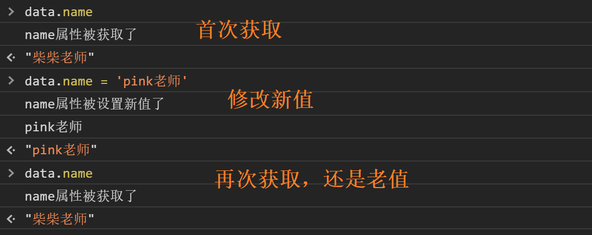
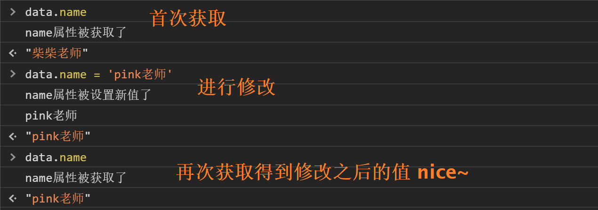
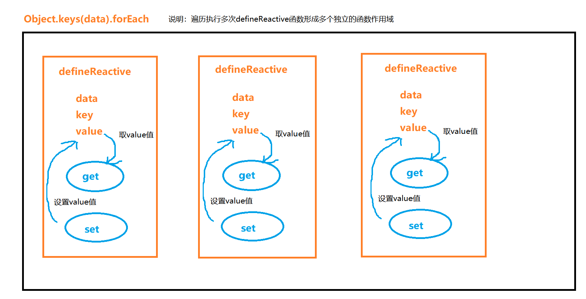
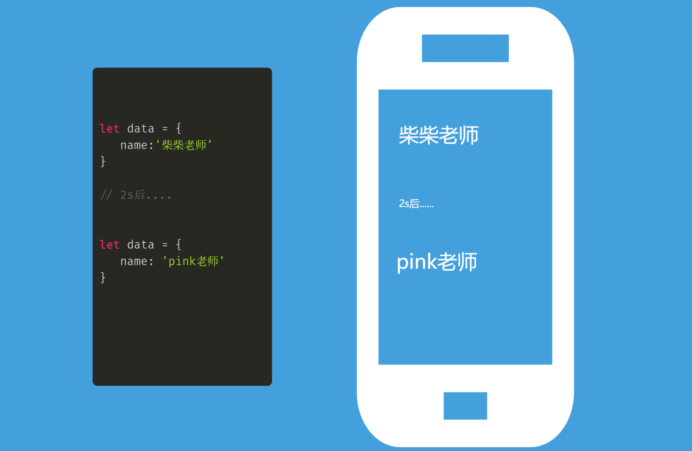
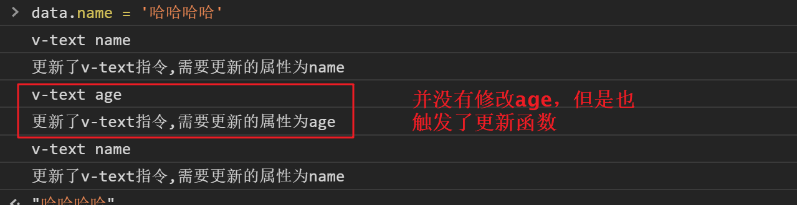
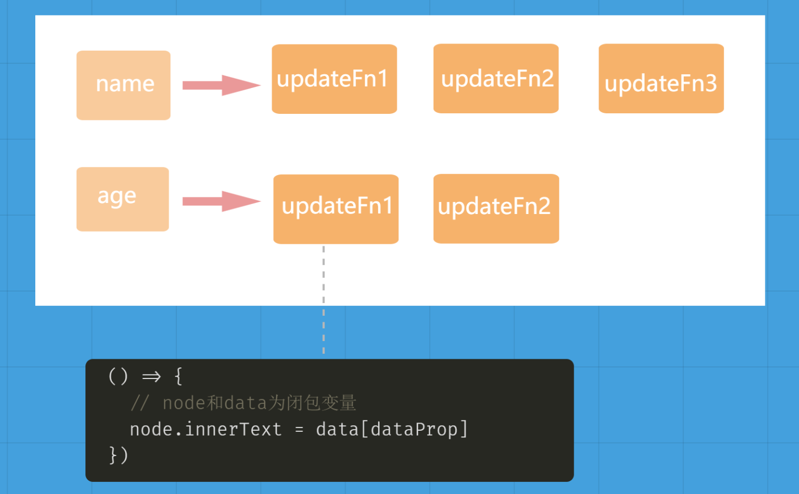
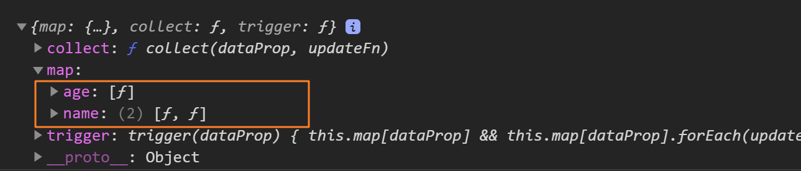
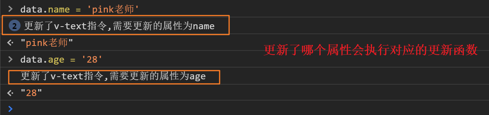

# vue相关原理进阶

## 1 - 整体目标

- [x] 了解`Object.defineProperty`实现响应式
- [x] 了解`指令编译`的基础原理
- [x] 清楚`observe/watcher/dep`具体指的是什么
- [x] 了解`发布订阅模式`以及其解决的具体问题

## 2 -  数据响应式

### 2.1  响应式是什么

> 一旦数据发生变化，我们可以立刻知道，并且做一些你想完成的事情，这些事情包括但不限于以下：

- 发送一个网络请求
- 打印一段文字
- 操作一个dom
- ....

### 2.2 如何实现数据响应式

在Javascript里实现数据响应式一般有俩种方案，分别对应着vue2.x 和 vue3.x使用的方式，他们分别是：

1. 对象属性拦截  (vue2.x)

   `Object.defineProperty`

2. 对象整体代理 (vue3.x)

   `Proxy`

其中**对象属性拦截**，是我们本次课程关注的重点，不管使用其中的哪种方式，道理都是相通的

### 2.3 实现对象属性拦截

字面量对象定义

```js
let data = {
    name:'柴柴老师'
}
```

Object.defineProperty对象定义

```js
let data = {}
Object.defineProperty(data,'name',{
    // 访问name属性就会执行此方法 返回值就是获取到的值
    get(){
       console.log('name属性被获取了')
       return '柴柴老师'
    },
    // 设置新值就会执行此方法 newVal就是设置的新值
    set(newVal){
       console.log('name属性被设置新值了')
       console.log(newVal)
    }
})
```

### 2.4 优化1- get和set联动

> 上一小节，我们的get方法中返回的值始终是`柴柴老师`，是固定的，set中拿到新值之后，我们如何让get中可以得到newVal使我们需要解决的问题

#### 现存问题

```js
let data = {}
Object.defineProperty(data,'name',{
    // 访问name属性就会执行此方法 返回值就是获取到的值
    get(){
       console.log('name属性被获取了')
       return '柴柴老师'
    },
    // 设置新值就会执行此方法 newVal就是设置的新值
    set(newVal){
       console.log('name属性被设置新值了')
       console.log(newVal)
    }
})
```

#### 错误演示



#### 解决方案

> 我们可以 通过一个中间变量 `_name` 来中转get函数和set函数之间的联动

```js
let data = {}
let _name = '柴柴老师'
Object.defineProperty(data,'name',{
    // 访问name属性就会执行此方法 返回值就是获取到的值
    get(){
       console.log('name属性被获取了')
       return _name
    },
    // 设置新值就会执行此方法 newVal就是设置的新值
    set(newVal){
       console.log('name属性被设置新值了')
       console.log(newVal)
       _name = newVal
    }
})
```

#### 结果验证



### 2.5 优化2-更加通用的劫持方案

> 大家想想看，如果现在有一份已经声明好了数据的对象，我们如何通过劫持的方法把每一个属性都变成setter和getter的形式

一份已经声明好的数据

```js
let data = {
    name: '柴柴老师',
    age: 18,
    height:180
}
```

我想让里面所有的属性都变成响应式的，并且get和set方法中对于每个属性值的操作是连通的

```js
let data = {
    name: '柴柴老师',
    age: 18,
    height:180
}

// 遍历每一个属性
Object.keys(data).forEach((key)=>{
    // key 属性名
    // data[key] 属性值
    // data 原对象
    defineReactive(data,key,data[key])
})
// 响应式转化方法
function defineReactive(data,key,value){
    Object.defineProperty(data,key,{
        get(){
           return value
        },
        set(newVal){
          value = newVal 
        }
    })
}
```

!> 结构说明：这个地方实际上使用了闭包的特性，看下图，在每一次的defineReactive函数执行的时候，都会形成一块独立的函数作用域，传入的`value` 因为闭包的关系会常驻内存，这样一来，每个defineReactive函数中的`value` 会作为各自set和get函数操作的局部变量



### 2.6 响应式总结

1. 所谓的响应式其实就是拦截对象属性的访问和设置，插入一些我们自己想要做的事情
2. 在Javascript中能实现响应式拦截的方法有俩种，`Object.defineProperty`方法和`Proxy对象代理`
3. 回归到vue2.x中的data配置项，只要放到了data里的数据，不管层级多深不管你最终会不会用到这个数据都会进行递归响应式处理，所以要求我们如非必要，尽量不要添加太多的冗余数据在data中
4. 需要了解vue3.x中，解决了2中对于数据响应式处理的无端性能消耗，使用的手段是Proxy劫持对象整体 + 惰性处理（用到了才进行响应式转换）

## 3 - 数据的变化反应到视图

上一章节，我们了解到数据劫持之后，我们可以在数据发生修改之后做任何我们想要做的事情，操作视图当然也是OK的，回归到我们的主角-视图上，我们学习下如何把数据的变化在视图上反应出来，看下面的案例



!> 要想把数据反应到视图中，本质上还是离不开dom操作

### 3.1  命令式操作视图

> 目标：我们通过原始的操作dom的方式让每一次的name的最新值都能显示到p元素内部

```html
<div id="app">
  <p></p>
</div>
<script>
   let data = {
        name: '柴柴老师',
        age: 18,
        height:180
    }
    // 遍历每一个属性
    Object.keys(data).forEach((key)=>{
        // key 属性名
        // data[key] 属性值
        // data 原对象
        defineReactive(data,key,data[key])
    })
    function defineReactive(data,key,value){
        Object.defineProperty(data,key,{
            get(){
               return value
            },
            set(newVal){
              value = newVal 
              // 数据发生变化,操作dom进行更新
              document.querySelector('#app p').innerHTML = data.name
            }
        })
    }
  // 首次渲染
  document.querySelector('#app p').innerHTML = data.name
</script>
```

### 3.2  声明式操作视图

> 目标：我们将data中name属性的值作为文本渲染到标记了v-text的p标签内部，在vue中，我们把这种标记式的声明式渲染叫做`指令`

```html
<div id="app">
  <p v-text="name"></p>
</div>
<script>
  let data = {
    name: '柴柴老师',
    age: 18,
    height: 180
  }
  // 遍历每一个属性
  Object.keys(data).forEach((key) => {
    // key 属性名
    // data[key] 属性值
    // data 原对象
    defineReactive(data, key, data[key])
  })
  function defineReactive(data, key, value) {
    Object.defineProperty(data, key, {
      get() {
        return value
      },
      set(newVal) {
        value = newVal
        // 数据发生变化,操作dom进行更新
        compile()
      }
    })
  }
  // 
  function compile() {
    let app = document.getElementById('app')
    // 1.拿到app下所有的子元素
    const nodes = app.childNodes   //  [text, input, text]
    //2.遍历所有的子元素
    nodes.forEach(node => {
      // nodeType为1为元素节点
      if (node.nodeType === 1) {
        const attrs = node.attributes
        // 遍历所有的attrubites找到 v-model
        Array.from(attrs).forEach(attr => {
          const dirName = attr.nodeName
          const dataProp = attr.nodeValue
          if (dirName === 'v-text') {
            node.innerText = data[dataProp]
          }
        })
      }
    })
  }
  // 首次渲染
  compile()
</script>
```

### 3.3 总结

1. 不管是指令也好，插值表达式也好，这些都是将数据反应到视图的标记而已，通过标记我们可以把数据的变化响应式的反应到对应的dom位置上去
2. 找标记，把数据绑定到dom的过程，我们称之为`binding` 

## 4 - 视图的变化反应到数据

> 目标：将data中的message属性对应的值渲染到input上面，同时input值发生修改之后，可以反向修改message的值，在vue系统中，v-model指令就是干这个事情的，下面我们就实现一下v-model的功能

```html
<div id="app">
  <input v-model="name" />
</div>
<script>
  let data = {
    name: '柴柴老师',
    age: 18,
    height: 180
  }
  // 遍历每一个属性
  Object.keys(data).forEach((key) => {
    // key 属性名
    // data[key] 属性值
    // data 原对象
    defineReactive(data, key, data[key])
  })
  function defineReactive(data, key, value) {
    Object.defineProperty(data, key, {
      get() {
        return value
      },
      set(newVal) {
        // 数据发生变化,操作dom进行更新
        if (newVal === value) {
          return
        }
        value = newVal
        compile()
      }
    })
  }
  // 编译函数
  function compile() {
    let app = document.getElementById('app')
    // 1.拿到app下所有的子元素
    const nodes = app.childNodes   //  [text, input, text]
    //2.遍历所有的子元素
    nodes.forEach(node => {
      // nodeType为1为元素节点
      if (node.nodeType === 1) {
        const attrs = node.attributes
        // 遍历所有的attrubites找到 v-model
        Array.from(attrs).forEach(attr => {
          const dirName = attr.nodeName
          const dataProp = attr.nodeValue
          if (dirName === 'v-model') {
            node.value = data[dataProp]
            // 视图变化反应到数据 无非是事件监听反向修改
            node.addEventListener('input', (e) => {
              data[dataProp] = e.target.value
            })
          }
        })
      }
    })
  }
  // 首次渲染
  compile()
</script>
```

## 5 - 现存架构的问题

> 无法做到精准更新

```html
<div id="app">
  <p v-text="name"></p>
  <p v-text="age"></p>
  <p v-text="name"></p>
</div>
<script>
  let data = {
    name: '柴柴老师',
    age: 18,
    height: 180
  }
  // 遍历每一个属性
  Object.keys(data).forEach((key) => {
    // key 属性名
    // data[key] 属性值
    // data 原对象
    defineReactive(data, key, data[key])
  })
  function defineReactive(data, key, value) {
    Object.defineProperty(data, key, {
      get() {
        return value
      },
      set(newVal) {
        // 数据发生变化,操作dom进行更新
        if (newVal === value) {
          return
        }
        value = newVal
        compile()
      }
    })
  }
  // 编译函数
  function compile() {
    let app = document.getElementById('app')
    // 1.拿到app下所有的子元素
    const nodes = app.childNodes   //  [text, input, text]
    //2.遍历所有的子元素
    nodes.forEach(node => {
      // nodeType为1为元素节点
      if (node.nodeType === 1) {
        const attrs = node.attributes
        Array.from(attrs).forEach(attr => {
          const dirName = attr.nodeName
          const dataProp = attr.nodeValue
          console.log( dirName,dataProp)
          if (dirName === 'v-text') {
            console.log(`更新了${dirName}指令,需要更新的属性为${dataProp}`)
            node.innerText = data[dataProp]
          }
        })
      }
    })
  }
  // 首次渲染
  compile()
</script>
```



为了做到精准更新，我们需要借助设计模式来优化我们的架构，下面我们就聊聊发布订阅模式~

## 6 - 发布订阅模式优化

### 6.1 优化思路思考

1.数据更新之后实际上需要执行的代码是什么？

```js
node.innerText = data[dataProp]
```

为了保存当前的node和dataProp，我们再次设计一个函数执行利用闭包函数将每一次编译函数执行时候的node和dataProp都缓存下来，所以每一次数据变化之后执行的是这样的一个`更新函数`

```js
() => {
  node.innerText = data[dataProp]
}
```

2.一个响应式数据可能会有多个视图部分都需要依赖，也就是响应式数据变化之后，需要执行的更新函数可能不止一个，如下面的代码所示，name属性有俩个div元素都使用了它，所以当name变化之后，俩个div节点都需要得到更新，那属性和更新函数之间应该是一个一对多的关系

```html
<div id="app">
   <div v-text="name"></div>
   <div v-text="name"></div>
   <p v-text="age"></p>
   <p v-text="age"></p>
</div>

<script>
  let data = {
     name: 'cp',
     age: 18
  }
</script>
```

经过分析我们可以得到下面的存储架构图，每一个响应式属性都绑定了相对应的更新函数，是一个一对多的关系，数据发生变化之后，只会再次执行和自己绑定的更新函数



### 6.2 理解发布订阅模式(自定义事件)

> 理解发布订阅，关键是理解`一对多`

#### 1. 从浏览器事件说起

dom绑定事件的方式，我们学过俩种

1. dom.onclick = function(){}
2. dom.addEventListener('click',()=>{})

这俩种绑定方式的区别是，第二种方案可以实现同一个事件绑定多个回调函数，很明显这是一个一对多的场景，既然浏览器也叫作事件，我们试着分析下浏览器事件绑定实现的思路

1. 首先addEventListenr是一个函数方法，接受俩个参数，分别是`事件类型` 和`回调函数`

2. 因为是一个事件绑定多个回调函数，那在内存里大概会有这样的一个数据结构

   ```js
   {
     click: ['cb1','cb2',....],
     input: ['cb1','cb2',...]
   }
   ```

3. 触发事件执行，浏览器因为有鼠标键盘输入可以触发事件，大概的思路是通过事件名称找到与之关联的回调函数列表，然后遍历执行一遍即可

ok，我们分析了浏览器事件的底层实现思路，那我们完全可以自己模仿一个出来，事件的触发，我们也通过设计一个方法来执行

#### 2. 实现简单的发布订阅

```js
// 增加dep对象 用来收集依赖和触发依赖
const dep = {
    map: Object.create(null),
    // 收集
    collect(dataProp, updateFn) {
      if (!this.map[dataProp]) {
        this.map[dataProp] = []
      }
      this.map[dataProp].push(updateFn)
    },
    // 触发
    trigger(dataProp) {
      this.map[dataProp] && this.map[dataProp].forEach(updateFn => {
        updateFn()
      })
    }
}
```

### 6.3 收集更新函数

在编译函数执行的时候，我们把用于更新dom的更新函数收集起来

```js
 // 编译函数
  function compile() {
    let app = document.getElementById('app')
    // 1.拿到app下所有的子元素
    const nodes = app.childNodes   //  [text, input, text]
    //2.遍历所有的子元素
    nodes.forEach(node => {
      // nodeType为1为元素节点
      if (node.nodeType === 1) {
        const attrs = node.attributes
        // 遍历所有的attrubites找到 v-model
        Array.from(attrs).forEach(attr => {
          const dirName = attr.nodeName
          const dataProp = attr.nodeValue
          console.log(dirName, dataProp)
          if (dirName === 'v-text') {
            console.log(`更新了${dirName}指令,需要更新的属性为${dataProp}`)
            node.innerText = data[dataProp]
            // 收集更新函数
            dep.collect(dataProp, () => {
              node.innerText = data[dataProp]
            })
          }
        })
      }
    })
 }
```

**查看收集结果**



### 6.4 触发更新函数

> 当属性发生变化的时候，我们通过属性找到对应的更新函数列表，然后依次执行即可

```js
function defineReactive(data, key, value) {
    Object.defineProperty(data, key, {
      get() {
        return value
      },
      set(newValue) {
        // 更新视图
        if (newValue === value) return
        value = newValue
        // 再次编译要放到新值已经变化之后只更新当前的key
        dep.trigger(key)
      }
    })
}
```

**验证优化结果**



### 6.5 总结

1. 了解了发布订阅模式的基础形态
2. 了解发布订阅可以解决什么样的具体问题（精准更新）

## 7 - 整体总结

1. 数据响应式的实现无非是对象属性拦截，我们使用`Object.defineProperty`来实现，在vue3中使用`Proxy`对象代理方案进行了优化

2. 面试宝典上提到的几个专业名词

   `observe`对象指的是把数据处理成响应式的对象  

   `watcher`指的其实就是数据变化之后的更新函数  (vue中的watcher有两种，一种是用来更新视图的watcher，一种是通过watch配置项声明的watcher)

   `dep`指的就是使用发布订阅实现的收集更新函数和触发更新函数的对象

3. 指令实现的核心无非是通过模板编译找到标识然后把数据绑上去，等到数据变化之后再重新放一次

4. 发布订阅模式的本质是解决一对多的问题，在vue中实现数据变化之后的精准更新

   

