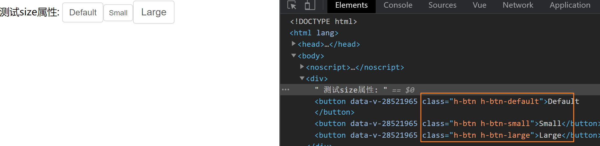

# vue组件开发

## 1. 整体目标

- [x] 了解组件开发的整体流程
- [x] 掌握组件事件和标签事件的区别
- [x] 掌握在组件上使用v-model的方式

## 2. Button组件开发

### 2.1 确定组件API

**属性**

| 属性名 | 说明                                                | 类型   | 默认值  |
| ------ | --------------------------------------------------- | ------ | ------- |
| type   | 设置按钮类型，可选值为 `primary`  `danger` 或者不设 | String | default |
| size   | 设置按钮大小，可选值为 `small` `large` 或者不设     | String | default |

**事件**

| 事件名称 | 说明         | 回调参数        |
| -------- | ------------ | --------------- |
| click    | 按钮点击事件 | (event) => void |

### 2.2 编写测试基础Button

> 组件有很多的功能，但是这些功能都是由一个最原始的组件逐渐扩展而来的，所以我们先完成一个最基础的button组件，然后逐渐往上添加功能

**编写Button组件**

目的：完成基础结构 + 基础样式

`components/Button/index.vue`

```html
<template>
  <button class="h-btn">
    <slot></slot>
  </button>
</template>
<style scoped lang="less">
    // 默认背景色 默认大小
    .h-btn {
      line-height: 1.499;
      position: relative;
      display: inline-block;
      font-weight: 400;
      white-space: nowrap;
      text-align: center;
      background-image: none;
      box-shadow: 0 2px 0 rgba(0, 0, 0, 0.015);
      cursor: pointer;
      transition: all 0.3s cubic-bezier(0.645, 0.045, 0.355, 1);
      -webkit-user-select: none;
      -moz-user-select: none;
      -ms-user-select: none;
      user-select: none;
      touch-action: manipulation;
      padding: 5px 10px;
      font-size: 14px;
      border-radius: 4px;
      color: rgba(0, 0, 0, 0.65);
      background-color: #fff;
      border: 1px solid #d9d9d9;
    }
    .h-btn:focus {
      outline: 0;
    }
</style>
```

!> 由于button中的文字是动态的，完全是由用户使用时决定，所以我们需要设计一个插槽，用来渲染传入的自定义文字


**测试基础Button**

`app.vue`

```html
<template>
  <div>
    <h-button>Default</h-button>
    <h-button>Danger</h-button>
    <h-button>Primary</h-button>
  </div>
</template>

<script>
import HButton from '@/components/Button'
export default {
  components:{
    HButton
  }
}
</script>
```


进过测试，我们编写的button组件可以进行正常使用，并且`插槽功能`是生效的

### 2.3 完成type配置

> 核心思路：通过prop传入的值的不同切换需要渲染的类名，达到显示不一样背景色的目的

**1. 准备对应class类**

```html
<style scoped lang="less">
    // primary类
    .h-btn-primary {
      color: #fff;
      background-color: #1890ff;
      border-color: #1890ff;
      text-shadow: 0 -1px 0 rgba(0, 0, 0, 0.12);
      box-shadow: 0 2px 0 rgba(0, 0, 0, 0.045);
    }
    // danger类
    .h-btn-danger {
      color: #fff;
      background-color: #ff4d4f;
      border-color: #ff4d4f;
      text-shadow: 0 -1px 0 rgba(0, 0, 0, 0.12);
      box-shadow: 0 2px 0 rgba(0, 0, 0, 0.045);
    }
</style>
```

**2. 编写props**

```html
<script>
export default {
  props: {
    type: {
      type: String
    }
  }
}
</script>
```

**3. 根据不同的prop切换class**

> 因为要添加的类名是根据prop的不同计算得来的，所以我们可以使用计算属性来完成匹配计算，然后我们找到匹配规则，类名为 `h-btn-danger`，prop值为`danger`，所以计算公式为：`h-btn-prop`

```html
<template>
  <button class="h-btn" :class="[typeClass]">
    <slot></slot>
  </button>
</template>

<script>
export default {
  props: {
    type: {
      type: String,
      // 默认值
      default() {
        return 'default'
      }
    }
  },
  computed: {
    typeClass() {
      return `h-btn-${this.type}`
    }
  }
}
</script>
```

**4. 测试type属性**

`app.vue`

```html
<template>
  <div>
    测试type属性:
    <h-button>Default</h-button>
    <h-button type="danger">Danger</h-button>
    <h-button type="primary">Primary</h-button>
  </div>
</template>

<script>
import HButton from '@/components/Button'
export default {
  components:{
    HButton
  }
}
</script>
```


### 2.4 完成size配置

**1. 准备对应class类**

```html
<style scoped lang="less">
    // size:small
    .h-btn-small {
      padding: 4px 8px;
      font-size: 12px;
    }
    // size:large
    .h-btn-large {
      padding: 6px 12px;
      font-size: 16px;
    }
</style>
```

**2. 编写props**

```html
<script>
export default {
  props: {
    size: {
      type: String,
      default(){
         return 'default'
      },
      validator: function (value) {
        return ['small','large'].includes(value)
      }
    }
  }
}
</script>
```

**3. 根据不同的prop切换class**

```html
<template>
  <button class="h-btn" :class="[typeClass]">
    <slot></slot>
  </button>
</template>

<script>
export default {
  props: {
    size: {
      type: String,
      default(){
         return 'default'
      },
      // 校验
      validator: function (value) {
        return ['small','large'].includes(value)
      }
    }
  },
  computed: {
    sizeClass() {
      return `h-btn-${this.size}`
    }
  }
}
</script>
```

**4. 测试size属性**

`app.vue`

```html
<template>
  <div>
    测试size属性:
    <h-button>Default</h-button>
    <h-button size="small">Small</h-button>
    <h-button size="large">Large</h-button>
  </div>
</template>

<script>
import HButton from '@/components/Button'
export default {
  components:{
    HButton
  }
}
</script>
```




### 2.5 完成事件绑定

**1.组件直接绑定click事件**

```html
<template>
  <div>
    <h-button size="large" @click="clickHandler">Large</h-button>
  </div>
</template>

<script>
import HButton from '@/components/Button'
export default {
  components:{
    HButton
  },
  methods:{
    clickHandler(){
     console.log('按钮点击了')
    }
  }
}
</script>
```

测试发现，点击事件并没有绑定成功，接下来我们说一下，vue系统中的事件系统

1. 浏览器原生事件 （在浏览器支持的原生标签上绑定的事件）

   ```html
   <button @click="handler"></button>
   ```

2. 组件事件  （在组件身上绑定的事件）

   ```html
   <h-button @click="handler"></h-button>
   ```

!> 组件绑定的事件默认是不会被浏览器识别的，我们需要做额外的处理让事件生效，有俩种方案

1. 添加`.native`修饰符

   添加修饰符之后，事件会被绑定到组件的根元素身上

2. 把click当成自定义事件通过`$emit`执行（推荐）

**2. 使用$emit方法触发事件**

> 用户的本意是想在点击button按钮的时候，触发组件身上绑定的click回调函数

```html
<template>
  <button @click="clickHandler">
    <slot></slot>
  </button>
</template>

<script>
export default {
  methods: {
    clickHandler(e) {
      // 触发自定义事件click,并传递事件对象e
      this.$emit('click', e)
    }
  }
}
</script>
```

### 2.6 总结

1. 编写组件时应该API先行，先确定组件该如何给用户用，再根据API编写逻辑
2. props的名称应该具备语义化，类型应该符合规范，并且可以添加自定义校验
3. 组件上绑定的类似于原生的事件，默认是不会被识别的，需要额外处理
4. 组件有一些设计需要整体把控，比如props与对应类名的匹配，这是我们故意设计的

## 3. Editor编辑器组件开发

> Button组件的编写，我们是从零开始的，接下来我们借助一些开源的三方基础插件，完成我们自己编辑器组件的编写

组件依赖：[wangEditor](https://www.wangeditor.com/)    

安装依赖： `npm i wangeditor --save`

### 3.1 确定基础API

**指令**

| 指令名  | 说明                     | 类型   | 默认值 |
| ------- | ------------------------ | ------ | ------ |
| v-model | 提供编辑器数据的双向绑定 | String | 无     |

### 3.2 编写测试基础Editor

**编写Editor组件**

`components/Editor/index.vue`

```html
<template>
  <div class="editorContainer" ref="editor"></div>
</template>

<script>
import E from 'wangeditor'
export default {
  methods: {
    initEditor(){
      const editor = new E(this.$refs.editor)
      // 或者 const editor = new E( document.getElementById('div1') )
      editor.create()
    }
  },
  mounted(){
    this.initEditor()
  }
}
</script>
```

**测试组件**

`app.vue`

```html
<template>
  <div>
    <Editor/>
  </div>
</template>

<script>
import Editor from '@/components/Editor'
export default {
  components:{
    Editor
  }
}
</script>
```


### 3.3 完成v-model双向绑定

**前置知识**

!> 当我们在一个组件身上通过v-model绑定一个响应式数据时，记住，他是一个语法糖，实际上相当于完成了俩件事情

1. 组件上绑定了一个名为`value` 的自定义属性
2. 组件身上绑定了一个名为`input`的自定义事件

**1. 接受数据传入**

```html
<template>
  <div>
    <Editor v-model="content"/>
  </div>
</template>

<script>
import Editor from '@/components/Editor'
export default {
  components:{
    Editor
  },
  data(){
    return {
      content:'我是编辑器,我真牛逼！'
    }
  }
}
</script>
```

`Editor/index.vue`

```html
<template>
  <div class="editorContainer" ref="editor"></div>
</template>

<script>
import E from 'wangeditor'
export default {
  props: {
    // 接收数据传入
    value: {
      type: String
    }
  },
  methods: {
    initEditor() {
      const editor = new E(this.$refs.editor)
      editor.create()

    }
  },
  mounted() {
    console.log('传过来的数据为', this.value)
    this.initEditor()
  }
}
</script>
```

**2. 实现数据回显**

> 数据我们拿到了，然后就可以把它渲染到编辑器内部了，编辑器有一个方法是专门用来设置内容的，我们找到它，`editor.txt.html('富文本内容') `

```js
initEditor() {
  const editor = new E(this.$refs.editor)
  // 监听编辑器改动事件,把最新内容传出去
  editor.config.onchange = (newHtml) => {
    console.log('change 之后最新的 html', newHtml)
    this.$emit('input', newHtml)
  }
  editor.create()
  editor.txt.html(this.value)
}
```


**4. Bug修复**

> 看起来我们实现了数据的传入回显和修改时的内容传出，接下来我们在app.vue中动态的修改一下传入的`content`，看看编辑器有没有实时响应得到显示

我们通过调试工具，修改content属性的值，发现编辑器并没有得到显示，然后再查看props数据，发现最新的数据已经传进去了，之所以没有显示到编辑器中，是因为编辑器类似一个独立的个体，它并不知道props已经变成新内容了，所以我们的思路是:  `监听props的变化，然后把props的值设置到编辑器里`

如何监听 - `watch`

如何设置 -  `editor.txt.html()`

```js
initEditor() {
  const editor = new E(this.$refs.editor)
  editor.config.onchange = (newHtml) => {
    console.log('change 之后最新的 html', newHtml)
    this.$emit('input', newHtml)
  }
  editor.create()
  editor.txt.html(this.value)
  // 为了能使用editor对象,我们采取一个更加灵活的命令式监听写法
  this.$watch('value', () => {
    editor.txt.html(this.value)
  })
}
```

再次测试，发现双向绑定已经完全正常，nice~

### 3.4 总结

通过这一节的学习，我们应该掌握以下知识点

1. 组件上绑定`v-model` 等同于做了什么
2. watch监听的另外一种调用方法命令式的监听方法，功能一样
3. 使用三方现成的开源插件编写自己组件的流程（基础使用 、三方方法调用）