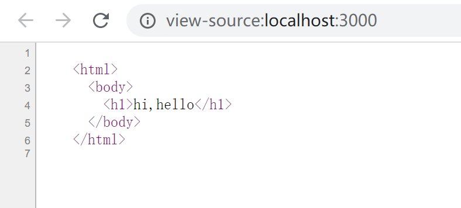
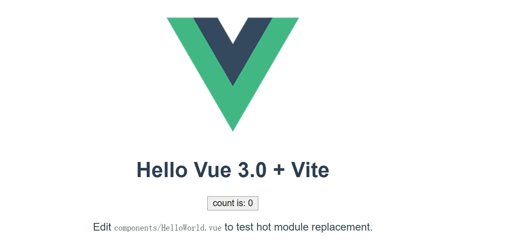
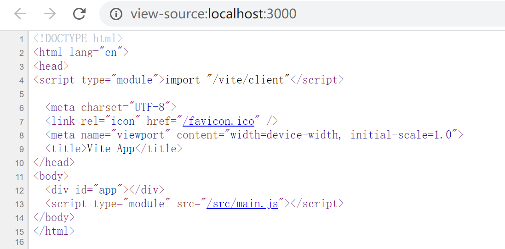
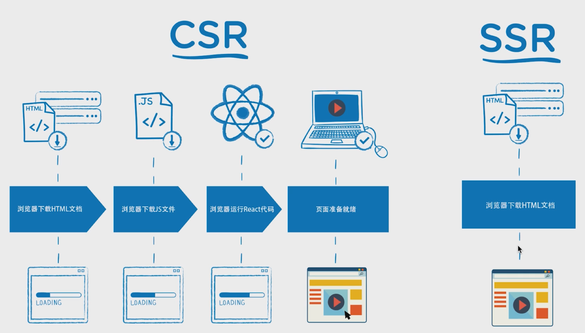
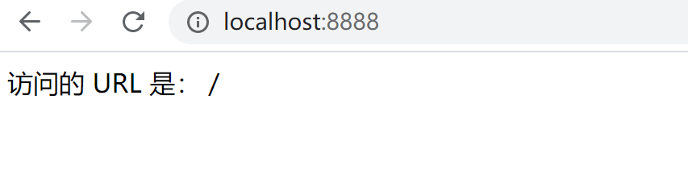
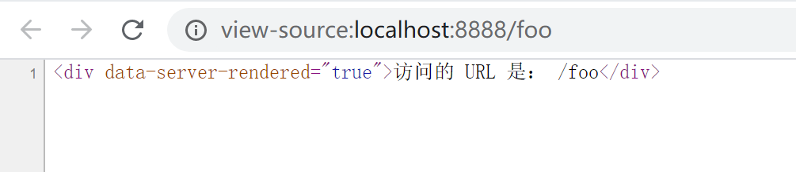
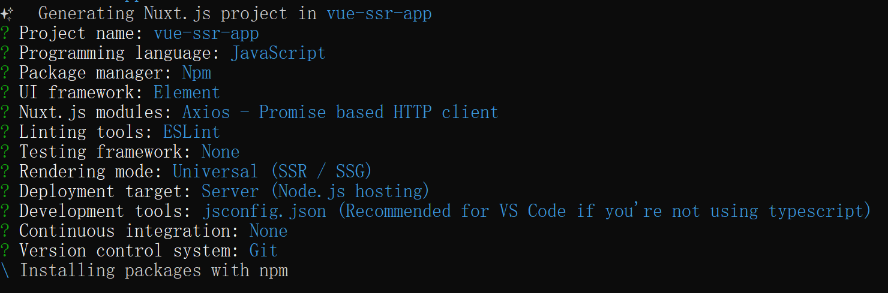
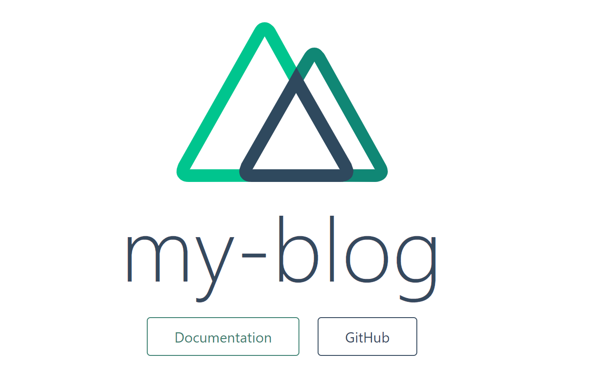
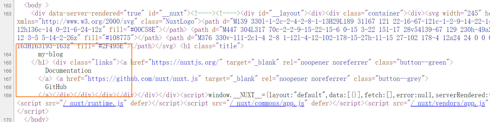

## 1 - 什么是服务器端渲染？

>  server side render 前端页面的产生是由服务器端生成的，我们就称之为服务端渲染

### 1.1  新建server文件夹

```
server
```

### 1.2 生成一个node项目

```bash
npm init -y
```

### 1.3 安装express

[express](https://www.expressjs.com.cn/) 官方文档

```bash
npm install express --save
```

### 1.4 服务端渲染小案例

`app.js`

```js
const express = require('express')
const app = express()
const port = 3000
// 当路径为跟路径,返回完整的html片段
app.get('/', (req, res) => res.send(`
    <html>
      <body>
        <h1>hi,hello</h1>
      </body>
    </html>
`))

app.listen(port, () => console.log(`Example app listening on port ${port}!`))
```

### 1.5 运行查看效果

```bash
node app.js
```

### 1.6 打开浏览器

`http://localhost:3000`


### 1.7 右键查看源代码



总结：所谓的服务端渲染值得是页面的内容完全是由服务端侧决定到底要展示出什么内容

## 2 - 什么是客户端渲染？

> client side render  服务端只提供json格式的数据，渲染成什么样子由客户端通过js控制

通过vite快速创建一个基于vue框架的客户端渲染样例

### 2.1 新建client文件夹

```
client
```

### 2.2 生成一个vue项目

> 我们使用vite工具快速生成一个vue项目，https://vitejs.dev/

```bash
npm init @vitejs/app client-vue-app --template vue
```

### 2.3 安装依赖并启动

```bash
cd vue-app
npm install (or `yarn`)
npm run dev (or `yarn dev`)
```

### 2.4 浏览器查看效果

`http://localhost:8080`



### 2.5 查看源代码



结论：通过查看源代码我们发现，源代码并没有显示我们页面中实际渲染的内容，我们只看到一个main.js文件，和一个id为app的根元素，所以我们知道网页内容是通过js来动态的进行渲染的，js运行在浏览器，浏览器也就是客户端，这种由浏览器端的js做主导渲染网页内容的方式，我们就称之为**客户端渲染**


思考题：如何得知一个网站是哪种方式的渲染？

## 3 - 客户端渲染vs服务端渲染

> 客户端渲染我们叫做CSR渲染方式，服务端渲染我们叫做SSR渲染

### 3.1 运行架构对比



**说明**

CSR执行流程：浏览器加载html文件  ->  浏览器下载js文件 -> 浏览器运行vue代码  -> 渲染页面

SSR执行流程：浏览器加载html文件 -> 服务端装填好内容 -> 返回浏览器渲染

### 3.2 开发模式对比

CSR：前后端通过接口JSON数据进行通信，各自开发互不影响

SSR：前后端分工搭配复杂，前端需要写好html模板交给后端，后端装填模板内容返给浏览器

### 3.3  特点优势总结

|                    | 客户端渲染（CSR） | 服务端渲染（SSR） |
| ------------------ | ----------------- | ----------------- |
| 首次渲染时间       | 长                | 很短              |
| seo支持            | 差                | 良好              |
| 前后端分工开发效率 | 快                | 慢                |

思考：如果我们的项目既想要使用vue高效率的开发项目，同时还想要首屏渲染时间很短，那该怎么办？

## 4 - vue框架中的服务端渲染

为了解决第3章节提出的问题，目前我们的vue组件都是在浏览器侧通过js渲染出来的，所以首次加载时间很慢，那么我们把vue组件交给服务端负责渲染，渲染为完整内容之后直接返给客户端，是不是就可以可以解决既想渲染快，还想继续使用vue进行开发的问题了？

[vue ssr基础使用](https://ssr.vuejs.org/zh/guide/#%E5%AE%89%E8%A3%85)

### 4.1 新建vue-ssr文件夹

```
vue-ssr
```

### 4.2 把server文件夹中的文件拷贝进来

### 4.3 安装必要依赖

```bash
npm install vue vue-server-renderer --save
```

### 4.4 vue服务端渲染最小demo

`app.js`

```js
const Vue = require('vue')
const server = require('express')()

const renderer = require('vue-server-renderer').createRenderer()

server.get('*', (req, res) => {
  const app = new Vue({
    data: {
      url: req.url
    },
    template: `<div>访问的 URL 是：{{ url }}</div>`,
  })
  renderer.renderToString(app, (err, html) => {
    if (err) throw err
    res.send(html)
  })
})

server.listen(8888,() => console.log(`Example app listening on port 8888!`))
```

### 4.5 浏览器访问

`http://localhost:8888`



### 4.6 查看源代码




结论：我们通过在服务器端渲染vue组件的方式，让网页中又有了完整的内容，这样我们就可以既使用了vue开发又节省了首次渲染时间

### 4.7 遗留问题

修改app.js，添加一个button元素并使用vue的方式绑定click事件

```js
const Vue = require('vue')
const server = require('express')()

const renderer = require('vue-server-renderer').createRenderer()

server.get('*', (req, res) => {
  const app = new Vue({
    data: {
      url: req.url
    },
    template: 
    `<div>
      访问的 URL 是：{{ url }}
      <button @click="alert('123')">click me!</button>
    </div>`,
  })
  renderer.renderToString(app, (err, html) => {
    if (err) throw err
    res.send(html)
  })
})

server.listen(8888,() => console.log(`Example app listening on port 8888!`))
```

运行发现，页面成功显示了button按钮，但是可惜的是，没有成功绑定事件，点击无效，事实上除了事件没有绑定之外，服务器端虽然完成了vue的渲染，但是给到客户端的时候已经成了字符串了，一系列我们熟悉的vue应用的特性，我们都无法使用，比如数据响应式更新，那该怎么办呢？

为了解决以上问题，我们需要引入一个新的概念，称作 `同构`

## 5 - 理解同构理念

> 一套vue（react）代码，在服务端执行一次，在客户端再执行一次，就做同构

```js
const app = new Vue({
    data: {
      url: req.url
    },
    template: 
    `<div>
      访问的 URL 是：{{ url }}
      <button @click="alert('123')">click me!</button>
    </div>`
})
```

上面所示的vue代码，我们在服务端的执行保持不变，只要我们把这段代码在客户端再重新执行一遍，不就可以拥有原本vue应用的所有特性了么，确实如此，不过这个过程的难度太大，我们现在只需要理解，所谓的同构是指：**同一套vue代码在服务端执行一次在客户端再执行一次**

1. 服务端执行完成渲染解决了首次加载速度慢的问题
2. 浏览器执行解决了绑定事件及恢复vue本身特性的问题

## 6 - Nuxt.js框架使用

> nuxt.js是一套使用vue框架开发应用的服务端渲染框架，提供了开箱即用的功能

### 1. 使用nuxt.js创建一个ssr项目

```bash
npm create nuxt-app <项目名>
```

按照提示选择项目之后完成创建，需要注意，这一步要选择ssr



### 2. 启动项目

```bash
cd vue-ssr-app
npm run dev
```

`http://localhost:3000`



### 3. 查看源代码



显然，我们看到了网页上有实际渲染的内容，这是服务端负责的渲染

### 4. 搭建首页

`pages/index.vue`

在nuxt.js生成的项目中我们依旧像之前一样写单文件组件.vue代码，ElementUI组件也可以正常使用

```html
<template>
  <div class="container">
    <Logo />
    <div class="articleList">
      <el-collapse>
        <el-collapse-item title="一致性 Consistency" name="1">
          <div>与现实生活一致：与现实生活的流程、逻辑保持一致，遵循用户习惯的语言和概念；</div>
        </el-collapse-item>
      </el-collapse>
    </div>
  </div>
</template>

<script>
export default {}
</script>

<style>
.container{
  padding:0 200px;
}
.articleList{
  margin-top:30px;
}
</style>
```

### 5. 异步数据获取

https://axios.nuxtjs.org/    

#### 1. 认识asyncData方法

`asyncData`方法会在组件（**限于页面组件**）每次加载之前被调用。它可以在服务端或路由更新之前被调用，你可以利用 `asyncData`方法来获取数据，Nuxt.js 会将 `asyncData` 返回的数据融合组件 `data` 方法返回的数据一并返回给当前组件

官网推荐使用的请求方式   https://axios.nuxtjs.org/

```js
async asyncData({ $axios }) {
  const ip = await $axios.$get('http://icanhazip.com')
  return { ip }
},
data(){
  return {
     name:'cp'
  }
}

----合并完之后的data数据----
{
   name:'cp',
   ip
}
```

#### 2. 获取文章列表（移动端项目）

```js
async asyncData ({ $axios }) {
    const url = 'http://ttapi.research.itcast.cn/app/v1_1/articles?channel_id=0&timestamp=1606309443970&with_top=1'
    const res = await $axios.$get(url)
    // eslint-disable-next-line no-console
    console.log('文章数据列表：', res)
    return {
      list: res.data.results
    }
 }
```

#### 3. 渲染接口数据

```html
<el-collapse>
    <el-collapse-item v-for="item in list" :key="item.id" :title="item.title.slice(0,40)">
      <div>评论数：{{ item.comm_count }}  点赞数：{{ item.like_count }}</div>
    </el-collapse-item>
</el-collapse>
```

#### 4. 预览效果并查看源代码

结论：我们完成了既使用vue开发模式，又实现了服务端渲染模式，nice~

## 7- 总结

### 7.1 服务端渲染和客户端渲染各自指什么？有什么特点？

```
SSR 服务端渲染  网页内容由服务端生成   首屏时间短  有利于seo
CSR 客户端渲染  vue、react框架渲染方式  spa都是客户端渲染   首屏渲染时间长不利于seo
```

### 7.2 同构的本质是什么？

```
一份vue代码在服务端渲染一遍  然后在客户端再渲染一遍
服务端渲染解决了首屏显示快  客户端渲染是需要把事件、响应式特性等vue经典的特性都绑回去

我们既可以使用vue的开发模式 又可以享受俩种渲染方式的优势
```

### 7.3 Nuxt.js中如何实现异步数据获取（asyncData方法）？

```
asyncData函数时Nuxtjs框架内置的一个函数  
执行结果和和data进行融合  一起返给当前组件 
```


