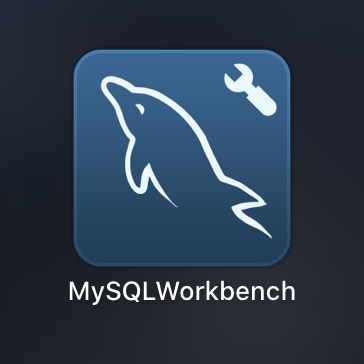

# Mac 系统配置 MySql 数据库

## 1. 安装 MySql 数据库

+ 1.1 双击打开安装包 `mysql-8.0.19-macos10.15-x86_64.dmg`：

+ 1.2 双击 `mysql-8.0.19-macos10.15-x86_64.pkg` 运行安装包，并点击 `继续` 按钮：

+ 1.3 进入 `介绍` 页面之后，点击 `继续` 按钮：

+ 1.4 进入 `安装类型` 页面之后，点击 `安装` 按钮：

+ 1.5 输入电脑的登录密码，从而确认此次安装行为：

+ 1.6 在 `Configuration` 页面，确认勾选了 `Use Legacy Password Encryption` 选项之后，点击 `Next` 按钮：

+ 1.7 为 root 用户设置初始密码为 admin123 之后，点击 `Finish` 按钮：

+ 1.8 再次输入电脑登陆密码，确认此次 `设置初始密码` 的操作：

+ 1.9 提示安装完成之后，点击 `关闭` 按钮即可：

## 2. 安装 MySql Workbench 可视化工具

+ 2.1 双击打开安装包 `mysql-workbench-community-8.0.19-macos-x86_64.dmg`，进入到安装页面：

+ 2.2 使用鼠标左键，将 `MySQLWorkbench` 图标拖拽到右侧 `Applications` 图标之上后，松开鼠标左键，等待进度条完成之后，就完成了安装的过程：

+ 2.3 在启动台，找到 `MySQLWorkbench` 图标，点击之后，即可启动 MySQL 可视化管理工具：

